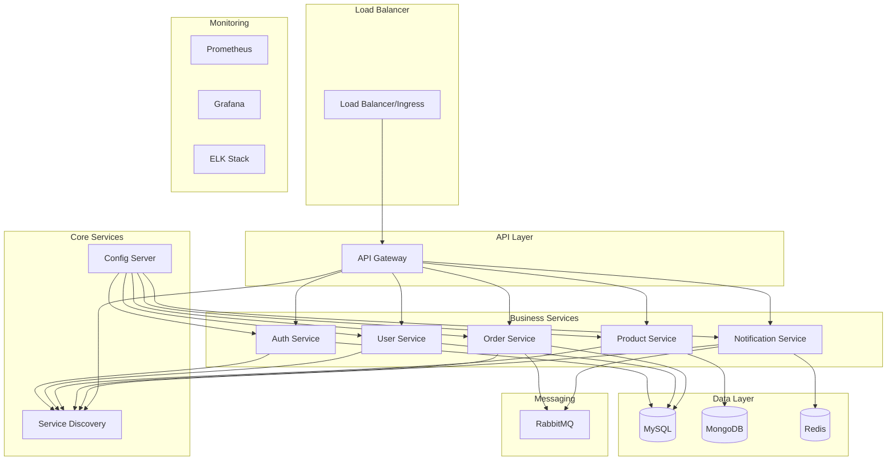

# Deployment Guide

This document provides comprehensive deployment instructions for the Microservices Platform across different environments.

## Table of Contents

- [Deployment Overview](#deployment-overview)
- [Prerequisites](#prerequisites)
- [Environment Configurations](#environment-configurations)
- [Local Deployment](#local-deployment)
- [Docker Deployment](#docker-deployment)
- [Kubernetes Deployment](#kubernetes-deployment)
- [Cloud Deployment](#cloud-deployment)
- [CI/CD Pipeline](#cicd-pipeline)
- [Monitoring and Observability](#monitoring-and-observability)
- [Security Considerations](#security-considerations)
- [Troubleshooting](#troubleshooting)
- [Rollback Procedures](#rollback-procedures)

## Deployment Overview

The Microservices Platform supports multiple deployment strategies:

| Environment | Infrastructure | Orchestration | Scaling | Use Case |
|-------------|---------------|---------------|---------|----------|
| Local | Docker Compose | Manual | Limited | Development |
| Staging | Docker + K8s | Kubernetes | Auto | Testing |
| Production | K8s + Cloud | Kubernetes | Auto | Production |

### Architecture Components



## Prerequisites

### System Requirements

**Minimum Requirements:**
- CPU: 4 cores
- RAM: 8GB
- Storage: 50GB
- Network: 100Mbps

**Recommended Requirements:**
- CPU: 8+ cores
- RAM: 16GB+
- Storage: 100GB+ SSD
- Network: 1Gbps

### Software Dependencies

| Component | Version | Purpose |
|-----------|---------|---------|
| Java | 17+ | Runtime |
| Maven | 3.6+ | Build tool |
| Docker | 20.10+ | Containerization |
| Docker Compose | 1.29+ | Local orchestration |
| Kubernetes | 1.21+ | Container orchestration |
| kubectl | 1.21+ | K8s CLI |
| Helm | 3.7+ | K8s package manager |

### Network Requirements

**Ports:**
- 8080: API Gateway
- 8761: Eureka Server
- 8888: Config Server
- 8081-8085: Business services
- 3306: MySQL
- 27017: MongoDB
- 6379: Redis
- 5672: RabbitMQ
- 9090: Prometheus
- 3000: Grafana

## Environment Configurations

### Configuration Management

The platform uses Spring Cloud Config for centralized configuration:

```yaml
# application.yml (shared)
spring:
  application:
    name: ${SERVICE_NAME}
  profiles:
    active: ${SPRING_PROFILES_ACTIVE:dev}
  cloud:
    config:
      uri: ${CONFIG_SERVER_URL:http://localhost:8888}
      fail-fast: true
      retry:
        initial-interval: 1000
        multiplier: 1.1
        max-interval: 2000
        max-attempts: 6
```

### Environment-Specific Settings

#### Development (dev)
```yaml
spring:
  datasource:
    url: jdbc:h2:mem:devdb
    username: sa
    password: 
  jpa:
    show-sql: true
eureka:
  client:
    service-url:
      defaultZone: http://localhost:8761/eureka/
logging:
  level:
    com.microservices: DEBUG
```

#### Staging (staging)
```yaml
spring:
  datasource:
    url: jdbc:mysql://${DB_HOST}:${DB_PORT}/${DB_NAME}
    username: ${DB_USER}
    password: ${DB_PASSWORD}
eureka:
  client:
    service-url:
      defaultZone: http://eureka-server:8761/eureka/
logging:
  level:
    com.microservices: INFO
management:
  endpoints:
    web:
      exposure:
        include: health,info,metrics
```

#### Production (prod)
```yaml
spring:
  datasource:
    url: jdbc:mysql://${DB_HOST}:${DB_PORT}/${DB_NAME}
    username: ${DB_USER}
    password: ${DB_PASSWORD}
    hikari:
      maximum-pool-size: 20
      minimum-idle: 5
eureka:
  client:
    service-url:
      defaultZone: ${EUREKA_SERVERS}
security:
  oauth2:
    resourceserver:
      jwt:
        issuer-uri: ${AUTH_ISSUER_URI}
logging:
  level:
    com.microservices: WARN
    root: INFO
management:
  endpoints:
    web:
      exposure:
        include: health,info
```

## Local Deployment

### Using Docker Compose

1. **Start Infrastructure Services**
   ```bash
   docker-compose up -d mysql mongodb redis rabbitmq elasticsearch
   ```

2. **Build Services**
   ```bash
   make build
   ```

3. **Start Application Services**
   ```bash
   docker-compose up -d
   ```

4. **Verify Deployment**
   ```bash
   make status
   make health
   ```

### Using Make Commands

```bash
# Complete setup
make setup
make build
make run

# Individual service management
make logs-service name=user-service
make restart
make stop
```

### Docker Compose Configuration

```yaml
version: '3.8'

services:
  eureka-server:
    build: ./eureka-server
    ports:
      - "8761:8761"
    environment:
      - SPRING_PROFILES_ACTIVE=docker
    healthcheck:
      test: ["CMD", "curl", "-f", "http://localhost:8761/actuator/health"]
      interval: 30s
      timeout: 10s
      retries: 3
    networks:
      - microservices-network

  config-server:
    build: ./config-server
    ports:
      - "8888:8888"
    environment:
      - SPRING_PROFILES_ACTIVE=docker
      - EUREKA_CLIENT_SERVICE_URL_DEFAULTZONE=http://eureka-server:8761/eureka
    depends_on:
      eureka-server:
        condition: service_healthy
    healthcheck:
      test: ["CMD", "curl", "-f", "http://localhost:8888/actuator/health"]
      interval: 30s
      timeout: 10s
      retries: 3
    networks:
      - microservices-network

  api-gateway:
    build: ./api-gateway
    ports:
      - "8080:8080"
    environment:
      - SPRING_PROFILES_ACTIVE=docker
      - EUREKA_CLIENT_SERVICE_URL_DEFAULTZONE=http://eureka-server:8761/eureka
    depends_on:
      config-server:
        condition: service_healthy
    networks:
      - microservices-network

networks:
  microservices-network:
    driver: bridge

volumes:
  mysql-data:
  mongodb-data:
  redis-data:
```

## Docker Deployment

### Building Docker Images

#### Multi-stage Dockerfile
```dockerfile
FROM openjdk:17-jdk-slim AS build
WORKDIR /app
COPY pom.xml .
COPY src ./src
COPY mvnw .
COPY .mvn .mvn
RUN ./mvnw clean package -DskipTests

FROM openjdk:17-jdk-slim
WORKDIR /app
RUN groupadd -g 1000 spring && useradd -u 1000 -g spring spring
COPY --from=build /app/target/*.jar app.jar
RUN chown -R spring:spring /app
USER spring
EXPOSE 8080
HEALTHCHECK --interval=30s --timeout=3s --start-period=40s --retries=3 \
  CMD curl -f http://localhost:8080/actuator/health || exit 1
ENTRYPOINT ["java", "-jar", "app.jar"]
```

#### Build Script
```bash
#!/bin/bash
# build-images.sh

SERVICES=("eureka-server" "config-server" "api-gateway" "auth-service" "user-service" "product-service" "order-service" "notification-service")
TAG=${1:-latest}
REGISTRY=${2:-localhost:5000}

for service in "${SERVICES[@]}"; do
    echo "Building $service..."
    docker build -t $service:$TAG ./$service
    docker tag $service:$TAG $REGISTRY/$service:$TAG
    docker push $REGISTRY/$service:$TAG
done
```

### Docker Registry Setup

```bash
# Start local registry
docker run -d -p 5000:5000 --name registry registry:2

# Configure Docker daemon (for insecure registries)
# Add to /etc/docker/daemon.json
{
  "insecure-registries": ["localhost:5000"]
}
```

## Kubernetes Deployment

### Cluster Setup

#### Using Minikube (Development)
```bash
# Start minikube
minikube start --cpus 4 --memory 8192 --disk-size 50g

# Enable addons
minikube addons enable ingress
minikube addons enable dashboard
minikube addons enable metrics-server
```

#### Using kubeadm (Production)
```bash
# Initialize control plane
sudo kubeadm init --pod-network-cidr=10.244.0.0/16

# Install CNI plugin (Flannel)
kubectl apply -f https://raw.githubusercontent.com/flannel-io/flannel/master/Documentation/kube-flannel.yml

# Join worker nodes
sudo kubeadm join <master-ip>:6443 --token <token> --discovery-token-ca-cert-hash <hash>
```

### Kubernetes Manifests

#### Namespace
```yaml
# namespace.yaml
apiVersion: v1
kind: Namespace
metadata:
  name: microservices
  labels:
    name: microservices
```

#### ConfigMap
```yaml
# configmap.yaml
apiVersion: v1
kind: ConfigMap
metadata:
  name: microservices-config
  namespace: microservices
data:
  EUREKA_SERVERS: "http://eureka-server:8761/eureka/"
  CONFIG_SERVER_URL: "http://config-server:8888"
  DB_HOST: "mysql"
  DB_PORT: "3306"
  REDIS_HOST: "redis"
  REDIS_PORT: "6379"
  RABBITMQ_HOST: "rabbitmq"
  RABBITMQ_PORT: "5672"
```

#### Secret
```yaml
# secret.yaml
apiVersion: v1
kind: Secret
metadata:
  name: microservices-secret
  namespace: microservices
type: Opaque
data:
  DB_PASSWORD: cm9vdHBhc3N3b3Jk  # base64 encoded
  JWT_SECRET: bXktand0LXNlY3JldA==
  REDIS_PASSWORD: cmVkaXNwYXNzd29yZA==
  RABBITMQ_PASSWORD: YWRtaW5wYXNzd29yZA==
```

#### Service Deployment
```yaml
# user-service.yaml
apiVersion: apps/v1
kind: Deployment
metadata:
  name: user-service
  namespace: microservices
spec:
  replicas: 3
  selector:
    matchLabels:
      app: user-service
  template:
    metadata:
      labels:
        app: user-service
    spec:
      containers:
      - name: user-service
        image: user-service:latest
        ports:
        - containerPort: 8082
        env:
        - name: SPRING_PROFILES_ACTIVE
          value: "k8s"
        envFrom:
        - configMapRef:
            name: microservices-config
        - secretRef:
            name: microservices-secret
        livenessProbe:
          httpGet:
            path: /actuator/health
            port: 8082
          initialDelaySeconds: 60
          periodSeconds: 30
        readinessProbe:
          httpGet:
            path: /actuator/health/readiness
            port: 8082
          initialDelaySeconds: 30
          periodSeconds: 10
        resources:
          requests:
            memory: "512Mi"
            cpu: "250m"
          limits:
            memory: "1Gi"
            cpu: "500m"
---
apiVersion: v1
kind: Service
metadata:
  name: user-service
  namespace: microservices
spec:
  selector:
    app: user-service
  ports:
  - port: 8082
    targetPort: 8082
  type: ClusterIP
```

#### Ingress
```yaml
# ingress.yaml
apiVersion: networking.k8s.io/v1
kind: Ingress
metadata:
  name: microservices-ingress
  namespace: microservices
  annotations:
    kubernetes.io/ingress.class: "nginx"
    nginx.ingress.kubernetes.io/rewrite-target: /
spec:
  rules:
  - host: api.microservices.local
    http:
      paths:
      - path: /
        pathType: Prefix
        backend:
          service:
            name: api-gateway
            port:
              number: 8080
```

### Helm Charts

#### Chart Structure
```
helm/
├── Chart.yaml
├── values.yaml
├── templates/
│   ├── deployment.yaml
│   ├── service.yaml
│   ├── configmap.yaml
│   ├── secret.yaml
│   ├── ingress.yaml
│   └── hpa.yaml
└── charts/
    └── dependencies/
```

#### values.yaml
```yaml
# Global settings
global:
  imageRegistry: "localhost:5000"
  imageTag: "latest"
  pullPolicy: "IfNotPresent"

# API Gateway
apiGateway:
  enabled: true
  replicaCount: 2
  image:
    repository: api-gateway
  service:
    type: LoadBalancer
    port: 8080

# Services
services:
  authService:
    enabled: true
    replicaCount: 3
    resources:
      requests:
        memory: "512Mi"
        cpu: "250m"
      limits:
        memory: "1Gi"
        cpu: "500m"
  
  userService:
    enabled: true
    replicaCount: 3
    
  productService:
    enabled: true
    replicaCount: 3
    
  orderService:
    enabled: true
    replicaCount: 3
    
  notificationService:
    enabled: true
    replicaCount: 2

# Databases
mysql:
  enabled: true
  auth:
    rootPassword: "rootpassword"
    database: "microservices"
  primary:
    persistence:
      size: 20Gi

mongodb:
  enabled: true
  auth:
    rootPassword: "adminpassword"
  persistence:
    size: 20Gi

redis:
  enabled: true
  auth:
    password: "redispassword"

# Monitoring
prometheus:
  enabled: true
  server:
    persistentVolume:
      size: 10Gi

grafana:
  enabled: true
  adminPassword: "admin"
  persistence:
    enabled: true
    size: 1Gi
```

### Deployment Commands

```bash
# Create namespace
kubectl apply -f k8s/namespace.yaml

# Deploy with kubectl
kubectl apply -f k8s/

# Deploy with Helm
helm install microservices ./helm/microservices -n microservices

# Update deployment
helm upgrade microservices ./helm/microservices -n microservices

# Scale services
kubectl scale deployment user-service --replicas=5 -n microservices

# Rolling update
kubectl set image deployment/user-service user-service=user-service:v2 -n microservices
```

## Cloud Deployment

### AWS EKS

#### Cluster Setup
```bash
# Install eksctl
curl --silent --location "https://github.com/weaveworks/eksctl/releases/latest/download/eksctl_$(uname -s)_amd64.tar.gz" | tar xz -C /tmp
sudo mv /tmp/eksctl /usr/local/bin

# Create cluster
eksctl create cluster \
  --name microservices-cluster \
  --version 1.21 \
  --region us-west-2 \
  --nodegroup-name standard-workers \
  --node-type t3.medium \
  --nodes 3 \
  --nodes-min 1 \
  --nodes-max 4 \
  --managed
```

#### Load Balancer
```yaml
# aws-load-balancer.yaml
apiVersion: v1
kind: Service
metadata:
  name: api-gateway-lb
  namespace: microservices
  annotations:
    service.beta.kubernetes.io/aws-load-balancer-type: "nlb"
    service.beta.kubernetes.io/aws-load-balancer-scheme: "internet-facing"
spec:
  type: LoadBalancer
  selector:
    app: api-gateway
  ports:
  - port: 80
    targetPort: 8080
```

### Google GKE

#### Cluster Setup
```bash
# Create cluster
gcloud container clusters create microservices-cluster \
  --zone us-central1-a \
  --num-nodes 3 \
  --machine-type n1-standard-2 \
  --enable-autoscaling \
  --min-nodes 1 \
  --max-nodes 10

# Get credentials
gcloud container clusters get-credentials microservices-cluster --zone us-central1-a
```

### Azure AKS

#### Cluster Setup
```bash
# Create resource group
az group create --name microservices-rg --location eastus

# Create cluster
az aks create \
  --resource-group microservices-rg \
  --name microservices-cluster \
  --node-count 3 \
  --enable-addons monitoring \
  --generate-ssh-keys

# Get credentials
az aks get-credentials --resource-group microservices-rg --name microservices-cluster
```

## CI/CD Pipeline

### GitHub Actions

```yaml
# .github/workflows/ci-cd.yml
name: CI/CD Pipeline

on:
  push:
    branches: [ main, develop ]
  pull_request:
    branches: [ main ]

env:
  REGISTRY: ghcr.io
  IMAGE_NAME: ${{ github.repository }}

jobs:
  test:
    runs-on: ubuntu-latest
    steps:
    - uses: actions/checkout@v3
    
    - name: Set up JDK 17
      uses: actions/setup-java@v3
      with:
        java-version: '17'
        distribution: 'temurin'
    
    - name: Cache Maven packages
      uses: actions/cache@v3
      with:
        path: ~/.m2
        key: ${{ runner.os }}-m2-${{ hashFiles('**/pom.xml') }}
    
    - name: Run tests
      run: mvn clean test
    
    - name: Run integration tests
      run: mvn verify -P integration-test
    
    - name: Generate test report
      uses: dorny/test-reporter@v1
      if: always()
      with:
        name: Maven Tests
        path: '**/target/surefire-reports/*.xml'
        reporter: java-junit
    
    - name: Code coverage
      uses: codecov/codecov-action@v3

  build:
    needs: test
    runs-on: ubuntu-latest
    if: github.ref == 'refs/heads/main'
    
    strategy:
      matrix:
        service: [eureka-server, config-server, api-gateway, auth-service, user-service, product-service, order-service, notification-service]
    
    steps:
    - uses: actions/checkout@v3
    
    - name: Set up Docker Buildx
      uses: docker/setup-buildx-action@v2
    
    - name: Log in to Container Registry
      uses: docker/login-action@v2
      with:
        registry: ${{ env.REGISTRY }}
        username: ${{ github.actor }}
        password: ${{ secrets.GITHUB_TOKEN }}
    
    - name: Build and push Docker image
      uses: docker/build-push-action@v4
      with:
        context: ./${{ matrix.service }}
        push: true
        tags: ${{ env.REGISTRY }}/${{ env.IMAGE_NAME }}/${{ matrix.service }}:latest
        cache-from: type=gha
        cache-to: type=gha,mode=max

  deploy-staging:
    needs: build
    runs-on: ubuntu-latest
    if: github.ref == 'refs/heads/develop'
    environment: staging
    
    steps:
    - uses: actions/checkout@v3
    
    - name: Configure AWS credentials
      uses: aws-actions/configure-aws-credentials@v2
      with:
        aws-access-key-id: ${{ secrets.AWS_ACCESS_KEY_ID }}
        aws-secret-access-key: ${{ secrets.AWS_SECRET_ACCESS_KEY }}
        aws-region: us-west-2
    
    - name: Update kubeconfig
      run: aws eks update-kubeconfig --name microservices-staging-cluster
    
    - name: Deploy to staging
      run: |
        helm upgrade --install microservices-staging ./helm/microservices \
          --namespace microservices-staging \
          --create-namespace \
          --values ./helm/microservices/values-staging.yaml \
          --set global.imageTag=latest

  deploy-production:
    needs: build
    runs-on: ubuntu-latest
    if: github.ref == 'refs/heads/main'
    environment: production
    
    steps:
    - uses: actions/checkout@v3
    
    - name: Configure AWS credentials
      uses: aws-actions/configure-aws-credentials@v2
      with:
        aws-access-key-id: ${{ secrets.AWS_ACCESS_KEY_ID }}
        aws-secret-access-key: ${{ secrets.AWS_SECRET_ACCESS_KEY }}
        aws-region: us-west-2
    
    - name: Update kubeconfig
      run: aws eks update-kubeconfig --name microservices-prod-cluster
    
    - name: Deploy to production
      run: |
        helm upgrade --install microservices-prod ./helm/microservices \
          --namespace microservices-prod \
          --create-namespace \
          --values ./helm/microservices/values-prod.yaml \
          --set global.imageTag=latest
```

### Jenkins Pipeline

```groovy
// Jenkinsfile
pipeline {
    agent any
    
    environment {
        DOCKER_REGISTRY = 'localhost:5000'
        KUBECONFIG = credentials('kubeconfig')
    }
    
    stages {
        stage('Checkout') {
            steps {
                checkout scm
            }
        }
        
        stage('Test') {
            steps {
                sh 'mvn clean test'
            }
            post {
                always {
                    junit '**/target/surefire-reports/*.xml'
                    jacoco()
                }
            }
        }
        
        stage('Build') {
            steps {
                script {
                    def services = ['eureka-server', 'config-server', 'api-gateway', 'auth-service', 'user-service', 'product-service', 'order-service', 'notification-service']
                    for (service in services) {
                        sh "docker build -t ${DOCKER_REGISTRY}/${service}:${BUILD_NUMBER} ./${service}"
                        sh "docker push ${DOCKER_REGISTRY}/${service}:${BUILD_NUMBER}"
                    }
                }
            }
        }
        
        stage('Deploy to Staging') {
            when {
                branch 'develop'
            }
            steps {
                sh "helm upgrade --install microservices-staging ./helm/microservices --namespace microservices-staging --set global.imageTag=${BUILD_NUMBER}"
            }
        }
        
        stage('Deploy to Production') {
            when {
                branch 'main'
            }
            steps {
                input 'Deploy to production?'
                sh "helm upgrade --install microservices-prod ./helm/microservices --namespace microservices-prod --set global.imageTag=${BUILD_NUMBER}"
            }
        }
    }
    
    post {
        always {
            cleanWs()
        }
    }
}
```

## Monitoring and Observability

### Prometheus Configuration

```yaml
# prometheus-config.yaml
global:
  scrape_interval: 15s
  evaluation_interval: 15s

rule_files:
  - "rules/*.yml"

alerting:
  alertmanagers:
    - static_configs:
        - targets:
          - alertmanager:9093

scrape_configs:
  - job_name: 'microservices'
    metrics_path: '/actuator/prometheus'
    static_configs:
      - targets: ['api-gateway:8080', 'auth-service:8081', 'user-service:8082']
```

### Grafana Dashboard

```json
{
  "dashboard": {
    "title": "Microservices Dashboard",
    "panels": [
      {
        "title": "Service Health",
        "type": "stat",
        "targets": [
          {
            "expr": "up{job=\"microservices\"}",
            "legendFormat": "{{instance}}"
          }
        ]
      },
      {
        "title": "Request Rate",
        "type": "graph",
        "targets": [
          {
            "expr": "rate(http_server_requests_seconds_count[5m])",
            "legendFormat": "{{service}}"
          }
        ]
      }
    ]
  }
}
```

### Alerting Rules

```yaml
# alerts.yml
groups:
  - name: microservices
    rules:
      - alert: ServiceDown
        expr: up == 0
        for: 1m
        labels:
          severity: critical
        annotations:
          summary: "Service {{ $labels.instance }} is down"
          
      - alert: HighErrorRate
        expr: rate(http_server_requests_seconds_count{status=~"5.."}[5m]) > 0.1
        for: 5m
        labels:
          severity: warning
        annotations:
          summary: "High error rate detected"
```

## Security Considerations

### RBAC Configuration

```yaml
# rbac.yaml
apiVersion: v1
kind: ServiceAccount
metadata:
  name: microservices-service-account
  namespace: microservices

---
apiVersion: rbac.authorization.k8s.io/v1
kind: Role
metadata:
  namespace: microservices
  name: microservices-role
rules:
- apiGroups: [""]
  resources: ["pods", "services", "configmaps"]
  verbs: ["get", "list", "watch"]

---
apiVersion: rbac.authorization.k8s.io/v1
kind: RoleBinding
metadata:
  name: microservices-role-binding
  namespace: microservices
subjects:
- kind: ServiceAccount
  name: microservices-service-account
  namespace: microservices
roleRef:
  kind: Role
  name: microservices-role
  apiGroup: rbac.authorization.k8s.io
```

### Network Policies

```yaml
# network-policy.yaml
apiVersion: networking.k8s.io/v1
kind: NetworkPolicy
metadata:
  name: microservices-network-policy
  namespace: microservices
spec:
  podSelector: {}
  policyTypes:
  - Ingress
  - Egress
  ingress:
  - from:
    - namespaceSelector:
        matchLabels:
          name: microservices
    - podSelector: {}
  egress:
  - to:
    - namespaceSelector:
        matchLabels:
          name: microservices
    - podSelector: {}
  - to: []
    ports:
    - protocol: TCP
      port: 53
    - protocol: UDP
      port: 53
```

### Secrets Management

```bash
# Using Sealed Secrets
kubectl create secret generic database-secret \
  --from-literal=username=admin \
  --from-literal=password=secret123 \
  --dry-run=client -o yaml | \
  kubeseal -o yaml > sealed-secret.yaml

# Using External Secrets Operator
apiVersion: external-secrets.io/v1beta1
kind: SecretStore
metadata:
  name: vault-backend
spec:
  provider:
    vault:
      server: "https://vault.example.com"
      path: "secret"
      version: "v2"
      auth:
        kubernetes:
          mountPath: "kubernetes"
          role: "microservices-role"
```

## Troubleshooting

### Common Issues

#### Pod Startup Issues
```bash
# Check pod status
kubectl get pods -n microservices

# Describe pod for events
kubectl describe pod user-service-xxx -n microservices

# Check logs
kubectl logs user-service-xxx -n microservices --previous

# Check resource usage
kubectl top pods -n microservices
```

#### Service Discovery Issues
```bash
# Check Eureka registration
kubectl port-forward service/eureka-server 8761:8761 -n microservices
curl http://localhost:8761/eureka/apps

# Check DNS resolution
kubectl run -it --rm debug --image=busybox --restart=Never -- nslookup eureka-server.microservices.svc.cluster.local
```

#### Database Connection Issues
```bash
# Check database connectivity
kubectl run -it --rm mysql-client --image=mysql:8 --restart=Never -- mysql -h mysql -u root -p

# Check connection pool metrics
kubectl port-forward service/user-service 8082:8082 -n microservices
curl http://localhost:8082/actuator/metrics/hikaricp.connections
```

### Debug Commands

```bash
# Get cluster information
kubectl cluster-info

# Check node status
kubectl get nodes -o wide

# Check resource usage
kubectl top nodes
kubectl top pods -n microservices

# Check events
kubectl get events -n microservices --sort-by=.metadata.creationTimestamp

# Debug networking
kubectl run -it --rm debug --image=nicolaka/netshoot --restart=Never -- bash
```

## Rollback Procedures

### Helm Rollback

```bash
# List releases
helm list -n microservices

# Check release history
helm history microservices -n microservices

# Rollback to previous version
helm rollback microservices -n microservices

# Rollback to specific revision
helm rollback microservices 3 -n microservices
```

### Kubernetes Rollback

```bash
# Check rollout status
kubectl rollout status deployment/user-service -n microservices

# Check rollout history
kubectl rollout history deployment/user-service -n microservices

# Rollback deployment
kubectl rollout undo deployment/user-service -n microservices

# Rollback to specific revision
kubectl rollout undo deployment/user-service --to-revision=2 -n microservices
```

### Database Rollback

```bash
# Using Flyway
mvn flyway:info
mvn flyway:undo

# Manual rollback
kubectl exec -it mysql-pod -n microservices -- mysql -u root -p
mysql> USE microservices;
mysql> SHOW TABLES;
# Execute rollback scripts
```

### Blue-Green Deployment

```yaml
# blue-green-deployment.yaml
apiVersion: argoproj.io/v1alpha1
kind: Rollout
metadata:
  name: user-service
spec:
  replicas: 5
  strategy:
    blueGreen:
      activeService: user-service-active
      previewService: user-service-preview
      autoPromotionEnabled: false
      scaleDownDelaySeconds: 30s
      prePromotionAnalysis:
        templates:
        - templateName: success-rate
        args:
        - name: service-name
          value: user-service-preview
      postPromotionAnalysis:
        templates:
        - templateName: success-rate
        args:
        - name: service-name
          value: user-service-active
  selector:
    matchLabels:
      app: user-service
  template:
    metadata:
      labels:
        app: user-service
    spec:
      containers:
      - name: user-service
        image: user-service:latest
```

This deployment guide provides comprehensive instructions for deploying the Microservices Platform across different environments. Follow the appropriate section based on your target deployment environment and requirements.