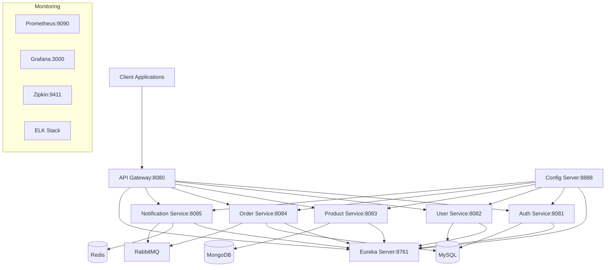

# Development Guide

This guide provides detailed information for developers working on the Microservices Platform.

## Table of Contents

- [Architecture Overview](#architecture-overview)
- [Service Architecture](#service-architecture)
- [Development Environment](#development-environment)
- [Building and Running](#building-and-running)
- [Testing Strategy](#testing-strategy)
- [Debugging](#debugging)
- [Performance Optimization](#performance-optimization)
- [Monitoring and Observability](#monitoring-and-observability)
- [Security Considerations](#security-considerations)
- [Best Practices](#best-practices)

## Architecture Overview

The Microservices Platform follows a distributed architecture pattern with the following components:

### Core Services
- **API Gateway**: Entry point for all client requests
- **Eureka Server**: Service discovery and registration
- **Config Server**: Centralized configuration management

### Business Services
- **Auth Service**: Authentication and authorization
- **User Service**: User management and profiles
- **Product Service**: Product catalog management
- **Order Service**: Order processing and management
- **Notification Service**: Email, SMS, and push notifications

### Infrastructure Components
- **MySQL**: Primary database for most services
- **MongoDB**: Document store for flexible data
- **Redis**: Caching and session storage
- **RabbitMQ**: Asynchronous messaging
- **Elasticsearch**: Search and analytics
- **Prometheus**: Metrics collection
- **Grafana**: Metrics visualization
- **Zipkin**: Distributed tracing



## Service Architecture

### Standard Service Structure

Each microservice follows a consistent structure:

```
service-name/
├── src/
│   ├── main/
│   │   ├── java/com/microservices/servicename/
│   │   │   ├── controller/          # REST endpoints
│   │   │   ├── service/            # Business logic
│   │   │   ├── repository/         # Data access
│   │   │   ├── model/              # Domain entities
│   │   │   ├── dto/                # Data transfer objects
│   │   │   ├── config/             # Configuration
│   │   │   ├── exception/          # Custom exceptions
│   │   │   └── util/               # Utilities
│   │   └── resources/
│   │       ├── application.yml     # Main configuration
│   │       ├── application-*.yml   # Environment-specific configs
│   │       └── db/migration/       # Database migrations
│   └── test/
│       ├── java/                   # Test classes
│       └── resources/              # Test resources
├── Dockerfile                      # Container definition
├── pom.xml                         # Maven configuration
└── README.md                       # Service documentation
```

### Service Communication

Services communicate using:

1. **Synchronous Communication**
   - REST APIs via HTTP
   - OpenFeign for inter-service calls
   - Circuit breakers with Resilience4j

2. **Asynchronous Communication**
   - RabbitMQ for event-driven messaging
   - Event sourcing for complex workflows

### Data Management

Each service owns its data:
- **Database per Service**: Each service has its own database
- **Eventual Consistency**: Accept eventual consistency where appropriate
- **Saga Pattern**: For distributed transactions
- **CQRS**: Command Query Responsibility Segregation where needed

## Development Environment

### Local Development Stack

The development stack includes:

| Component | Port | Purpose |
|-----------|------|---------|
| API Gateway | 8080 | Main entry point |
| Eureka Server | 8761 | Service discovery |
| Config Server | 8888 | Configuration |
| Auth Service | 8081 | Authentication |
| User Service | 8082 | User management |
| Product Service | 8083 | Product catalog |
| Order Service | 8084 | Order processing |
| Notification Service | 8085 | Notifications |
| MySQL | 3306 | Primary database |
| MongoDB | 27017 | Document store |
| Redis | 6379 | Cache |
| RabbitMQ | 5672/15672 | Messaging |
| Elasticsearch | 9200 | Search |
| Prometheus | 9090 | Metrics |
| Grafana | 3000 | Dashboards |
| Zipkin | 9411 | Tracing |

### Environment Variables

Key environment variables:

```bash
# Database Configuration
DB_HOST=localhost
DB_PORT=3306
DB_NAME=microservices
DB_USER=root
DB_PASSWORD=rootpassword

# Service Discovery
EUREKA_HOST=localhost
EUREKA_PORT=8761

# Configuration Server
CONFIG_SERVER_HOST=localhost
CONFIG_SERVER_PORT=8888

# Security
JWT_SECRET=your-secret-key
JWT_EXPIRATION=86400

# Redis
REDIS_HOST=localhost
REDIS_PORT=6379
REDIS_PASSWORD=redispassword

# RabbitMQ
RABBITMQ_HOST=localhost
RABBITMQ_PORT=5672
RABBITMQ_USER=admin
RABBITMQ_PASSWORD=adminpassword

# Monitoring
ZIPKIN_URL=http://localhost:9411
```

### IDE Configuration

#### IntelliJ IDEA Setup

1. **Import Project**
   - File → Open → Select project root
   - Choose "Import as Maven project"

2. **Configure Java SDK**
   - File → Project Structure → Project → Project SDK → Java 17

3. **Enable Annotation Processing**
   - Settings → Build → Compiler → Annotation Processors → Enable

4. **Install Recommended Plugins**
   - Spring Boot
   - Docker
   - Database Tools
   - SonarLint

#### VS Code Setup

1. **Install Extensions**
   - Extension Pack for Java
   - Spring Boot Extension Pack
   - Docker
   - SonarLint

2. **Configure Settings**
   - Use the provided `.vscode/settings.json`

## Building and Running

### Quick Start

```bash
# Setup development environment
make setup

# Build all services
make build

# Start infrastructure
make run-infra

# Start all services
make run

# Check status
make status
```

### Individual Service Management

```bash
# Build specific service
mvn -pl user-service clean package

# Run specific service
java -jar user-service/target/user-service-*.jar

# Run with profile
java -jar -Dspring.profiles.active=dev user-service/target/user-service-*.jar
```

### Docker Development

```bash
# Build Docker images
make build-docker

# Run with Docker Compose
docker-compose up -d

# View logs
docker-compose logs -f user-service
```

### Development Profiles

| Profile | Purpose | Database | Configuration |
|---------|---------|----------|--------------|
| dev | Local development | H2 in-memory | Relaxed security |
| test | Unit/Integration tests | H2 in-memory | Mock external services |
| docker | Docker containers | MySQL | Container networking |
| prod | Production | MySQL/MongoDB | Full security |

## Testing Strategy

### Test Pyramid

```
         /\
        /  \     E2E Tests (10%)
       /____\    
      /      \   Integration Tests (20%)
     /________\  
    /          \
   /____________\ Unit Tests (70%)
```

### Unit Testing

**Framework**: JUnit 5 + Mockito

```java
@ExtendWith(MockitoExtension.class)
class UserServiceTest {
    
    @Mock
    private UserRepository userRepository;
    
    @InjectMocks
    private UserService userService;
    
    @Test
    void shouldReturnUserWhenValidIdProvided() {
        // Given
        Long userId = 1L;
        User expectedUser = User.builder()
            .id(userId)
            .username("testuser")
            .build();
        when(userRepository.findById(userId)).thenReturn(Optional.of(expectedUser));
        
        // When
        User actualUser = userService.findById(userId);
        
        // Then
        assertThat(actualUser).isEqualTo(expectedUser);
    }
}
```

### Integration Testing

**Framework**: Spring Boot Test + TestContainers

```java
@SpringBootTest
@TestPropertySource(properties = {
    "spring.datasource.url=jdbc:h2:mem:testdb",
    "eureka.client.enabled=false"
})
class UserControllerIntegrationTest {
    
    @Autowired
    private TestRestTemplate restTemplate;
    
    @Test
    void shouldCreateUserSuccessfully() {
        // Given
        CreateUserRequest request = CreateUserRequest.builder()
            .username("testuser")
            .email("test@example.com")
            .build();
        
        // When
        ResponseEntity<UserDto> response = restTemplate.postForEntity(
            "/api/v1/users", request, UserDto.class);
        
        // Then
        assertThat(response.getStatusCode()).isEqualTo(HttpStatus.CREATED);
        assertThat(response.getBody().getUsername()).isEqualTo("testuser");
    }
}
```

### Contract Testing

**Framework**: Spring Cloud Contract

```groovy
Contract.make {
    description "should return user by id"
    request {
        method GET()
        url "/api/v1/users/1"
    }
    response {
        status OK()
        body([
            id: 1,
            username: "testuser",
            email: "test@example.com"
        ])
        headers {
            contentType(applicationJsonUtf8())
        }
    }
}
```

### Performance Testing

**Framework**: JMeter / Gatling

```bash
# Run performance tests
mvn gatling:test

# JMeter tests
jmeter -n -t performance-tests/load-test.jmx -l results.jtl
```

## Debugging

### Local Debugging

#### IntelliJ IDEA
1. Set breakpoints in code
2. Run service in debug mode
3. Use "Debug" configuration

#### VS Code
1. Use launch configuration in `.vscode/launch.json`
2. Set breakpoints
3. Press F5 to start debugging

### Remote Debugging

```bash
# Enable remote debugging
JAVA_OPTS="-agentlib:jdwp=transport=dt_socket,server=y,suspend=n,address=5005"

# Connect from IDE to localhost:5005
```

### Docker Debugging

```bash
# Run container with debug port exposed
docker run -p 8080:8080 -p 5005:5005 -e JAVA_OPTS="-agentlib:jdwp=transport=dt_socket,server=y,suspend=n,address=*:5005" user-service
```

### Common Issues and Solutions

#### Service Discovery Issues
```bash
# Check Eureka registration
curl http://localhost:8761/eureka/apps

# Check service health
curl http://localhost:8082/actuator/health
```

#### Database Connection Issues
```bash
# Check database connectivity
mysql -h localhost -u root -p microservices

# Check connection pool
curl http://localhost:8082/actuator/metrics/hikaricp.connections
```

#### Memory Issues
```bash
# Monitor memory usage
curl http://localhost:8082/actuator/metrics/jvm.memory.used

# Generate heap dump
jcmd <pid> GC.run_finalization
jcmd <pid> VM.gc
jmap -dump:format=b,file=heapdump.hprof <pid>
```

## Performance Optimization

### JVM Tuning

```bash
# Production JVM settings
JAVA_OPTS="-Xms1g -Xmx2g -XX:+UseG1GC -XX:MaxGCPauseMillis=200"
```

### Database Optimization

1. **Connection Pooling**
   ```yaml
   spring:
     datasource:
       hikari:
         maximum-pool-size: 20
         minimum-idle: 5
         connection-timeout: 30000
   ```

2. **Query Optimization**
   - Use proper indexes
   - Avoid N+1 queries
   - Use pagination for large datasets

3. **Caching Strategy**
   ```java
   @Cacheable(value = "users", key = "#id")
   public User findById(Long id) {
       return userRepository.findById(id).orElse(null);
   }
   ```

### Microservice Patterns

1. **Circuit Breaker**
   ```java
   @CircuitBreaker(name = "user-service", fallbackMethod = "fallbackGetUser")
   public User getUser(Long id) {
       return userServiceClient.getUser(id);
   }
   
   public User fallbackGetUser(Long id, Exception ex) {
       return User.builder().id(id).username("Unknown").build();
   }
   ```

2. **Bulkhead Pattern**
   ```yaml
   resilience4j:
     bulkhead:
       instances:
         user-service:
           max-concurrent-calls: 10
   ```

3. **Retry Pattern**
   ```yaml
   resilience4j:
     retry:
       instances:
         user-service:
           max-attempts: 3
           wait-duration: 1s
   ```

## Monitoring and Observability

### Health Checks

```yaml
management:
  endpoints:
    web:
      exposure:
        include: health,info,metrics,prometheus
  endpoint:
    health:
      show-details: always
```

### Custom Health Indicators

```java
@Component
public class DatabaseHealthIndicator implements HealthIndicator {
    
    @Override
    public Health health() {
        if (isDatabaseUp()) {
            return Health.up()
                .withDetail("database", "Available")
                .build();
        } else {
            return Health.down()
                .withDetail("database", "Unavailable")
                .build();
        }
    }
}
```

### Metrics Collection

```java
@RestController
public class UserController {
    
    private final MeterRegistry meterRegistry;
    private final Counter userCreationCounter;
    
    public UserController(MeterRegistry meterRegistry) {
        this.meterRegistry = meterRegistry;
        this.userCreationCounter = Counter.builder("users.created")
            .description("Number of users created")
            .register(meterRegistry);
    }
    
    @PostMapping("/users")
    public ResponseEntity<User> createUser(@RequestBody User user) {
        User savedUser = userService.save(user);
        userCreationCounter.increment();
        return ResponseEntity.ok(savedUser);
    }
}
```

### Distributed Tracing

```yaml
spring:
  sleuth:
    zipkin:
      base-url: http://localhost:9411
    sampler:
      probability: 1.0
```

### Logging

```yaml
logging:
  level:
    com.microservices: DEBUG
  pattern:
    console: "%d{yyyy-MM-dd HH:mm:ss} [%thread] %-5level [%X{traceId},%X{spanId}] %logger{36} - %msg%n"
```

## Security Considerations

### Authentication and Authorization

1. **JWT Token Validation**
   ```java
   @Configuration
   @EnableWebSecurity
   public class SecurityConfig {
       
       @Bean
       public SecurityFilterChain filterChain(HttpSecurity http) throws Exception {
           http
               .oauth2ResourceServer()
               .jwt();
           return http.build();
       }
   }
   ```

2. **Method-level Security**
   ```java
   @PreAuthorize("hasRole('ADMIN') or #userId == authentication.principal.id")
   public User getUserById(Long userId) {
       return userService.findById(userId);
   }
   ```

### Input Validation

```java
@RestController
@Validated
public class UserController {
    
    @PostMapping("/users")
    public ResponseEntity<User> createUser(@Valid @RequestBody CreateUserRequest request) {
        User user = userService.createUser(request);
        return ResponseEntity.ok(user);
    }
}

public class CreateUserRequest {
    @NotBlank(message = "Username is required")
    @Size(min = 3, max = 50, message = "Username must be between 3 and 50 characters")
    private String username;
    
    @Email(message = "Invalid email format")
    private String email;
}
```

### Sensitive Data Protection

1. **Configuration Encryption**
   ```yaml
   spring:
     cloud:
       config:
         server:
           encrypt:
             enabled: true
   ```

2. **Database Encryption**
   ```java
   @Entity
   public class User {
       @Column(name = "email")
       @Convert(converter = AttributeEncryptor.class)
       private String email;
   }
   ```

## Best Practices

### Code Quality

1. **SOLID Principles**
   - Single Responsibility Principle
   - Open/Closed Principle
   - Liskov Substitution Principle
   - Interface Segregation Principle
   - Dependency Inversion Principle

2. **Clean Code**
   - Meaningful names
   - Small functions
   - Clear comments
   - Consistent formatting

3. **Error Handling**
   ```java
   @ControllerAdvice
   public class GlobalExceptionHandler {
       
       @ExceptionHandler(UserNotFoundException.class)
       public ResponseEntity<ErrorResponse> handleUserNotFound(UserNotFoundException ex) {
           ErrorResponse error = ErrorResponse.builder()
               .code("USER_NOT_FOUND")
               .message(ex.getMessage())
               .timestamp(Instant.now())
               .build();
           return ResponseEntity.status(HttpStatus.NOT_FOUND).body(error);
       }
   }
   ```

### Performance Best Practices

1. **Database Access**
   - Use connection pooling
   - Implement proper caching
   - Optimize queries
   - Use batch operations

2. **Service Communication**
   - Implement circuit breakers
   - Use async communication where possible
   - Cache frequently accessed data
   - Implement proper retry strategies

3. **Resource Management**
   - Close resources properly
   - Use try-with-resources
   - Monitor memory usage
   - Implement proper garbage collection

### Deployment Best Practices

1. **Container Optimization**
   - Use multi-stage builds
   - Minimize image size
   - Run as non-root user
   - Implement health checks

2. **Configuration Management**
   - Externalize configuration
   - Use environment-specific configs
   - Secure sensitive data
   - Version configuration changes

3. **Monitoring and Alerting**
   - Implement comprehensive monitoring
   - Set up alerting rules
   - Monitor business metrics
   - Track performance trends

### Documentation

1. **API Documentation**
   - Use OpenAPI/Swagger
   - Provide examples
   - Document error codes
   - Keep documentation up to date

2. **Code Documentation**
   - Document complex logic
   - Use meaningful comments
   - Document public APIs
   - Maintain README files

This development guide provides a comprehensive overview of working with the Microservices Platform. For specific questions or issues, please refer to the troubleshooting section or contact the development team.