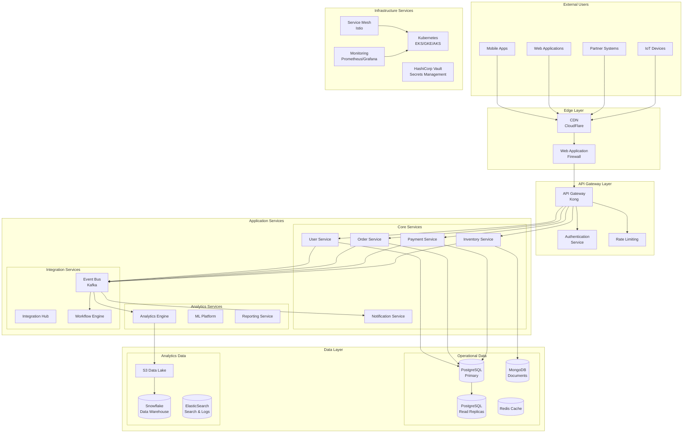
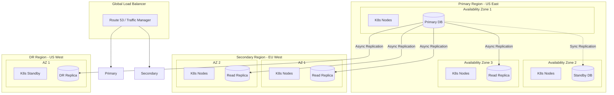
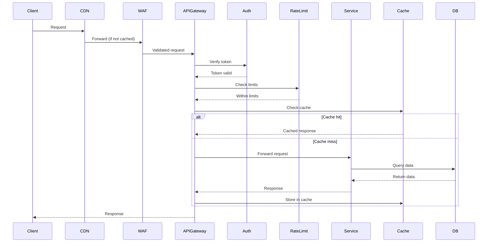
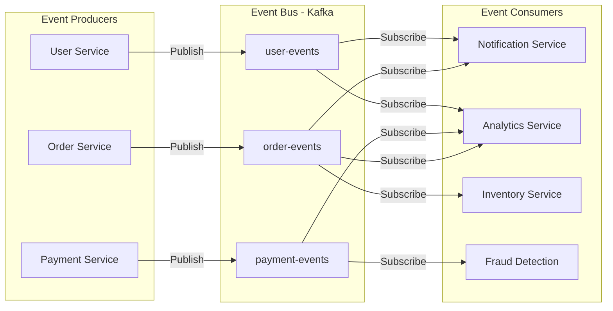
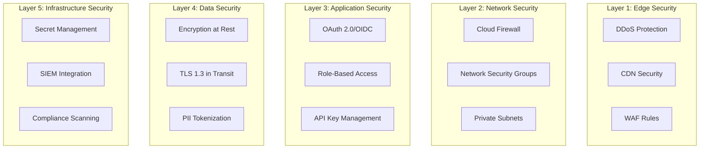
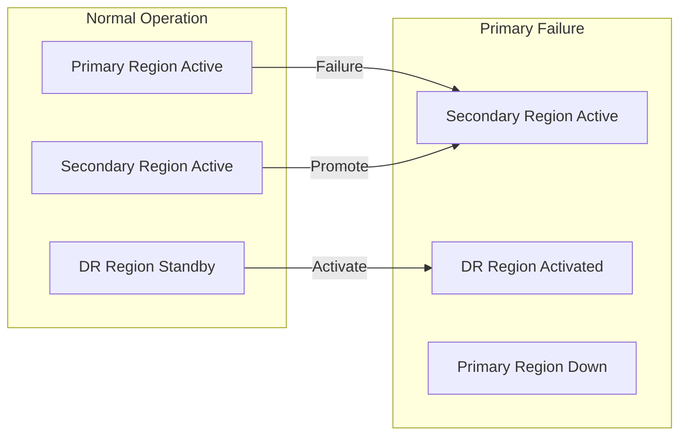

# High-Level System Architecture

## Executive Summary

This document presents the high-level architecture for the enterprise system, designed to meet demanding requirements for scalability, performance, security, and compliance. The architecture follows cloud-native principles with a microservices-based approach, ensuring flexibility and resilience while supporting business objectives of 25% revenue growth and 30% operational cost reduction.

## System Overview

### Architecture Principles

1. **Cloud-Native First**: Designed for distributed cloud environments
2. **API-First Design**: All functionality exposed through well-defined APIs
3. **Security by Design**: Zero-trust architecture with defense-in-depth
4. **Event-Driven**: Loosely coupled services communicating via events
5. **Domain-Driven Design**: Clear bounded contexts and service boundaries
6. **Infrastructure as Code**: All infrastructure defined declaratively

### High-Level Architecture Diagram



## Technology Stack Decisions

### Core Technologies

| Component | Technology | Rationale |
|-----------|------------|-----------|
| **Backend Language** | Go | High performance, excellent concurrency, low memory footprint |
| **API Framework** | Gin/Fiber | Lightweight, fast, production-ready |
| **Primary Database** | PostgreSQL 14+ | ACID compliance, JSON support, proven scalability |
| **Document Store** | MongoDB | Flexible schema for product catalogs, user preferences |
| **Cache Layer** | Redis Cluster | Sub-millisecond latency, data structures support |
| **Message Queue** | Apache Kafka | High throughput, distributed streaming, event sourcing |
| **Container Runtime** | Docker | Industry standard, excellent tooling |
| **Orchestration** | Kubernetes | Multi-cloud support, auto-scaling, self-healing |
| **Service Mesh** | Istio | Traffic management, security, observability |
| **API Gateway** | Kong | Plugin ecosystem, high performance, Kubernetes native |

### Supporting Technologies

| Component | Technology | Purpose |
|-----------|------------|---------|
| **Search** | ElasticSearch | Full-text search, log aggregation |
| **Analytics** | Snowflake | Cloud data warehouse, scalable analytics |
| **Monitoring** | Prometheus + Grafana | Metrics collection and visualization |
| **Tracing** | Jaeger | Distributed tracing |
| **Secrets** | HashiCorp Vault | Secret management, PKI |
| **CI/CD** | GitLab CI / GitHub Actions | Automated deployment pipelines |
| **IaC** | Terraform | Multi-cloud infrastructure provisioning |

## Deployment Architecture

### Multi-Region Strategy



### Kubernetes Cluster Architecture

```yaml
kubernetes_architecture:
  clusters:
    production:
      - name: "prod-us-east"
        region: "us-east-1"
        node_groups:
          - name: "system"
            instance_type: "c5.2xlarge"
            min_size: 3
            max_size: 6
            labels:
              workload: "system"
          - name: "application"
            instance_type: "c5.4xlarge"
            min_size: 6
            max_size: 50
            labels:
              workload: "application"
          - name: "data"
            instance_type: "r5.4xlarge"
            min_size: 3
            max_size: 12
            labels:
              workload: "data-intensive"
              
    staging:
      - name: "staging-us-east"
        region: "us-east-1"
        node_groups:
          - name: "general"
            instance_type: "t3.xlarge"
            min_size: 2
            max_size: 6
```

## Integration Architecture

### API Gateway Pattern



### Event-Driven Integration



### External System Integration

| System Type | Integration Method | Protocol | Security |
|-------------|-------------------|----------|----------|
| **ERP Systems** | REST API + Webhooks | HTTPS | OAuth 2.0 + mTLS |
| **Payment Gateways** | SDK + Callbacks | HTTPS | API Keys + Webhooks |
| **Shipping Providers** | REST API | HTTPS | API Keys |
| **Analytics Platforms** | Event Streaming | Kafka | SASL/SCRAM |
| **Cloud Storage** | Native SDKs | HTTPS | IAM Roles |

## Security Architecture Overview

### Defense in Depth



## Scalability Patterns

### Horizontal Scaling Strategy

1. **Service Level**
   - Stateless microservices
   - Kubernetes HPA based on CPU/Memory/Custom metrics
   - Service mesh for load balancing

2. **Data Level**
   - Read replicas for PostgreSQL
   - MongoDB sharding for document storage
   - Redis Cluster for cache distribution

3. **Message Level**
   - Kafka partition scaling
   - Consumer group auto-scaling
   - Topic-based load distribution

### Performance Optimization

| Layer | Optimization | Target |
|-------|--------------|--------|
| **CDN** | Global edge caching | <50ms latency globally |
| **API Gateway** | Response caching | <100ms p95 latency |
| **Service Layer** | Connection pooling | <20ms service calls |
| **Database** | Query optimization | <50ms query time |
| **Cache** | Redis clustering | <1ms cache hits |

## Disaster Recovery

### RTO/RPO Targets

- **Recovery Time Objective (RTO)**: < 1 hour
- **Recovery Point Objective (RPO)**: < 15 minutes

### DR Strategy



## Monitoring and Observability

### Four Pillars of Observability

1. **Metrics**
   - Prometheus for metrics collection
   - Grafana for visualization
   - Custom business metrics

2. **Logging**
   - Structured logging (JSON)
   - Centralized in ElasticSearch
   - Log correlation IDs

3. **Tracing**
   - Distributed tracing with Jaeger
   - End-to-end request tracking
   - Performance bottleneck identification

4. **Events**
   - Audit events in separate store
   - Security events to SIEM
   - Business events to analytics

## Cost Optimization

### Multi-Cloud Cost Management

1. **Resource Optimization**
   - Spot instances for batch processing
   - Reserved instances for baseline
   - Auto-scaling for demand variance

2. **Data Transfer Optimization**
   - Regional data locality
   - CDN for static content
   - Compression for API responses

3. **Storage Tiering**
   - Hot data in SSD storage
   - Warm data in standard storage
   - Cold data in glacier/archive

## Architecture Decision Records

### ADR-001: Microservices Architecture
- **Status**: Accepted
- **Context**: Need for independent scaling and deployment
- **Decision**: Adopt microservices with clear bounded contexts
- **Consequences**: Increased operational complexity, better scalability

### ADR-002: Go as Primary Language
- **Status**: Accepted
- **Context**: Need for high performance and concurrent processing
- **Decision**: Use Go for all backend services
- **Consequences**: Excellent performance, smaller team learning curve

### ADR-003: Event-Driven Architecture
- **Status**: Accepted
- **Context**: Need for loose coupling and real-time processing
- **Decision**: Implement event-driven patterns with Kafka
- **Consequences**: Better scalability, eventual consistency challenges

## Next Steps

1. Review and approve high-level architecture
2. Detail microservices boundaries
3. Define data models and schemas
4. Create API specifications
5. Plan proof-of-concept implementations
6. Establish development environments