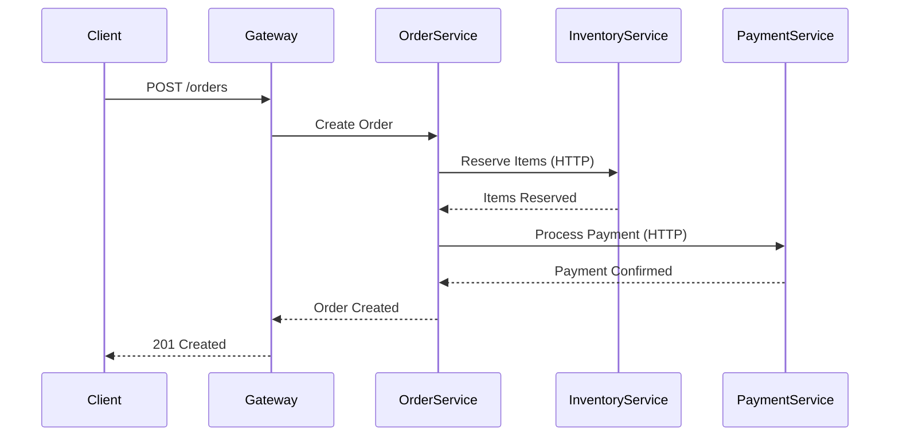
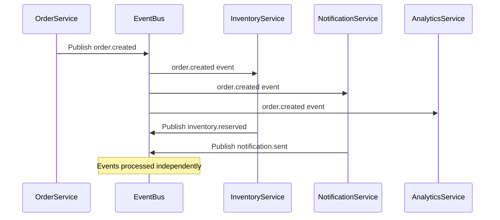
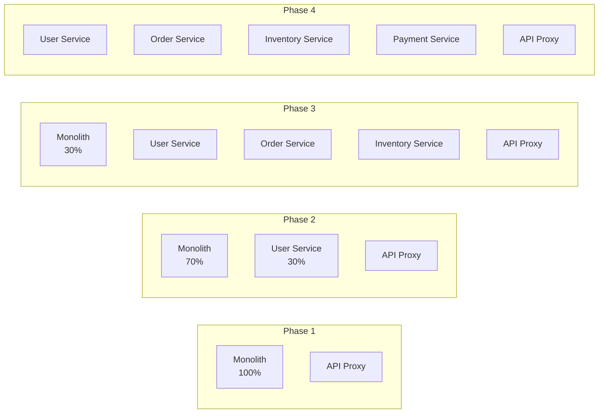

# Microservices Architecture Design

## Overview

This document details the microservices architecture for the enterprise system, defining service boundaries based on Domain-Driven Design (DDD) principles, establishing clear responsibilities, and specifying communication patterns.

## Domain Model

### Bounded Contexts

```mermaid
graph TB
    subgraph "User Management Context"
        UserAggregate[User Aggregate]
        ProfileAggregate[Profile Aggregate]
        AuthAggregate[Authentication Aggregate]
    end

    subgraph "Order Management Context"
        OrderAggregate[Order Aggregate]
        CartAggregate[Cart Aggregate]
        CheckoutAggregate[Checkout Aggregate]
    end

    subgraph "Inventory Context"
        ProductAggregate[Product Aggregate]
        StockAggregate[Stock Aggregate]
        WarehouseAggregate[Warehouse Aggregate]
    end

    subgraph "Payment Context"
        PaymentAggregate[Payment Aggregate]
        InvoiceAggregate[Invoice Aggregate]
        RefundAggregate[Refund Aggregate]
    end

    subgraph "Fulfillment Context"
        ShippingAggregate[Shipping Aggregate]
        TrackingAggregate[Tracking Aggregate]
        DeliveryAggregate[Delivery Aggregate]
    end

    subgraph "Customer Support Context"
        TicketAggregate[Ticket Aggregate]
        ChatAggregate[Chat Aggregate]
        KnowledgeAggregate[Knowledge Base]
    end

    subgraph "Analytics Context"
        MetricsAggregate[Metrics Aggregate]
        ReportsAggregate[Reports Aggregate]
        InsightsAggregate[Insights Aggregate]
    end

    subgraph "Notification Context"
        EmailAggregate[Email Aggregate]
        SMSAggregate[SMS Aggregate]
        PushAggregate[Push Notification]
    end
```



## Service Catalog

### Core Business Services

#### 1. User Service
```yaml
service:
  name: user-service
  port: 8001
  description: Manages user accounts, profiles, and preferences
  
responsibilities:
  - User registration and authentication
  - Profile management
  - Preference settings
  - Account security (password, MFA)
  - User search and directory
  
api_endpoints:
  - POST /api/v1/users
  - GET /api/v1/users/{id}
  - PUT /api/v1/users/{id}
  - DELETE /api/v1/users/{id}
  - POST /api/v1/users/authenticate
  - POST /api/v1/users/{id}/mfa/enable
  - GET /api/v1/users/search
  
events_published:
  - user.created
  - user.updated
  - user.deleted
  - user.authenticated
  - user.locked
  
events_consumed:
  - order.completed (for loyalty points)
  - payment.processed (for subscription status)
  
database:
  type: PostgreSQL
  schemas:
    - users
    - user_profiles
    - user_preferences
    - authentication_logs
    
dependencies:
  - auth-service (token validation)
  - notification-service (welcome emails)
```

#### 2. Order Service
```yaml
service:
  name: order-service
  port: 8002
  description: Handles order lifecycle from cart to completion
  
responsibilities:
  - Shopping cart management
  - Order creation and processing
  - Order status tracking
  - Order history
  - Return/refund initiation
  
api_endpoints:
  - POST /api/v1/carts
  - PUT /api/v1/carts/{id}/items
  - POST /api/v1/orders
  - GET /api/v1/orders/{id}
  - PUT /api/v1/orders/{id}/status
  - POST /api/v1/orders/{id}/cancel
  - GET /api/v1/users/{userId}/orders
  
events_published:
  - cart.created
  - cart.updated
  - order.created
  - order.confirmed
  - order.cancelled
  - order.completed
  
events_consumed:
  - payment.completed
  - shipping.dispatched
  - inventory.reserved
  - inventory.released
  
database:
  type: PostgreSQL
  schemas:
    - carts
    - cart_items
    - orders
    - order_items
    - order_status_history
```

#### 3. Inventory Service
```yaml
service:
  name: inventory-service
  port: 8003
  description: Manages product catalog and inventory levels
  
responsibilities:
  - Product catalog management
  - Inventory tracking
  - Stock reservations
  - Warehouse management
  - Reorder point monitoring
  
api_endpoints:
  - POST /api/v1/products
  - GET /api/v1/products/{id}
  - PUT /api/v1/products/{id}
  - GET /api/v1/products/search
  - POST /api/v1/inventory/reserve
  - POST /api/v1/inventory/release
  - GET /api/v1/inventory/availability
  
events_published:
  - product.created
  - product.updated
  - inventory.reserved
  - inventory.released
  - inventory.low_stock
  
events_consumed:
  - order.created (for reservation)
  - order.cancelled (for release)
  - shipping.completed (for deduction)
  
database:
  type: MongoDB
  collections:
    - products
    - inventory_levels
    - warehouses
    - stock_movements
    - reservations
```

#### 4. Payment Service
```yaml
service:
  name: payment-service
  port: 8004
  description: Processes payments and manages transactions
  
responsibilities:
  - Payment processing
  - Payment method management
  - Transaction recording
  - Refund processing
  - Fraud detection integration
  
api_endpoints:
  - POST /api/v1/payments
  - GET /api/v1/payments/{id}
  - POST /api/v1/payments/{id}/refund
  - POST /api/v1/payment-methods
  - DELETE /api/v1/payment-methods/{id}
  - GET /api/v1/transactions
  
events_published:
  - payment.initiated
  - payment.completed
  - payment.failed
  - refund.processed
  - fraud.detected
  
events_consumed:
  - order.created
  - order.cancelled
  
database:
  type: PostgreSQL
  schemas:
    - payments
    - payment_methods
    - transactions
    - refunds
    
external_integrations:
  - Stripe API
  - PayPal API
  - Fraud detection service
```

#### 5. Notification Service
```yaml
service:
  name: notification-service
  port: 8005
  description: Handles all customer communications
  
responsibilities:
  - Email notifications
  - SMS notifications
  - Push notifications
  - Notification templates
  - Delivery tracking
  
api_endpoints:
  - POST /api/v1/notifications/send
  - GET /api/v1/notifications/{id}
  - PUT /api/v1/notifications/templates/{id}
  - GET /api/v1/users/{userId}/notifications
  - PUT /api/v1/users/{userId}/preferences
  
events_published:
  - notification.sent
  - notification.delivered
  - notification.failed
  
events_consumed:
  - user.created
  - order.confirmed
  - payment.completed
  - shipping.dispatched
  - inventory.low_stock
  
database:
  type: MongoDB
  collections:
    - notification_templates
    - notification_logs
    - user_preferences
    - delivery_status
```

### Infrastructure Services

#### 6. Authentication Service
```yaml
service:
  name: auth-service
  port: 8010
  description: Handles authentication and authorization
  
responsibilities:
  - OAuth 2.0/OIDC implementation
  - Token generation and validation
  - Session management
  - API key management
  - Permission evaluation
  
api_endpoints:
  - POST /oauth2/authorize
  - POST /oauth2/token
  - POST /oauth2/revoke
  - GET /oauth2/userinfo
  - POST /api/v1/api-keys
  - GET /.well-known/openid-configuration
  
database:
  type: Redis + PostgreSQL
  data:
    - sessions (Redis)
    - refresh_tokens (PostgreSQL)
    - api_keys (PostgreSQL)
    - permissions (PostgreSQL)
```

#### 7. API Gateway Service
```yaml
service:
  name: api-gateway
  port: 8080
  description: Central entry point for all API requests
  
responsibilities:
  - Request routing
  - Rate limiting
  - Authentication verification
  - Request/response transformation
  - API versioning
  
features:
  - Circuit breaker
  - Request caching
  - Load balancing
  - SSL termination
  - CORS handling
  
configuration:
  rate_limits:
    - public: 100 req/min
    - authenticated: 1000 req/min
    - premium: 10000 req/min
```

### Analytics Services

#### 8. Analytics Service
```yaml
service:
  name: analytics-service
  port: 8020
  description: Real-time analytics and metrics processing
  
responsibilities:
  - Event stream processing
  - Metrics aggregation
  - Real-time dashboards
  - Anomaly detection
  - Predictive analytics
  
events_consumed:
  - "*.created"
  - "*.updated"
  - "*.deleted"
  - user.authenticated
  - payment.completed
  
data_pipeline:
  input: Kafka event streams
  processing: Apache Flink
  storage: Snowflake
  visualization: Grafana/Tableau
```

#### 9. Reporting Service
```yaml
service:
  name: reporting-service
  port: 8021
  description: Generates business reports and insights
  
responsibilities:
  - Scheduled report generation
  - Ad-hoc report creation
  - Report distribution
  - Data export functionality
  - KPI calculation
  
api_endpoints:
  - POST /api/v1/reports/generate
  - GET /api/v1/reports/{id}
  - GET /api/v1/reports/templates
  - POST /api/v1/reports/schedule
  - GET /api/v1/dashboards/{id}
  
database:
  read_from: Snowflake (analytics DB)
  write_to: PostgreSQL (report metadata)
```

## Inter-Service Communication Patterns

### Synchronous Communication



### Asynchronous Communication



### Communication Protocols

| Pattern | Use Case | Protocol | Example |
|---------|----------|----------|---------|
| **Request-Response** | Real-time queries | HTTP/gRPC | Get user profile |
| **Async Messaging** | Event notifications | Kafka | Order created event |
| **Pub-Sub** | Broadcast updates | Kafka/Redis | Price updates |
| **Request-Reply** | Async commands | Kafka | Process payment |

## Data Ownership and Synchronization

### Data Ownership Matrix

| Service | Owned Data | Read-Only Access | Events for Sync |
|---------|------------|------------------|-----------------|
| **User Service** | Users, Profiles | - | user.* events |
| **Order Service** | Orders, Carts | User details, Product info | order.* events |
| **Inventory Service** | Products, Stock | - | inventory.* events |
| **Payment Service** | Payments, Transactions | User info, Order info | payment.* events |

### Data Synchronization Patterns

#### 1. Event-Driven Sync
```yaml
pattern: event_driven_sync
example:
  when: user.updated
  inventory_service:
    action: update_cached_user_data
    data: [user_id, name, tier]
  order_service:
    action: update_user_reference
    data: [user_id, name]
```

#### 2. CQRS Pattern
```yaml
pattern: cqrs
write_model:
  service: order-service
  database: PostgreSQL
  events: order.created, order.updated
  
read_model:
  service: analytics-service
  database: Snowflake
  projection: order_analytics_view
  update_via: event_stream
```

#### 3. Saga Pattern
```yaml
pattern: distributed_saga
saga: order_fulfillment
steps:
  - service: order-service
    action: create_order
    compensate: cancel_order
    
  - service: inventory-service
    action: reserve_items
    compensate: release_items
    
  - service: payment-service
    action: process_payment
    compensate: refund_payment
    
  - service: shipping-service
    action: create_shipment
    compensate: cancel_shipment
```

## Service Mesh Configuration

### Istio Service Mesh Setup

```yaml
apiVersion: networking.istio.io/v1beta1
kind: VirtualService
metadata:
  name: order-service
spec:
  hosts:
  - order-service
  http:
  - match:
    - headers:
        api-version:
          exact: v2
    route:
    - destination:
        host: order-service
        subset: v2
      weight: 100
  - route:
    - destination:
        host: order-service
        subset: v1
      weight: 90
    - destination:
        host: order-service
        subset: v2
      weight: 10
```

### Circuit Breaker Configuration

```yaml
apiVersion: networking.istio.io/v1beta1
kind: DestinationRule
metadata:
  name: order-service
spec:
  host: order-service
  trafficPolicy:
    connectionPool:
      tcp:
        maxConnections: 100
      http:
        http1MaxPendingRequests: 50
        http2MaxRequests: 100
    outlierDetection:
      consecutiveErrors: 5
      interval: 30s
      baseEjectionTime: 30s
      maxEjectionPercent: 50
```

## Service Discovery and Registration

### Kubernetes Service Discovery

```yaml
apiVersion: v1
kind: Service
metadata:
  name: order-service
  labels:
    app: order-service
    version: v1
spec:
  selector:
    app: order-service
  ports:
  - port: 8002
    targetPort: 8002
    name: http
  - port: 9090
    targetPort: 9090
    name: metrics
```

### Health Check Configuration

```yaml
livenessProbe:
  httpGet:
    path: /health/live
    port: 8002
  initialDelaySeconds: 30
  periodSeconds: 10
  
readinessProbe:
  httpGet:
    path: /health/ready
    port: 8002
  initialDelaySeconds: 5
  periodSeconds: 5
```

## API Versioning Strategy

### Version Management

```yaml
versioning_strategy:
  method: URI_versioning
  format: /api/v{version}
  
  rules:
    - current_version: v1
      supported_versions: [v1]
      deprecation_notice: 6_months
      sunset_period: 12_months
      
  backward_compatibility:
    - add_optional_fields: allowed
    - remove_fields: requires_new_version
    - change_field_type: requires_new_version
    - change_behavior: requires_new_version
```

## Monitoring and Observability

### Service Metrics

```yaml
service_metrics:
  business_metrics:
    - orders_per_minute
    - average_order_value
    - payment_success_rate
    - inventory_turnover
    
  technical_metrics:
    - request_rate
    - error_rate
    - response_time_p99
    - cpu_usage
    - memory_usage
    
  sla_metrics:
    - availability: 99.9%
    - response_time: <100ms
    - error_rate: <0.1%
```

### Distributed Tracing

```yaml
tracing_configuration:
  provider: Jaeger
  sampling_rate: 0.1
  
  trace_points:
    - service_entry
    - database_queries
    - external_api_calls
    - message_publishing
    - cache_operations
```

## Security Considerations

### Service-to-Service Authentication

```yaml
security:
  mtls:
    enabled: true
    certificate_rotation: 30_days
    
  service_accounts:
    order_service:
      permissions:
        - inventory:read
        - payment:write
        - notification:publish
        
  api_keys:
    rotation: 90_days
    scopes:
      - service:internal
      - service:external
```

## Development Guidelines

### Service Template

```go
// Standard service structure
service/
├── cmd/
│   └── main.go
├── internal/
│   ├── api/
│   │   ├── handlers/
│   │   └── middleware/
│   ├── domain/
│   │   ├── entities/
│   │   └── services/
│   ├── infrastructure/
│   │   ├── database/
│   │   └── messaging/
│   └── interfaces/
│       ├── http/
│       └── grpc/
├── pkg/
│   └── shared/
├── configs/
├── deployments/
│   └── kubernetes/
├── Dockerfile
├── Makefile
└── README.md
```

### Code Standards

1. **API Design**: RESTful, OpenAPI 3.0 spec
2. **Error Handling**: Consistent error codes and messages
3. **Logging**: Structured JSON logs with correlation IDs
4. **Testing**: Minimum 80% code coverage
5. **Documentation**: Inline API documentation

## Migration Strategy

### Strangler Fig Pattern



## Service Level Objectives (SLOs)

### Core Services SLOs

| Service | Availability | Latency (p99) | Error Rate |
|---------|--------------|---------------|------------|
| User Service | 99.95% | <50ms | <0.1% |
| Order Service | 99.9% | <100ms | <0.5% |
| Payment Service | 99.99% | <200ms | <0.01% |
| Inventory Service | 99.9% | <75ms | <0.1% |

## Conclusion

This microservices architecture provides:
- Clear service boundaries based on business domains
- Scalable and resilient communication patterns
- Comprehensive monitoring and observability
- Strong security and data governance
- Clear migration path from existing systems

The design enables independent deployment, scaling, and evolution of services while maintaining system integrity and performance.