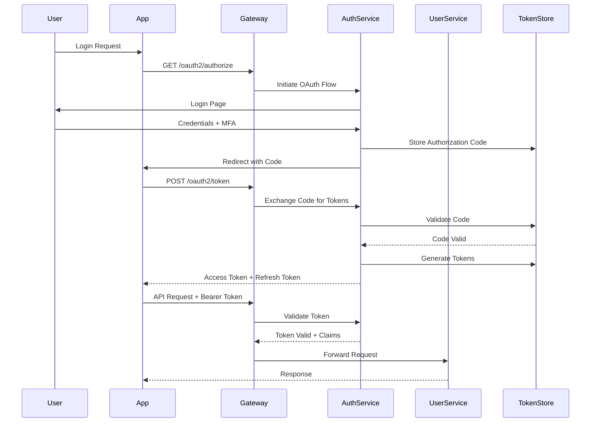
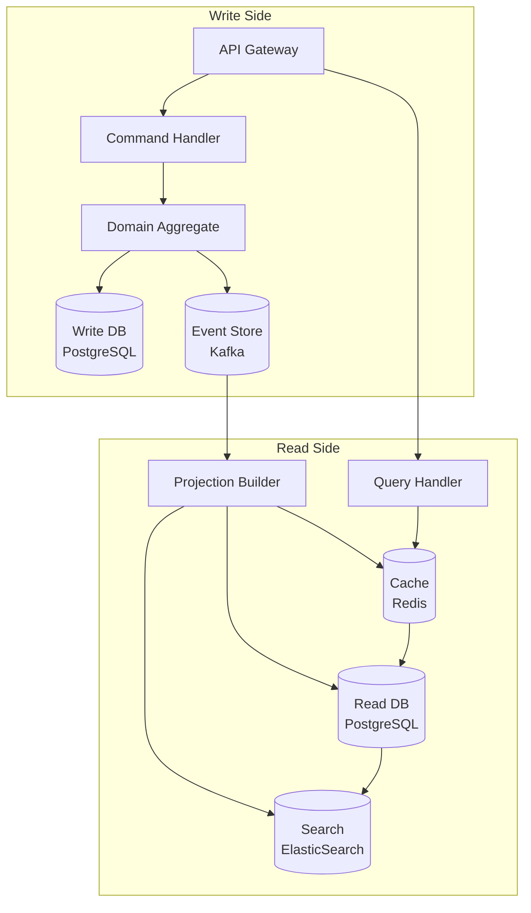
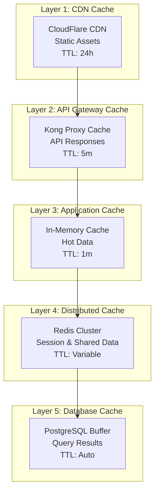
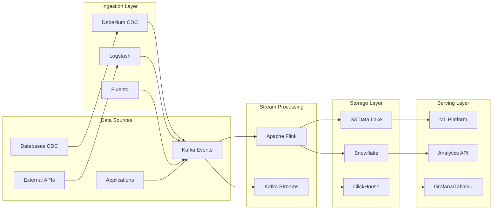

# Technical Architecture

## Overview

This document details the technical architecture components including API Gateway design, authentication/authorization flows, data architecture patterns, caching strategies, and message queue architecture for the enterprise system.

## API Gateway Architecture

### Kong API Gateway Configuration

```mermaid
graph TB
    subgraph "External Traffic"
        Mobile[Mobile Apps]
        Web[Web Apps]
        Partners[Partner APIs]
        IoT[IoT Devices]
    end

    subgraph "Kong API Gateway"
        subgraph "Plugins"
            RateLimit[Rate Limiting]
            Auth[Authentication]
            Transform[Request/Response Transform]
            Cache[Proxy Cache]
            Logging[Logging]
            CORS[CORS]
        end
        
        subgraph "Routes"
            UserRoute[/api/v*/users/*]
            OrderRoute[/api/v*/orders/*]
            ProductRoute[/api/v*/products/*]
            PaymentRoute[/api/v*/payments/*]
        end
    end

    subgraph "Backend Services"
        UserSvc[User Service]
        OrderSvc[Order Service]
        ProductSvc[Product Service]
        PaymentSvc[Payment Service]
    end

    Mobile --> RateLimit
    Web --> RateLimit
    Partners --> RateLimit
    IoT --> RateLimit

    RateLimit --> Auth
    Auth --> Transform
    Transform --> Cache
    Cache --> Logging
    Logging --> CORS

    CORS --> UserRoute
    CORS --> OrderRoute
    CORS --> ProductRoute
    CORS --> PaymentRoute

    UserRoute --> UserSvc
    OrderRoute --> OrderSvc
    ProductRoute --> ProductSvc
    PaymentRoute --> PaymentSvc
```

### API Gateway Configuration

```yaml
# Kong Gateway Configuration
_format_version: "2.1"
_transform: true

services:
  - name: user-service
    url: http://user-service.default.svc.cluster.local:8001
    protocol: http
    port: 8001
    retries: 5
    connect_timeout: 30000
    write_timeout: 60000
    read_timeout: 60000
    
routes:
  - name: user-routes
    service: user-service
    paths:
      - /api/v1/users
      - /api/v2/users
    methods:
      - GET
      - POST
      - PUT
      - DELETE
    strip_path: false
    preserve_host: true

plugins:
  # Global Rate Limiting
  - name: rate-limiting
    config:
      minute: 1000
      hour: 10000
      policy: cluster
      fault_tolerant: true
      hide_client_headers: false
      redis_host: redis-cluster.default.svc.cluster.local
      redis_port: 6379
      
  # Authentication
  - name: oauth2
    config:
      scopes:
        - user:read
        - user:write
        - admin
      mandatory_scope: true
      token_expiration: 3600
      refresh_token_ttl: 1209600
      enable_authorization_code: true
      enable_client_credentials: true
      
  # Request Transformation
  - name: request-transformer
    config:
      add:
        headers:
          - X-Request-ID:$(request_id)
          - X-Real-IP:$(remote_addr)
      remove:
        headers:
          - Authorization
          
  # Response Transformation  
  - name: response-transformer
    config:
      add:
        headers:
          - X-Kong-Upstream-Latency:$(upstream_latency)
          - X-Kong-Proxy-Latency:$(kong_latency)
          
  # Caching
  - name: proxy-cache
    config:
      response_code:
        - 200
        - 301
        - 404
      request_method:
        - GET
        - HEAD
      content_type:
        - application/json
        - application/json; charset=utf-8
      cache_ttl: 300
      strategy: memory
      memory:
        dictionary_name: api_cache
        
  # CORS
  - name: cors
    config:
      origins:
        - https://app.enterprise.com
        - https://admin.enterprise.com
      methods:
        - GET
        - POST
        - PUT
        - DELETE
        - OPTIONS
      headers:
        - Accept
        - Accept-Version
        - Content-Length
        - Content-MD5
        - Content-Type
        - Date
        - X-Auth-Token
        - X-Request-ID
      exposed_headers:
        - X-Auth-Token
        - X-Request-ID
      credentials: true
      max_age: 3600
```

### API Versioning and Routing

```yaml
# Version-based routing configuration
routes:
  # V1 Routes (Current)
  - name: users-v1
    service: user-service-v1
    paths:
      - /api/v1/users
    headers:
      API-Version: ["v1", "~*"]
      
  # V2 Routes (Beta)
  - name: users-v2
    service: user-service-v2
    paths:
      - /api/v2/users
    headers:
      API-Version: ["v2"]
      
  # Canary Deployment
  - name: users-canary
    service: user-service-canary
    paths:
      - /api/v1/users
    headers:
      X-Canary: ["true"]
    weight: 10  # 10% traffic
```

## Authentication and Authorization Architecture

### OAuth 2.0 / OpenID Connect Flow



### Token Management

```yaml
token_configuration:
  access_token:
    algorithm: RS256
    expiration: 900  # 15 minutes
    claims:
      - sub (user_id)
      - iss (issuer)
      - aud (audience)
      - exp (expiration)
      - iat (issued_at)
      - scope (permissions)
      - roles (user_roles)
      
  refresh_token:
    algorithm: HS512
    expiration: 604800  # 7 days
    rotation: true
    max_reuse: 1
    
  id_token:
    algorithm: RS256
    expiration: 3600  # 1 hour
    claims:
      - standard OIDC claims
      - custom user attributes
```

### RBAC Implementation

```go
// Role-Based Access Control Implementation
type Permission string
type Role string

const (
    // Permissions
    UserRead   Permission = "user:read"
    UserWrite  Permission = "user:write"
    OrderRead  Permission = "order:read"
    OrderWrite Permission = "order:write"
    AdminAll   Permission = "admin:*"
)

const (
    // Roles
    Customer     Role = "customer"
    Employee     Role = "employee"
    Manager      Role = "manager"
    Admin        Role = "admin"
    SuperAdmin   Role = "super_admin"
)

// Role-Permission Mapping
var RolePermissions = map[Role][]Permission{
    Customer: {
        UserRead,
        OrderRead,
    },
    Employee: {
        UserRead,
        UserWrite,
        OrderRead,
        OrderWrite,
    },
    Manager: {
        UserRead,
        UserWrite,
        OrderRead,
        OrderWrite,
        "report:read",
        "team:manage",
    },
    Admin: {
        AdminAll,
    },
}

// Policy Enforcement Point
func Authorize(userRoles []Role, requiredPermission Permission) bool {
    for _, role := range userRoles {
        permissions := RolePermissions[role]
        for _, perm := range permissions {
            if perm == requiredPermission || perm == AdminAll {
                return true
            }
            // Handle wildcard permissions
            if strings.HasSuffix(string(perm), ":*") {
                prefix := strings.TrimSuffix(string(perm), "*")
                if strings.HasPrefix(string(requiredPermission), prefix) {
                    return true
                }
            }
        }
    }
    return false
}
```

### Multi-Factor Authentication

```yaml
mfa_configuration:
  methods:
    totp:
      algorithm: SHA256
      digits: 6
      period: 30
      qr_code: true
      backup_codes: 10
      
    sms:
      provider: Twilio
      rate_limit: 3_per_hour
      code_length: 6
      expiration: 300  # 5 minutes
      
    webauthn:
      rp_name: "Enterprise Platform"
      rp_id: "enterprise.com"
      attestation: direct
      user_verification: required
      
  policies:
    enforcement:
      admin_users: mandatory
      high_value_transactions: mandatory
      sensitive_data_access: mandatory
      regular_users: optional
      
    grace_period:
      new_users: 30_days
      existing_users: 7_days
```

## Data Architecture

### CQRS Implementation



### Event Sourcing Architecture

```yaml
event_sourcing:
  event_store:
    technology: Apache Kafka
    retention: 7_days_hot_storage
    archive: S3_glacier_indefinite
    
  event_schema:
    version: "1.0"
    format: "Apache Avro"
    registry: "Confluent Schema Registry"
    
  event_structure:
    - event_id: UUID
    - aggregate_id: UUID
    - aggregate_type: string
    - event_type: string
    - event_version: integer
    - event_data: JSON
    - metadata:
        - user_id: UUID
        - correlation_id: UUID
        - causation_id: UUID
        - timestamp: ISO8601
        
  snapshot_strategy:
    frequency: every_100_events
    storage: PostgreSQL
    ttl: 30_days
```

### Event Examples

```json
// Order Created Event
{
  "event_id": "550e8400-e29b-41d4-a716-446655440001",
  "aggregate_id": "550e8400-e29b-41d4-a716-446655440002",
  "aggregate_type": "Order",
  "event_type": "OrderCreated",
  "event_version": 1,
  "event_data": {
    "customer_id": "550e8400-e29b-41d4-a716-446655440003",
    "items": [
      {
        "product_id": "PROD-001",
        "quantity": 2,
        "price": 99.99
      }
    ],
    "total_amount": 199.98,
    "currency": "USD"
  },
  "metadata": {
    "user_id": "550e8400-e29b-41d4-a716-446655440003",
    "correlation_id": "550e8400-e29b-41d4-a716-446655440004",
    "causation_id": "550e8400-e29b-41d4-a716-446655440005",
    "timestamp": "2024-01-15T10:30:00Z"
  }
}
```

### Database Sharding Strategy

```yaml
sharding_configuration:
  strategy: "hash_based"
  shard_key: "user_id"
  
  shards:
    - name: "shard_1"
      range: "0000-3FFF"
      primary: "postgres-shard1-primary"
      replicas:
        - "postgres-shard1-replica1"
        - "postgres-shard1-replica2"
        
    - name: "shard_2"
      range: "4000-7FFF"
      primary: "postgres-shard2-primary"
      replicas:
        - "postgres-shard2-replica1"
        - "postgres-shard2-replica2"
        
    - name: "shard_3"
      range: "8000-BFFF"
      primary: "postgres-shard3-primary"
      replicas:
        - "postgres-shard3-replica1"
        - "postgres-shard3-replica2"
        
    - name: "shard_4"
      range: "C000-FFFF"
      primary: "postgres-shard4-primary"
      replicas:
        - "postgres-shard4-replica1"
        - "postgres-shard4-replica2"
        
  routing:
    algorithm: "consistent_hashing"
    rebalancing: "automatic"
    migration: "online"
```

## Caching Architecture

### Multi-Layer Caching Strategy



### Redis Cluster Configuration

```yaml
redis_cluster:
  topology:
    masters: 3
    replicas_per_master: 2
    total_nodes: 9
    
  configuration:
    maxmemory: 8gb
    maxmemory-policy: allkeys-lru
    
  data_types:
    sessions:
      type: hash
      ttl: 3600  # 1 hour
      prefix: "session:"
      
    user_cache:
      type: hash
      ttl: 300  # 5 minutes
      prefix: "user:"
      
    product_cache:
      type: string
      ttl: 1800  # 30 minutes
      prefix: "product:"
      
    rate_limiting:
      type: string
      ttl: 60  # 1 minute
      prefix: "rate:"
      
    hot_data:
      type: sorted_set
      ttl: 86400  # 24 hours
      prefix: "trending:"
```

### Cache Invalidation Strategy

```go
// Cache Invalidation Patterns
type CacheInvalidator struct {
    redis *redis.ClusterClient
    kafka *kafka.Producer
}

// Pattern 1: Write-Through Cache
func (c *CacheInvalidator) WriteThrough(key string, value interface{}, ttl time.Duration) error {
    // Write to database first
    if err := db.Save(key, value); err != nil {
        return err
    }
    
    // Then update cache
    return c.redis.Set(ctx, key, value, ttl).Err()
}

// Pattern 2: Cache-Aside with Invalidation
func (c *CacheInvalidator) InvalidateOnUpdate(aggregateID string, eventType string) error {
    patterns := map[string][]string{
        "UserUpdated": {
            fmt.Sprintf("user:%s", aggregateID),
            fmt.Sprintf("user:profile:%s", aggregateID),
            "user:list:*",
        },
        "ProductUpdated": {
            fmt.Sprintf("product:%s", aggregateID),
            fmt.Sprintf("category:products:*"),
            "product:trending",
        },
    }
    
    if keys, ok := patterns[eventType]; ok {
        for _, pattern := range keys {
            if strings.Contains(pattern, "*") {
                // Delete keys matching pattern
                c.deleteByPattern(pattern)
            } else {
                // Delete specific key
                c.redis.Del(ctx, pattern)
            }
        }
    }
    
    // Publish invalidation event
    return c.publishInvalidationEvent(aggregateID, eventType)
}
```

## Message Queue Architecture

### Apache Kafka Configuration

```yaml
kafka_cluster:
  brokers:
    - kafka-1.enterprise.com:9092
    - kafka-2.enterprise.com:9092
    - kafka-3.enterprise.com:9092
    
  configuration:
    replication_factor: 3
    min_in_sync_replicas: 2
    default_partitions: 12
    log_retention_hours: 168  # 7 days
    compression_type: snappy
    
  topics:
    # User Events
    - name: user-events
      partitions: 12
      retention: 7d
      cleanup_policy: delete
      
    # Order Events
    - name: order-events
      partitions: 24
      retention: 30d
      cleanup_policy: delete
      
    # Payment Events
    - name: payment-events
      partitions: 12
      retention: 90d
      cleanup_policy: delete
      
    # Notification Commands
    - name: notification-commands
      partitions: 6
      retention: 1d
      cleanup_policy: delete
      
    # Analytics Stream
    - name: analytics-stream
      partitions: 48
      retention: 24h
      cleanup_policy: delete
      compression: lz4
```

### Message Patterns

#### 1. Event Streaming Pattern

```go
// Event Producer
type EventProducer struct {
    producer *kafka.Producer
    schema   *avro.Schema
}

func (p *EventProducer) PublishEvent(event DomainEvent) error {
    // Serialize event
    data, err := p.schema.Marshal(event)
    if err != nil {
        return err
    }
    
    // Produce to Kafka
    msg := &kafka.Message{
        TopicPartition: kafka.TopicPartition{
            Topic:     &event.AggregateType,
            Partition: kafka.PartitionAny,
        },
        Key:   []byte(event.AggregateID),
        Value: data,
        Headers: []kafka.Header{
            {Key: "event_type", Value: []byte(event.EventType)},
            {Key: "version", Value: []byte(event.Version)},
        },
    }
    
    return p.producer.Produce(msg, nil)
}

// Event Consumer
type EventConsumer struct {
    consumer *kafka.Consumer
    handlers map[string]EventHandler
}

func (c *EventConsumer) Start(ctx context.Context) error {
    for {
        select {
        case <-ctx.Done():
            return nil
        default:
            msg, err := c.consumer.ReadMessage(100 * time.Millisecond)
            if err != nil {
                continue
            }
            
            eventType := string(msg.Headers[0].Value)
            if handler, ok := c.handlers[eventType]; ok {
                if err := handler.Handle(msg.Value); err != nil {
                    // Handle error (retry, DLQ, etc.)
                    c.handleError(msg, err)
                }
            }
            
            c.consumer.CommitMessages(msg)
        }
    }
}
```

#### 2. Command/Query Pattern

```yaml
command_queue_pattern:
  commands:
    - name: ProcessPayment
      queue: payment-commands
      timeout: 30s
      retries: 3
      
    - name: SendNotification  
      queue: notification-commands
      timeout: 10s
      retries: 5
      
  implementation:
    request_topic: "{service}-commands"
    response_topic: "{service}-responses"
    correlation: via_headers
    timeout_handling: dead_letter_queue
```

### Dead Letter Queue Strategy

```yaml
dlq_configuration:
  topics:
    - source: order-events
      dlq: order-events-dlq
      max_retries: 3
      backoff: exponential
      
    - source: payment-events
      dlq: payment-events-dlq
      max_retries: 5
      backoff: linear
      
  monitoring:
    alert_threshold: 100  # messages
    alert_window: 5m
    auto_replay: false
```

## Service Mesh Configuration

### Istio Service Mesh

```yaml
# Virtual Service for Traffic Management
apiVersion: networking.istio.io/v1beta1
kind: VirtualService
metadata:
  name: order-service
spec:
  hosts:
  - order-service
  http:
  - match:
    - headers:
        end-user:
          exact: testing
    route:
    - destination:
        host: order-service
        subset: v2
  - route:
    - destination:
        host: order-service
        subset: v1
      weight: 95
    - destination:
        host: order-service
        subset: v2
      weight: 5
    retries:
      attempts: 3
      perTryTimeout: 30s
    timeout: 60s
```

### Circuit Breaker Configuration

```yaml
# Destination Rule with Circuit Breaker
apiVersion: networking.istio.io/v1beta1
kind: DestinationRule
metadata:
  name: order-service
spec:
  host: order-service
  trafficPolicy:
    connectionPool:
      tcp:
        maxConnections: 100
      http:
        http1MaxPendingRequests: 50
        http2MaxRequests: 100
        maxRequestsPerConnection: 2
    outlierDetection:
      consecutiveErrors: 5
      interval: 30s
      baseEjectionTime: 30s
      maxEjectionPercent: 50
      minHealthPercent: 50
  subsets:
  - name: v1
    labels:
      version: v1
  - name: v2
    labels:
      version: v2
```

## Data Pipeline Architecture

### Real-Time Analytics Pipeline



## Security Implementation

### Zero Trust Network Architecture

```yaml
zero_trust_implementation:
  principles:
    - verify_explicitly
    - least_privilege_access
    - assume_breach
    
  components:
    identity_verification:
      - continuous_authentication
      - device_trust_scoring
      - behavioral_analytics
      
    microsegmentation:
      network_policies:
        - deny_all_by_default
        - explicit_allow_rules
        - namespace_isolation
        
    encryption:
      in_transit:
        internal: mTLS
        external: TLS_1.3
      at_rest:
        database: TDE
        files: AES-256-GCM
        
    monitoring:
      - all_traffic_inspection
      - anomaly_detection
      - automated_response
```

## Disaster Recovery

### Backup and Recovery Strategy

```yaml
backup_strategy:
  databases:
    postgresql:
      full_backup: daily_midnight
      incremental: every_6_hours
      retention: 30_days
      location: cross_region_s3
      
    mongodb:
      snapshot: every_4_hours
      oplog_backup: continuous
      retention: 7_days
      
  message_queues:
    kafka:
      mirror_maker: real_time
      topic_backup: daily
      retention: 7_days
      
  files:
    user_uploads:
      sync: real_time
      versioning: enabled
      retention: 90_days
      
recovery_procedures:
  rto: 1_hour
  rpo: 15_minutes
  
  priorities:
    1: authentication_service
    2: payment_service
    3: order_service
    4: user_service
    5: other_services
```

## Performance Optimization

### Database Query Optimization

```sql
-- Optimized indexes for common queries
CREATE INDEX CONCURRENTLY idx_orders_user_created 
ON orders(user_id, created_at DESC) 
WHERE status != 'cancelled';

CREATE INDEX CONCURRENTLY idx_products_category_price 
ON products(category_id, price) 
WHERE active = true;

-- Materialized view for analytics
CREATE MATERIALIZED VIEW daily_sales_summary AS
SELECT 
    date_trunc('day', created_at) as sale_date,
    category_id,
    COUNT(*) as order_count,
    SUM(total_amount) as total_sales,
    AVG(total_amount) as avg_order_value
FROM orders o
JOIN order_items oi ON o.id = oi.order_id
JOIN products p ON oi.product_id = p.id
WHERE o.status = 'completed'
GROUP BY date_trunc('day', created_at), category_id;

-- Refresh strategy
CREATE INDEX ON daily_sales_summary(sale_date, category_id);
REFRESH MATERIALIZED VIEW CONCURRENTLY daily_sales_summary;
```

### Application Performance

```yaml
performance_optimizations:
  connection_pooling:
    database:
      min_connections: 10
      max_connections: 100
      idle_timeout: 30s
      
    redis:
      pool_size: 50
      timeout: 5s
      
  request_handling:
    concurrent_requests: 1000
    request_timeout: 30s
    graceful_shutdown: 30s
    
  resource_limits:
    cpu:
      requests: 500m
      limits: 2000m
    memory:
      requests: 512Mi
      limits: 2Gi
```

## Monitoring and Alerting

### Comprehensive Monitoring Stack

```yaml
monitoring_stack:
  metrics:
    prometheus:
      scrape_interval: 15s
      retention: 30d
      targets:
        - job: kubernetes-pods
        - job: node-exporter
        - job: kafka-exporter
        - job: postgres-exporter
        
  visualization:
    grafana:
      dashboards:
        - system_overview
        - service_health
        - business_metrics
        - cost_analysis
        
  alerting:
    rules:
      - name: high_error_rate
        expr: rate(http_requests_total{status=~"5.."}[5m]) > 0.05
        severity: critical
        
      - name: high_latency
        expr: histogram_quantile(0.95, http_request_duration_seconds) > 0.5
        severity: warning
        
      - name: pod_memory_usage
        expr: container_memory_usage_bytes / container_spec_memory_limit_bytes > 0.9
        severity: warning
```

## Development and Deployment

### CI/CD Pipeline

```yaml
pipeline:
  stages:
    - name: build
      steps:
        - checkout
        - unit_tests
        - build_image
        - scan_vulnerabilities
        
    - name: test
      steps:
        - integration_tests
        - contract_tests
        - performance_tests
        
    - name: staging
      steps:
        - deploy_staging
        - smoke_tests
        - security_scan
        
    - name: production
      steps:
        - canary_deploy
        - monitor_metrics
        - full_deploy
        - post_deploy_tests
```

## Conclusion

This technical architecture provides:
- Robust API gateway with comprehensive features
- Secure authentication and authorization
- Scalable data architecture with CQRS and Event Sourcing
- Multi-layer caching for optimal performance
- Reliable message queue architecture
- Comprehensive monitoring and observability

The architecture is designed to handle enterprise-scale requirements while maintaining flexibility for future growth and technological evolution.