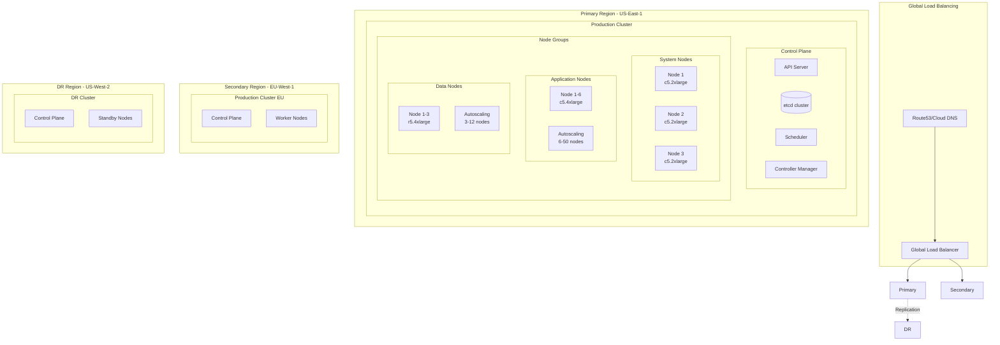
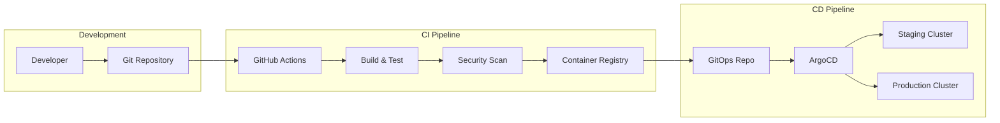
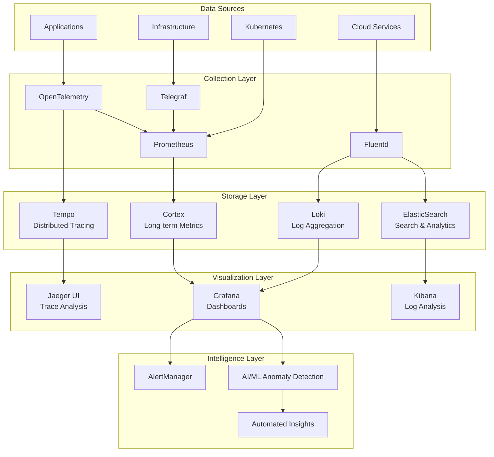
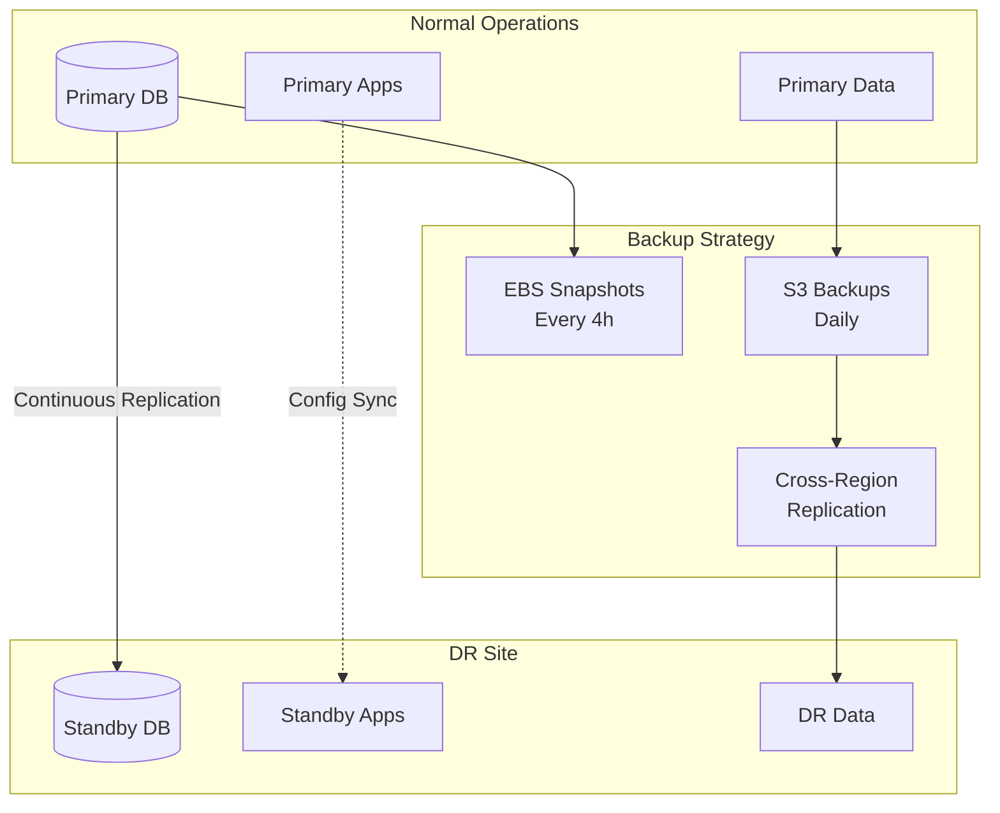

# Infrastructure Architecture

## Overview

This document details the infrastructure architecture including Kubernetes cluster design, CI/CD pipeline architecture, monitoring and observability stack, and disaster recovery planning for the enterprise system.

## Kubernetes Architecture

### Multi-Region Kubernetes Setup



### Kubernetes Cluster Configuration

```yaml
# EKS Cluster Configuration
apiVersion: eksctl.io/v1alpha5
kind: ClusterConfig

metadata:
  name: enterprise-prod-us-east-1
  region: us-east-1
  version: "1.28"

vpc:
  id: vpc-xxx
  cidr: 10.0.0.0/16
  nat:
    gateway: HighlyAvailable
  clusterEndpoints:
    publicAccess: false
    privateAccess: true

nodeGroups:
  # System node group for cluster services
  - name: system-nodes
    instanceType: c5.2xlarge
    desiredCapacity: 3
    minSize: 3
    maxSize: 6
    privateNetworking: true
    labels:
      workload: system
      node.kubernetes.io/lifecycle: normal
    taints:
      - key: system
        value: "true"
        effect: NoSchedule
    iam:
      withAddonPolicies:
        awsLoadBalancerController: true
        certManager: true
        ebs: true
        efs: true
        cloudWatch: true

  # Application node group
  - name: app-nodes
    instanceType: c5.4xlarge
    desiredCapacity: 6
    minSize: 6
    maxSize: 50
    privateNetworking: true
    labels:
      workload: application
      node.kubernetes.io/lifecycle: normal
    iam:
      withAddonPolicies:
        autoScaler: true
        cloudWatch: true

  # Data-intensive workload nodes
  - name: data-nodes
    instanceType: r5.4xlarge
    desiredCapacity: 3
    minSize: 3
    maxSize: 12
    privateNetworking: true
    volumeSize: 500
    volumeType: gp3
    labels:
      workload: data
      node.kubernetes.io/lifecycle: normal
    taints:
      - key: data-intensive
        value: "true"
        effect: NoSchedule

  # Spot instance node group for batch jobs
  - name: spot-nodes
    instancesDistribution:
      instanceTypes:
        - t3.large
        - t3a.large
      onDemandBaseCapacity: 0
      onDemandPercentageAboveBaseCapacity: 0
      spotInstancePools: 3
    desiredCapacity: 5
    minSize: 0
    maxSize: 20
    labels:
      workload: batch
      node.kubernetes.io/lifecycle: spot
    taints:
      - key: spot
        value: "true"
        effect: NoSchedule

addons:
  - name: vpc-cni
    version: latest
  - name: kube-proxy
    version: latest
  - name: coredns
    version: latest
  - name: aws-ebs-csi-driver
    version: latest

cloudWatch:
  clusterLogging:
    enableTypes: ["api", "audit", "authenticator", "controllerManager", "scheduler"]
    logRetentionInDays: 30
```

### Namespace Organization

```yaml
# Namespace structure
apiVersion: v1
kind: Namespace
metadata:
  name: production
  labels:
    env: production
    istio-injection: enabled
---
apiVersion: v1
kind: Namespace
metadata:
  name: staging
  labels:
    env: staging
    istio-injection: enabled
---
apiVersion: v1
kind: Namespace
metadata:
  name: development
  labels:
    env: development
    istio-injection: disabled
---
apiVersion: v1
kind: Namespace
metadata:
  name: infrastructure
  labels:
    env: infrastructure
    purpose: cluster-services
---
apiVersion: v1
kind: Namespace
metadata:
  name: monitoring
  labels:
    env: monitoring
    purpose: observability
---
apiVersion: v1
kind: Namespace
metadata:
  name: security
  labels:
    env: security
    purpose: security-tools
```

### Resource Quotas and Limits

```yaml
# Production namespace resource quota
apiVersion: v1
kind: ResourceQuota
metadata:
  name: production-quota
  namespace: production
spec:
  hard:
    requests.cpu: "1000"
    requests.memory: "2000Gi"
    limits.cpu: "2000"
    limits.memory: "4000Gi"
    persistentvolumeclaims: "100"
    services.loadbalancers: "10"
---
# Default resource limits
apiVersion: v1
kind: LimitRange
metadata:
  name: default-limits
  namespace: production
spec:
  limits:
  - default:
      cpu: "1000m"
      memory: "2Gi"
    defaultRequest:
      cpu: "100m"
      memory: "256Mi"
    min:
      cpu: "50m"
      memory: "128Mi"
    max:
      cpu: "4000m"
      memory: "8Gi"
    type: Container
```

### Network Policies

```yaml
# Default deny all ingress traffic
apiVersion: networking.k8s.io/v1
kind: NetworkPolicy
metadata:
  name: default-deny-ingress
  namespace: production
spec:
  podSelector: {}
  policyTypes:
  - Ingress
---
# Allow ingress from API Gateway
apiVersion: networking.k8s.io/v1
kind: NetworkPolicy
metadata:
  name: allow-from-api-gateway
  namespace: production
spec:
  podSelector:
    matchLabels:
      app: backend-service
  policyTypes:
  - Ingress
  ingress:
  - from:
    - namespaceSelector:
        matchLabels:
          name: infrastructure
      podSelector:
        matchLabels:
          app: api-gateway
    ports:
    - protocol: TCP
      port: 8080
---
# Allow egress to external services
apiVersion: networking.k8s.io/v1
kind: NetworkPolicy
metadata:
  name: allow-external-egress
  namespace: production
spec:
  podSelector: {}
  policyTypes:
  - Egress
  egress:
  - to:
    - namespaceSelector: {}
  - to:
    - ipBlock:
        cidr: 0.0.0.0/0
        except:
        - 169.254.169.254/32  # Block metadata service
```

## CI/CD Pipeline Architecture

### GitOps-Based Deployment



### CI Pipeline Configuration

```yaml
# .github/workflows/ci.yaml
name: CI Pipeline

on:
  push:
    branches: [main, develop]
  pull_request:
    branches: [main]

env:
  REGISTRY: ghcr.io
  IMAGE_NAME: ${{ github.repository }}

jobs:
  test:
    runs-on: ubuntu-latest
    strategy:
      matrix:
        service: [user-service, order-service, payment-service]
    steps:
      - uses: actions/checkout@v3
      
      - name: Set up Go
        uses: actions/setup-go@v4
        with:
          go-version: '1.21'
          
      - name: Run tests
        run: |
          cd services/${{ matrix.service }}
          go test -v -coverprofile=coverage.out ./...
          
      - name: Upload coverage
        uses: codecov/codecov-action@v3
        with:
          file: ./services/${{ matrix.service }}/coverage.out

  build:
    needs: test
    runs-on: ubuntu-latest
    strategy:
      matrix:
        service: [user-service, order-service, payment-service]
    steps:
      - uses: actions/checkout@v3
      
      - name: Set up Docker Buildx
        uses: docker/setup-buildx-action@v2
        
      - name: Log in to Container Registry
        uses: docker/login-action@v2
        with:
          registry: ${{ env.REGISTRY }}
          username: ${{ github.actor }}
          password: ${{ secrets.GITHUB_TOKEN }}
          
      - name: Build and push Docker image
        uses: docker/build-push-action@v4
        with:
          context: ./services/${{ matrix.service }}
          push: true
          tags: |
            ${{ env.REGISTRY }}/${{ env.IMAGE_NAME }}/${{ matrix.service }}:${{ github.sha }}
            ${{ env.REGISTRY }}/${{ env.IMAGE_NAME }}/${{ matrix.service }}:latest
          cache-from: type=gha
          cache-to: type=gha,mode=max

  security-scan:
    needs: build
    runs-on: ubuntu-latest
    strategy:
      matrix:
        service: [user-service, order-service, payment-service]
    steps:
      - name: Run Trivy vulnerability scanner
        uses: aquasecurity/trivy-action@master
        with:
          image-ref: ${{ env.REGISTRY }}/${{ env.IMAGE_NAME }}/${{ matrix.service }}:${{ github.sha }}
          format: 'sarif'
          output: 'trivy-results.sarif'
          
      - name: Upload Trivy scan results
        uses: github/codeql-action/upload-sarif@v2
        with:
          sarif_file: 'trivy-results.sarif'

  update-manifests:
    needs: [build, security-scan]
    if: github.ref == 'refs/heads/main'
    runs-on: ubuntu-latest
    steps:
      - name: Checkout GitOps repository
        uses: actions/checkout@v3
        with:
          repository: enterprise/k8s-manifests
          token: ${{ secrets.GITOPS_TOKEN }}
          
      - name: Update image tags
        run: |
          for service in user-service order-service payment-service; do
            sed -i "s|image: .*${service}:.*|image: ${{ env.REGISTRY }}/${{ env.IMAGE_NAME }}/${service}:${{ github.sha }}|g" \
              environments/staging/apps/${service}/deployment.yaml
          done
          
      - name: Commit and push changes
        run: |
          git config user.name github-actions
          git config user.email github-actions@github.com
          git add .
          git commit -m "Update image tags to ${{ github.sha }}"
          git push
```

### ArgoCD Configuration

```yaml
# ArgoCD Application for Production
apiVersion: argoproj.io/v1alpha1
kind: Application
metadata:
  name: enterprise-production
  namespace: argocd
  finalizers:
    - resources-finalizer.argocd.argoproj.io
spec:
  project: production
  source:
    repoURL: https://github.com/enterprise/k8s-manifests
    targetRevision: main
    path: environments/production
  destination:
    server: https://kubernetes.default.svc
    namespace: production
  syncPolicy:
    automated:
      prune: true
      selfHeal: true
      allowEmpty: false
    syncOptions:
    - Validate=true
    - CreateNamespace=false
    - PrunePropagationPolicy=foreground
    retry:
      limit: 5
      backoff:
        duration: 5s
        factor: 2
        maxDuration: 3m
---
# ArgoCD AppProject for Production
apiVersion: argoproj.io/v1alpha1
kind: AppProject
metadata:
  name: production
  namespace: argocd
spec:
  description: Production applications
  sourceRepos:
  - 'https://github.com/enterprise/k8s-manifests'
  destinations:
  - namespace: production
    server: https://kubernetes.default.svc
  clusterResourceWhitelist:
  - group: ''
    kind: Namespace
  namespaceResourceWhitelist:
  - group: '*'
    kind: '*'
  roles:
  - name: admin
    policies:
    - p, proj:production:admin, applications, *, production/*, allow
    groups:
    - enterprise:platform-team
```

### Progressive Delivery with Flagger

```yaml
# Canary deployment configuration
apiVersion: flagger.app/v1beta1
kind: Canary
metadata:
  name: order-service
  namespace: production
spec:
  targetRef:
    apiVersion: apps/v1
    kind: Deployment
    name: order-service
  progressDeadlineSeconds: 300
  service:
    port: 8002
    targetPort: 8002
    gateways:
    - public-gateway.istio-system.svc.cluster.local
    hosts:
    - order.enterprise.com
  analysis:
    interval: 30s
    threshold: 10
    maxWeight: 50
    stepWeight: 5
    metrics:
    - name: request-success-rate
      thresholdRange:
        min: 99
      interval: 30s
    - name: request-duration
      thresholdRange:
        max: 500
      interval: 30s
    webhooks:
    - name: load-test
      url: http://flagger-loadtester.test/
      timeout: 5s
      metadata:
        cmd: "hey -z 1m -q 10 -c 2 http://order-service-canary.production:8002/"
```

## Monitoring and Observability Stack

### Complete Observability Architecture



### Prometheus Configuration

```yaml
# Prometheus configuration
global:
  scrape_interval: 15s
  evaluation_interval: 15s
  external_labels:
    cluster: 'prod-us-east-1'
    region: 'us-east-1'

# Alerting configuration
alerting:
  alertmanagers:
    - static_configs:
        - targets:
          - alertmanager.monitoring.svc.cluster.local:9093

# Rule files
rule_files:
  - /etc/prometheus/rules/*.yaml

# Scrape configurations
scrape_configs:
  # Kubernetes API server
  - job_name: 'kubernetes-apiservers'
    kubernetes_sd_configs:
      - role: endpoints
    scheme: https
    tls_config:
      ca_file: /var/run/secrets/kubernetes.io/serviceaccount/ca.crt
    bearer_token_file: /var/run/secrets/kubernetes.io/serviceaccount/token
    relabel_configs:
      - source_labels: [__meta_kubernetes_namespace, __meta_kubernetes_service_name, __meta_kubernetes_endpoint_port_name]
        action: keep
        regex: default;kubernetes;https

  # Kubernetes nodes
  - job_name: 'kubernetes-nodes'
    kubernetes_sd_configs:
      - role: node
    scheme: https
    tls_config:
      ca_file: /var/run/secrets/kubernetes.io/serviceaccount/ca.crt
    bearer_token_file: /var/run/secrets/kubernetes.io/serviceaccount/token
    relabel_configs:
      - action: labelmap
        regex: __meta_kubernetes_node_label_(.+)

  # Kubernetes pods
  - job_name: 'kubernetes-pods'
    kubernetes_sd_configs:
      - role: pod
    relabel_configs:
      - source_labels: [__meta_kubernetes_pod_annotation_prometheus_io_scrape]
        action: keep
        regex: true
      - source_labels: [__meta_kubernetes_pod_annotation_prometheus_io_path]
        action: replace
        target_label: __metrics_path__
        regex: (.+)
      - source_labels: [__address__, __meta_kubernetes_pod_annotation_prometheus_io_port]
        action: replace
        regex: ([^:]+)(?::\d+)?;(\d+)
        replacement: $1:$2
        target_label: __address__

  # Service metrics
  - job_name: 'services'
    kubernetes_sd_configs:
      - role: service
    metrics_path: /metrics
    relabel_configs:
      - source_labels: [__meta_kubernetes_service_annotation_prometheus_io_scrape]
        action: keep
        regex: true
```

### Grafana Dashboards

```yaml
# ConfigMap for Grafana dashboards
apiVersion: v1
kind: ConfigMap
metadata:
  name: grafana-dashboards
  namespace: monitoring
data:
  system-overview.json: |
    {
      "dashboard": {
        "title": "System Overview",
        "panels": [
          {
            "title": "Request Rate",
            "targets": [{
              "expr": "sum(rate(http_requests_total[5m])) by (service)"
            }]
          },
          {
            "title": "Error Rate",
            "targets": [{
              "expr": "sum(rate(http_requests_total{status=~\"5..\"}[5m])) by (service)"
            }]
          },
          {
            "title": "Response Time (p95)",
            "targets": [{
              "expr": "histogram_quantile(0.95, sum(rate(http_request_duration_seconds_bucket[5m])) by (service, le))"
            }]
          },
          {
            "title": "CPU Usage",
            "targets": [{
              "expr": "sum(rate(container_cpu_usage_seconds_total[5m])) by (pod)"
            }]
          },
          {
            "title": "Memory Usage",
            "targets": [{
              "expr": "sum(container_memory_usage_bytes) by (pod)"
            }]
          }
        ]
      }
    }
```

### Alert Rules

```yaml
# Prometheus alert rules
apiVersion: v1
kind: ConfigMap
metadata:
  name: prometheus-rules
  namespace: monitoring
data:
  alerts.yaml: |
    groups:
      - name: service_alerts
        interval: 30s
        rules:
          - alert: HighErrorRate
            expr: |
              sum(rate(http_requests_total{status=~"5.."}[5m])) by (service)
              /
              sum(rate(http_requests_total[5m])) by (service)
              > 0.05
            for: 5m
            labels:
              severity: critical
              team: platform
            annotations:
              summary: "High error rate detected"
              description: "Service {{ $labels.service }} has error rate of {{ $value | humanizePercentage }}"

          - alert: HighLatency
            expr: |
              histogram_quantile(0.95,
                sum(rate(http_request_duration_seconds_bucket[5m])) by (service, le)
              ) > 0.5
            for: 5m
            labels:
              severity: warning
              team: platform
            annotations:
              summary: "High latency detected"
              description: "Service {{ $labels.service }} p95 latency is {{ $value | humanizeDuration }}"

          - alert: PodCrashLooping
            expr: |
              rate(kube_pod_container_status_restarts_total[15m]) > 0
            for: 5m
            labels:
              severity: critical
              team: platform
            annotations:
              summary: "Pod is crash looping"
              description: "Pod {{ $labels.namespace }}/{{ $labels.pod }} is crash looping"

      - name: infrastructure_alerts
        interval: 30s
        rules:
          - alert: NodeMemoryPressure
            expr: |
              (1 - (node_memory_MemAvailable_bytes / node_memory_MemTotal_bytes)) > 0.85
            for: 5m
            labels:
              severity: warning
              team: infrastructure
            annotations:
              summary: "Node memory pressure"
              description: "Node {{ $labels.instance }} memory usage is {{ $value | humanizePercentage }}"

          - alert: PersistentVolumeSpaceLow
            expr: |
              (1 - kubelet_volume_stats_available_bytes / kubelet_volume_stats_capacity_bytes) > 0.85
            for: 5m
            labels:
              severity: warning
              team: infrastructure
            annotations:
              summary: "PV space is running low"
              description: "PV {{ $labels.persistentvolumeclaim }} is {{ $value | humanizePercentage }} full"
```

### Distributed Tracing with OpenTelemetry

```yaml
# OpenTelemetry Collector configuration
apiVersion: v1
kind: ConfigMap
metadata:
  name: otel-collector-config
  namespace: monitoring
data:
  otel-collector-config.yaml: |
    receivers:
      otlp:
        protocols:
          grpc:
            endpoint: 0.0.0.0:4317
          http:
            endpoint: 0.0.0.0:4318
      prometheus:
        config:
          scrape_configs:
            - job_name: 'otel-collector'
              scrape_interval: 10s
              static_configs:
                - targets: ['0.0.0.0:8888']

    processors:
      batch:
        timeout: 10s
        send_batch_size: 1024
      memory_limiter:
        check_interval: 1s
        limit_mib: 1024
        spike_limit_mib: 256
      resource:
        attributes:
          - key: cluster
            value: prod-us-east-1
            action: insert
          - key: environment
            value: production
            action: insert

    exporters:
      tempo:
        endpoint: tempo.monitoring.svc.cluster.local:4317
        tls:
          insecure: true
      prometheus:
        endpoint: "0.0.0.0:8889"
      logging:
        loglevel: warn

    service:
      pipelines:
        traces:
          receivers: [otlp]
          processors: [memory_limiter, batch, resource]
          exporters: [tempo, logging]
        metrics:
          receivers: [otlp, prometheus]
          processors: [memory_limiter, batch, resource]
          exporters: [prometheus]
```

## Disaster Recovery Plan

### RTO/RPO Architecture



### Backup Configuration

```yaml
# Velero backup configuration
apiVersion: velero.io/v1
kind: Schedule
metadata:
  name: daily-backup
  namespace: velero
spec:
  schedule: "0 2 * * *"  # 2 AM daily
  template:
    includedNamespaces:
    - production
    - infrastructure
    excludedResources:
    - events
    - events.events.k8s.io
    ttl: 720h  # 30 days
    storageLocation: default
    volumeSnapshotLocations:
    - aws-us-east-1
---
apiVersion: velero.io/v1
kind: BackupStorageLocation
metadata:
  name: default
  namespace: velero
spec:
  provider: aws
  objectStorage:
    bucket: enterprise-velero-backups
    prefix: k8s-backups
  config:
    region: us-east-1
    s3ForcePathStyle: "false"
    s3Url: https://s3.amazonaws.com
---
apiVersion: velero.io/v1
kind: VolumeSnapshotLocation
metadata:
  name: aws-us-east-1
  namespace: velero
spec:
  provider: aws
  config:
    region: us-east-1
```

### Database Backup Strategy

```yaml
# PostgreSQL backup CronJob
apiVersion: batch/v1
kind: CronJob
metadata:
  name: postgres-backup
  namespace: production
spec:
  schedule: "0 */6 * * *"  # Every 6 hours
  concurrencyPolicy: Forbid
  successfulJobsHistoryLimit: 3
  failedJobsHistoryLimit: 3
  jobTemplate:
    spec:
      template:
        spec:
          containers:
          - name: postgres-backup
            image: postgres:14
            env:
            - name: PGPASSWORD
              valueFrom:
                secretKeyRef:
                  name: postgres-credentials
                  key: password
            command:
            - /bin/bash
            - -c
            - |
              DATE=$(date +%Y%m%d_%H%M%S)
              pg_dump -h postgres-primary -U postgres -d enterprise_db | \
                gzip | \
                aws s3 cp - s3://enterprise-db-backups/postgres/backup_${DATE}.sql.gz
              
              # Verify backup
              aws s3 ls s3://enterprise-db-backups/postgres/backup_${DATE}.sql.gz
              
              # Clean up old backups (keep 30 days)
              aws s3 ls s3://enterprise-db-backups/postgres/ | \
                awk '{print $4}' | \
                sort -r | \
                tail -n +31 | \
                xargs -I {} aws s3 rm s3://enterprise-db-backups/postgres/{}
          restartPolicy: OnFailure
```

### Disaster Recovery Procedures

```yaml
# DR Runbook
disaster_recovery_runbook:
  detection:
    - monitoring_alerts
    - health_check_failures
    - customer_reports
    
  assessment:
    - determine_scope
    - identify_affected_services
    - evaluate_data_loss
    
  communication:
    - notify_incident_commander
    - update_status_page
    - inform_stakeholders
    
  failover_procedure:
    primary_region_failure:
      1_verify_failure:
        - confirm_primary_unavailable
        - check_replication_lag
        
      2_prepare_dr_site:
        - verify_dr_resources
        - scale_up_capacity
        
      3_database_failover:
        - promote_standby_database
        - verify_data_integrity
        
      4_application_failover:
        - update_dns_records
        - deploy_applications
        - verify_connectivity
        
      5_validation:
        - run_smoke_tests
        - verify_critical_paths
        - monitor_performance
        
  recovery_steps:
    1_assess_primary:
      - determine_recovery_time
      - plan_restoration
      
    2_restore_primary:
      - fix_root_cause
      - restore_infrastructure
      - resync_databases
      
    3_failback:
      - plan_maintenance_window
      - reverse_failover_steps
      - validate_primary
      
    4_post_mortem:
      - document_incident
      - analyze_root_cause
      - update_procedures
```

### Chaos Engineering

```yaml
# Litmus Chaos experiments
apiVersion: litmuschaos.io/v1alpha1
kind: ChaosEngine
metadata:
  name: pod-failure-chaos
  namespace: production
spec:
  appinfo:
    appns: production
    applabel: app=order-service
    appkind: deployment
  engineState: active
  chaosServiceAccount: litmus-admin
  experiments:
    - name: pod-delete
      spec:
        components:
          env:
            - name: TOTAL_CHAOS_DURATION
              value: '60'
            - name: CHAOS_INTERVAL
              value: '10'
            - name: FORCE
              value: 'false'
---
apiVersion: litmuschaos.io/v1alpha1
kind: ChaosEngine
metadata:
  name: network-chaos
  namespace: production
spec:
  appinfo:
    appns: production
    applabel: app=payment-service
    appkind: deployment
  engineState: active
  chaosServiceAccount: litmus-admin
  experiments:
    - name: pod-network-latency
      spec:
        components:
          env:
            - name: NETWORK_INTERFACE
              value: 'eth0'
            - name: NETWORK_LATENCY
              value: '2000'  # 2 seconds
            - name: TOTAL_CHAOS_DURATION
              value: '300'   # 5 minutes
```

## Security and Compliance

### Pod Security Standards

```yaml
# Pod Security Policy
apiVersion: policy/v1beta1
kind: PodSecurityPolicy
metadata:
  name: restricted
spec:
  privileged: false
  allowPrivilegeEscalation: false
  requiredDropCapabilities:
    - ALL
  volumes:
    - 'configMap'
    - 'emptyDir'
    - 'projected'
    - 'secret'
    - 'downwardAPI'
    - 'persistentVolumeClaim'
  hostNetwork: false
  hostIPC: false
  hostPID: false
  runAsUser:
    rule: 'MustRunAsNonRoot'
  seLinux:
    rule: 'RunAsAny'
  supplementalGroups:
    rule: 'RunAsAny'
  fsGroup:
    rule: 'RunAsAny'
  readOnlyRootFilesystem: true
```

### Network Security

```yaml
# Calico network policies
apiVersion: projectcalico.org/v3
kind: GlobalNetworkPolicy
metadata:
  name: deny-egress-metadata
spec:
  selector: all()
  egress:
    - action: Deny
      protocol: TCP
      destination:
        nets:
          - 169.254.169.254/32
---
apiVersion: projectcalico.org/v3
kind: NetworkPolicy
metadata:
  name: allow-ingress-services
  namespace: production
spec:
  selector: role == 'backend'
  ingress:
    - action: Allow
      protocol: TCP
      source:
        selector: role == 'frontend'
      destination:
        ports:
          - 8080
  egress:
    - action: Allow
```

## Cost Optimization

### Resource Optimization

```yaml
# Vertical Pod Autoscaler
apiVersion: autoscaling.k8s.io/v1
kind: VerticalPodAutoscaler
metadata:
  name: order-service-vpa
  namespace: production
spec:
  targetRef:
    apiVersion: apps/v1
    kind: Deployment
    name: order-service
  updatePolicy:
    updateMode: "Auto"
  resourcePolicy:
    containerPolicies:
    - containerName: order-service
      minAllowed:
        cpu: 100m
        memory: 128Mi
      maxAllowed:
        cpu: 2
        memory: 4Gi
---
# Horizontal Pod Autoscaler
apiVersion: autoscaling/v2
kind: HorizontalPodAutoscaler
metadata:
  name: order-service-hpa
  namespace: production
spec:
  scaleTargetRef:
    apiVersion: apps/v1
    kind: Deployment
    name: order-service
  minReplicas: 3
  maxReplicas: 50
  metrics:
  - type: Resource
    resource:
      name: cpu
      target:
        type: Utilization
        averageUtilization: 70
  - type: Resource
    resource:
      name: memory
      target:
        type: Utilization
        averageUtilization: 80
  - type: Pods
    pods:
      metric:
        name: http_requests_per_second
      target:
        type: AverageValue
        averageValue: "1000"
  behavior:
    scaleDown:
      stabilizationWindowSeconds: 300
      policies:
      - type: Percent
        value: 10
        periodSeconds: 60
    scaleUp:
      stabilizationWindowSeconds: 0
      policies:
      - type: Percent
        value: 100
        periodSeconds: 15
      - type: Pods
        value: 4
        periodSeconds: 15
      selectPolicy: Max
```

### Spot Instance Configuration

```yaml
# Karpenter provisioner for spot instances
apiVersion: karpenter.sh/v1alpha5
kind: Provisioner
metadata:
  name: spot-provisioner
spec:
  requirements:
    - key: karpenter.sh/capacity-type
      operator: In
      values: ["spot"]
    - key: kubernetes.io/arch
      operator: In
      values: ["amd64"]
    - key: node.kubernetes.io/instance-type
      operator: In
      values:
        - t3.large
        - t3a.large
        - t3.xlarge
        - t3a.xlarge
  limits:
    resources:
      cpu: 1000
      memory: 4000Gi
  provider:
    subnetSelector:
      karpenter.sh/discovery: enterprise-prod
    securityGroupSelector:
      karpenter.sh/discovery: enterprise-prod
    instanceStorePolicy: RAID0
  ttlSecondsAfterEmpty: 30
  ttlSecondsUntilExpired: 604800  # 7 days
```

## Conclusion

This infrastructure architecture provides:
- Highly available multi-region Kubernetes setup
- Comprehensive CI/CD pipeline with GitOps
- Complete observability stack for monitoring
- Robust disaster recovery capabilities
- Security-first approach with compliance
- Cost optimization strategies

The infrastructure is designed to support enterprise-scale workloads while maintaining flexibility, security, and cost-effectiveness.