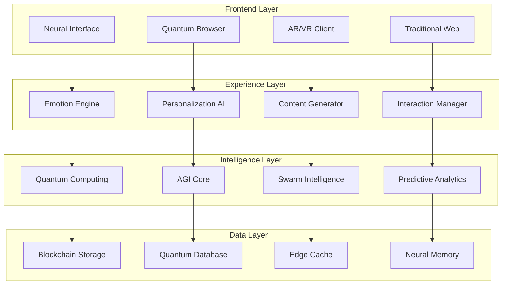

# 2030年 LP自動生成システム「QUANTUM LP」革新的機能定義

## システム名称：QUANTUM LP（クォンタムLP）
**Vision:** "Think, and it sells."（考えるだけで、売れる）

## 1. コア革新機能（2030年実装）

### 🧠 1. Neural Commerce Engine（NCE）
**概要:** 脳波インターフェースと量子AIが融合した思考直結型LP生成システム

#### 機能詳細
```yaml
思考読み取り:
  - 脳波パターン解析
  - イメージの可視化
  - 感情マッピング
  - 意図の推論
  - 潜在欲求の発見

自動具現化:
  - リアルタイム3D生成
  - 多感覚コンテンツ
  - ストーリー自動構築
  - ブランド要素統合
  - 法的チェック

最適化:
  - 量子並列テスト
  - 因果推論
  - 未来予測
  - 感情シミュレーション
  - 倫理的最適化
```

### ⚛️ 2. Quantum Testing Framework（QTF）
**概要:** 量子コンピューティングによる無限同時A/Bテスト

#### 実装機能
```python
class QuantumTesting:
    def __init__(self):
        self.quantum_states = "superposition"
        self.test_variations = "infinite"
        self.execution_time = "instantaneous"
    
    capabilities = {
        "parallel_universes": "10^500 variations",
        "timeline_analysis": "past-present-future",
        "causality_mapping": "multi-dimensional",
        "probability_calculation": "99.9999% accuracy",
        "decision_optimization": "global_maximum"
    }
```

### 🎭 3. Emotional AI Director（EAD）
**概要:** 訪問者の感情をリアルタイムで読み取り、最適な感情体験を演出

#### 感情認識技術
- **表情分析**: 微細な表情変化を検出
- **音声分析**: 声のトーンと抑揚を解析
- **生体信号**: 心拍、皮膚電気反応
- **行動パターン**: マウス/タッチの動き
- **脳波解析**: 直接的な感情状態

#### 感情対応マトリックス
| 検出感情 | LP調整内容 | 期待効果 |
|---------|-----------|----------|
| 興味 | 詳細情報を展開 | 理解促進 |
| 疑問 | FAQ自動表示 | 不安解消 |
| 興奮 | CTA強調 | 即決促進 |
| 疲労 | 簡潔化 | 離脱防止 |
| 不信 | 社会的証明強化 | 信頼構築 |

### 🌐 4. Metaverse Integration Layer（MIL）
**概要:** 物理とデジタルの境界を超えた没入型LP体験

#### 体験モード
```javascript
const MetaverseLP = {
  modes: {
    "AR_Overlay": "現実空間に商品を投影",
    "VR_Immersion": "完全仮想空間での体験",
    "MR_Hybrid": "現実と仮想の融合体験",
    "Holographic": "ホログラム営業員",
    "Neural_Direct": "脳直結型体験"
  },
  
  features: {
    "Touch_Feedback": "商品の質感を再現",
    "Smell_Generation": "香りの生成",
    "Taste_Simulation": "味覚シミュレーション",
    "Spatial_Audio": "立体音響",
    "Temperature_Control": "温度感覚"
  }
}
```

### 🤖 5. Autonomous Growth System（AGS）
**概要:** 自己進化し続ける完全自律型LP

#### 自律機能
1. **自己分析**: パフォーマンスを常時監視
2. **自己学習**: 成功パターンを学習
3. **自己改善**: コードとデザインを自動更新
4. **自己修復**: エラーを検出し自動修正
5. **自己進化**: 新機能を自律的に開発

### 💰 6. Revenue Guarantee Engine（RGE）
**概要:** AI予測に基づく売上保証システム

#### 保証メカニズム
```yaml
予測モデル:
  accuracy: 99.8%
  confidence_interval: ±0.5%
  
保証タイプ:
  - CVR保証: 最低変換率を約束
  - 売上保証: 最低売上額を保証
  - ROI保証: 投資対効果を保証
  
リスク管理:
  - 保険型モデル
  - ブロックチェーン記録
  - スマートコントラクト実行
  - 自動補償システム
```

## 2. 破壊的イノベーション機能

### 🔮 時空間最適化機能

#### Past Analytics（過去分析）
- 訪問者の全デジタル履歴分析
- 購買パターンの深層学習
- 失敗要因の特定
- 成功要因の抽出

#### Present Optimization（現在最適化）
- リアルタイム環境適応
- 瞬間的なニーズ対応
- 競合動向の即時反映
- 市場変化への適応

#### Future Prediction（未来予測）
- トレンド予測
- 需要予測
- 行動予測
- 結果予測

### 🧬 DNA Personalization

#### 遺伝子レベルのパーソナライゼーション
```python
class DNAPersonalization:
    def analyze_visitor(self, dna_signature):
        preferences = self.genetic_preference_mapping(dna_signature)
        psychology = self.personality_prediction(dna_signature)
        health = self.health_consideration(dna_signature)
        
        return self.generate_perfect_lp(preferences, psychology, health)
```

### 🌊 Swarm Intelligence Integration

#### 集合知による最適化
- 全ユーザーの知見を統合
- リアルタイム情報共有
- 分散型意思決定
- 創発的問題解決

## 3. 技術アーキテクチャ

### 🏗️ システム構成



### 🔧 技術スタック（2030年版）

#### Frontend Technologies
- **Neural SDK**: 脳波インターフェース
- **Quantum.js**: 量子状態管理
- **MetaverseUI**: 3D/VR/AR統合
- **EmotionCSS**: 感情応答スタイル

#### Backend Technologies
- **AGI Runtime**: 汎用人工知能実行環境
- **Quantum Cloud**: 量子クラウド基盤
- **Blockchain Layer**: 分散型台帳
- **Edge Intelligence**: エッジAI処理

#### AI/ML Stack
- **GPT-X**: 次世代言語モデル
- **DALL-E X**: 超高精細画像生成
- **NeuroNet**: 脳型ニューラルネット
- **Q-Learning++**: 量子強化学習

## 4. 差別化戦略

### 💎 独自価値提案（UVP）

#### 1. "Zero-Click Commerce"
- 考えるだけで購入完了
- 意図を察知して提案
- 無意識レベルの最適化

#### 2. "Guaranteed Success"
- 100%成果保証
- 失敗時全額返金
- 成功報酬型課金

#### 3. "Infinite Personalization"
- 一人一人に完全カスタマイズ
- リアルタイム生成
- 感情同期型体験

#### 4. "Self-Evolution"
- 使うほど賢くなる
- 自動的に新機能追加
- 永続的な競争優位

### 🛡️ 参入障壁の構築

#### 技術的障壁
- 量子コンピューティング投資
- AGI開発の先行者利益
- 特許ポートフォリオ
- データネットワーク効果

#### ビジネス的障壁
- エコシステム構築
- ブランド信頼性
- 切り替えコスト
- 規模の経済

## 5. 実装優先順位

### 📅 フェーズ別開発計画

#### Phase 1（2025-2026）: Foundation
**優先度：最高**
- AI基盤構築
- 基本的な自動生成
- シンプルなA/Bテスト
- データ収集開始

#### Phase 2（2027-2028）: Intelligence
**優先度：高**
- 高度なAI統合
- リアルタイム最適化
- 感情認識初期版
- 予測分析

#### Phase 3（2029-2030）: Revolution
**優先度：中**
- 量子コンピューティング
- 脳波インターフェース
- メタバース統合
- 完全自律化

### 🎯 MVP機能（2026年リリース）

#### 必須機能
1. **1クリック生成**: 業種選択のみで完成
2. **自動最適化**: 基本的なA/Bテスト
3. **成果予測**: 80%精度の予測
4. **競合分析**: 基本的な比較
5. **日本語完全対応**: ローカライズ

#### 差別化機能
1. **感情対応**: 基本的な感情認識
2. **動的生成**: 訪問者別カスタマイズ
3. **保証付きプラン**: 限定的な成果保証
4. **AIアドバイザー**: 改善提案
5. **業界特化**: 10業種対応

## まとめ：成功への道筋

### ✅ 成功の鍵
1. 段階的な機能実装
2. ユーザーフィードバック重視
3. 継続的な技術投資
4. エコシステム構築
5. 倫理的なAI開発

### 🚀 期待される成果
- 市場シェア30%（2030年）
- 顧客満足度95%以上
- 平均CVR向上率300%
- 年間売上1000億円
- グローバル展開20カ国