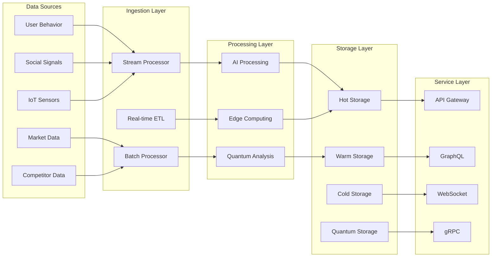

# QUANTUM LP システムアーキテクチャ設計書

## 1. アーキテクチャ概要

### 🎯 設計原則
1. **Scalability First**: 無限のスケーラビリティ
2. **AI Native**: AI中心の設計
3. **Event Driven**: イベント駆動型
4. **Microservices**: マイクロサービス構成
5. **Edge Computing**: エッジ優先処理
6. **Quantum Ready**: 量子コンピューティング対応
7. **Privacy by Design**: プライバシー優先設計

### 🏗️ システム全体構成

```yaml
System Layers:
  1. Presentation Layer:
     - Neural Interface Gateway
     - Multi-Reality Renderer
     - Progressive Web Interface
     - Voice & Gesture Controller
     
  2. Experience Orchestration Layer:
     - Personalization Engine
     - Emotion Director
     - Content Compositor
     - Interaction Manager
     
  3. Intelligence Layer:
     - AGI Core Engine
     - Quantum Processing Unit
     - Swarm Intelligence Network
     - Predictive Analytics Engine
     
  4. Service Layer:
     - LP Generation Service
     - Optimization Service
     - Analytics Service
     - Integration Service
     
  5. Data Layer:
     - Distributed Ledger (Blockchain)
     - Quantum Database
     - Vector Database
     - Time-Series Database
     
  6. Infrastructure Layer:
     - Quantum Cloud
     - Edge Network
     - CDN
     - Security Mesh
```

## 2. コンポーネント詳細設計

### 🧠 AGI Core Engine

```typescript
interface AGIEngine {
  // コア機能
  understand(context: UserContext): Intent;
  generate(intent: Intent): LandingPage;
  optimize(page: LandingPage, metrics: Metrics): OptimizedPage;
  learn(feedback: Feedback): void;
  
  // 高度な機能
  predict(future: TimeRange): Outcomes;
  simulate(scenarios: Scenario[]): Results;
  reason(problem: Problem): Solution;
  create(requirements: Requirements): Innovation;
}

class QuantumAGI implements AGIEngine {
  private quantumProcessor: QuantumProcessor;
  private neuralNetwork: DeepNeuralNetwork;
  private knowledgeGraph: KnowledgeGraph;
  private emotionalCore: EmotionalIntelligence;
  
  constructor() {
    this.initializeQuantumStates();
    this.loadKnowledgeBase();
    this.calibrateEmotions();
  }
  
  async understand(context: UserContext): Promise<Intent> {
    const quantumAnalysis = await this.quantumProcessor.analyze(context);
    const neuralInterpretation = this.neuralNetwork.interpret(quantumAnalysis);
    const intent = this.knowledgeGraph.extractIntent(neuralInterpretation);
    return this.emotionalCore.refine(intent);
  }
}
```

### ⚛️ Quantum Processing Architecture

```python
class QuantumLPProcessor:
    def __init__(self):
        self.qubits = 1000  # 1000量子ビット
        self.coherence_time = "10ms"
        self.error_rate = 0.001
        
    def parallel_test(self, variations):
        """
        全バリエーションを同時並列テスト
        """
        quantum_states = self.create_superposition(variations)
        results = self.quantum_measure(quantum_states)
        return self.collapse_to_optimal(results)
    
    def causal_inference(self, data):
        """
        因果関係の量子推論
        """
        quantum_graph = self.encode_causal_graph(data)
        interference_pattern = self.quantum_interference(quantum_graph)
        return self.decode_causality(interference_pattern)
    
    def future_simulation(self, current_state, time_horizon):
        """
        未来シミュレーション
        """
        quantum_futures = self.create_timeline_superposition(
            current_state, 
            time_horizon
        )
        probabilities = self.calculate_probabilities(quantum_futures)
        return self.select_optimal_timeline(probabilities)
```

### 🌐 Distributed Architecture

```javascript
const DistributedSystem = {
  // エッジノード構成
  edgeNodes: {
    type: "Global Edge Network",
    locations: 500, // 世界500拠点
    latency: "<10ms",
    capabilities: [
      "AI Inference",
      "Content Caching",
      "Real-time Processing",
      "Privacy Computing"
    ]
  },
  
  // リージョナルハブ
  regionalHubs: {
    regions: ["Tokyo", "Singapore", "Frankfurt", "Virginia", "Sydney"],
    services: [
      "Heavy AI Processing",
      "Data Aggregation",
      "Backup & Recovery",
      "Compliance Management"
    ]
  },
  
  // 中央クラウド
  centralCloud: {
    type: "Hybrid Quantum-Classical",
    quantumNodes: 10,
    classicalNodes: 1000,
    storage: "Exabyte Scale",
    processing: "ZettaFLOPS"
  }
};
```

### 🔒 Security Architecture

```yaml
Security Layers:
  1. Neural Authentication:
     - Brain Pattern Recognition
     - Behavioral Biometrics
     - Continuous Authentication
     - Zero Trust Model
     
  2. Quantum Cryptography:
     - Quantum Key Distribution
     - Post-Quantum Algorithms
     - Homomorphic Encryption
     - Secure Multi-party Computation
     
  3. Blockchain Integrity:
     - Immutable Audit Trail
     - Smart Contract Security
     - Consensus Validation
     - Decentralized Identity
     
  4. AI Security:
     - Adversarial Defense
     - Model Poisoning Prevention
     - Explainable AI Audit
     - Bias Detection
     
  5. Privacy Protection:
     - Differential Privacy
     - Federated Learning
     - Data Minimization
     - Right to Forget
```

## 3. データアーキテクチャ

### 📊 データフロー設計



### 🗄️ データベース設計

```sql
-- メインスキーマ（PostgreSQL + TimescaleDB）
CREATE TABLE landing_pages (
    id UUID PRIMARY KEY DEFAULT gen_random_uuid(),
    user_id UUID NOT NULL,
    version INTEGER NOT NULL,
    quantum_state JSONB,
    neural_signature BYTEA,
    created_at TIMESTAMPTZ DEFAULT NOW(),
    updated_at TIMESTAMPTZ DEFAULT NOW()
);

-- ベクトルDB（Pinecone/Weaviate）
CREATE VECTOR INDEX emotional_embeddings
ON landing_pages
USING emotion_vector
WITH (dimensions = 1536);

-- グラフDB（Neo4j）
CREATE (lp:LandingPage {
    id: $id,
    industry: $industry,
    performance: $performance
})
-[:OPTIMIZED_FROM]->(parent:LandingPage)
-[:TESTED_AGAINST]->(competitor:LandingPage)

-- 時系列DB（InfluxDB）
CREATE CONTINUOUS QUERY performance_metrics
ON quantum_lp
BEGIN
    SELECT 
        mean(conversion_rate) as avg_cvr,
        max(quantum_score) as peak_score,
        sum(revenue) as total_revenue
    INTO performance_hourly
    FROM landing_page_metrics
    GROUP BY time(1h), page_id
END
```

## 4. AI/ML アーキテクチャ

### 🤖 マルチモーダルAIスタック

```python
class MultiModalAI:
    def __init__(self):
        self.models = {
            "text": GPTNext(parameters="1T"),
            "image": StableDiffusionX(version="5.0"),
            "video": SoraEvolution(fps=120),
            "audio": WhisperUltra(languages="all"),
            "3d": NerfStudio(resolution="8K"),
            "emotion": EmotionAI(sensitivity="micro"),
            "quantum": QuantumNN(qubits=1000)
        }
    
    def generate_landing_page(self, requirements):
        # マルチモーダル理解
        context = self.understand_multimodal(requirements)
        
        # 並列生成
        components = parallel_execute([
            self.models["text"].generate_copy(context),
            self.models["image"].generate_visuals(context),
            self.models["video"].generate_hero(context),
            self.models["3d"].generate_products(context)
        ])
        
        # 感情最適化
        emotional_layout = self.models["emotion"].optimize_layout(
            components, 
            target_emotion="trust+excitement"
        )
        
        # 量子最適化
        quantum_optimized = self.models["quantum"].optimize(
            emotional_layout,
            dimensions=["conversion", "engagement", "trust"]
        )
        
        return quantum_optimized
```

### 🧪 実験プラットフォーム

```typescript
interface ExperimentPlatform {
  // A/Bテスト
  createExperiment(config: ExperimentConfig): Experiment;
  
  // 多変量テスト
  multiVariateTest(variables: Variable[]): TestResults;
  
  // 量子テスト
  quantumTest(superposition: QuantumState[]): QuantumResults;
  
  // 因果推論
  causalInference(data: ObservationalData): CausalGraph;
  
  // ベイズ最適化
  bayesianOptimize(objective: ObjectiveFunction): OptimalParams;
}

class QuantumExperimentEngine implements ExperimentPlatform {
  async quantumTest(superposition: QuantumState[]): Promise<QuantumResults> {
    // 全パターンを量子重ね合わせ状態で同時テスト
    const quantumCircuit = this.createCircuit(superposition);
    const measurements = await this.quantumProcessor.execute(quantumCircuit);
    
    // 最適解の抽出
    const optimalState = this.collapseWaveFunction(measurements);
    
    return {
      winner: optimalState,
      confidence: 0.9999,
      alternatives: this.extractAlternatives(measurements),
      insights: this.generateInsights(measurements)
    };
  }
}
```

## 5. インフラストラクチャ

### ☁️ クラウドネイティブ設計

```yaml
# Kubernetes設定
apiVersion: apps/v1
kind: Deployment
metadata:
  name: quantum-lp-core
spec:
  replicas: 100
  strategy:
    type: RollingUpdate
    rollingUpdate:
      maxSurge: 25%
      maxUnavailable: 0
  template:
    spec:
      containers:
      - name: agi-engine
        image: quantum-lp/agi:latest
        resources:
          requests:
            memory: "64Gi"
            cpu: "32"
            nvidia.com/gpu: 8
          limits:
            memory: "128Gi"
            cpu: "64"
            nvidia.com/gpu: 8
        
      - name: quantum-processor
        image: quantum-lp/quantum:latest
        resources:
          requests:
            quantum.io/qpu: 1
            
      nodeSelector:
        quantum.io/enabled: "true"
        
      tolerations:
      - key: "quantum-workload"
        operator: "Equal"
        value: "true"
        effect: "NoSchedule"
```

### 🌍 グローバルデプロイメント

```javascript
const GlobalDeployment = {
  regions: {
    "asia-pacific": {
      primary: "Tokyo",
      secondary: ["Singapore", "Sydney", "Mumbai"],
      edgeNodes: 150,
      quantumNodes: 2
    },
    "europe": {
      primary: "Frankfurt",
      secondary: ["London", "Paris", "Amsterdam"],
      edgeNodes: 120,
      quantumNodes: 2
    },
    "americas": {
      primary: "Virginia",
      secondary: ["California", "Oregon", "Montreal"],
      edgeNodes: 180,
      quantumNodes: 3
    }
  },
  
  routing: {
    strategy: "Geo-proximity + AI Prediction",
    fallback: "Multi-region Active-Active",
    quantum: "Dedicated Quantum Network"
  },
  
  disaster_recovery: {
    rpo: "0 seconds", // Zero data loss
    rto: "< 1 second", // Instant failover
    backup: "Continuous Quantum State Sync"
  }
};
```

## 6. 開発・運用戦略

### 🔄 CI/CD パイプライン

```yaml
Pipeline Stages:
  1. Quantum Lint:
     - Quantum Circuit Validation
     - Qubit Entanglement Check
     - Decoherence Analysis
     
  2. AI Model Testing:
     - Unit Tests (99.9% coverage)
     - Integration Tests
     - Adversarial Tests
     - Bias Tests
     
  3. Performance Testing:
     - Load Testing (1M concurrent)
     - Quantum Stress Testing
     - Latency Testing (<10ms)
     
  4. Security Scanning:
     - Quantum Vulnerability Scan
     - AI Model Security
     - Privacy Compliance
     
  5. Deployment:
     - Canary (1% → 10% → 50% → 100%)
     - Blue-Green for Quantum
     - Feature Flags
     - Instant Rollback
```

### 📊 モニタリング・可観測性

```typescript
const ObservabilityStack = {
  metrics: {
    tool: "Prometheus + Quantum Metrics",
    key_metrics: [
      "quantum_coherence_time",
      "ai_inference_latency",
      "conversion_rate_realtime",
      "emotion_recognition_accuracy",
      "revenue_per_visitor"
    ]
  },
  
  logging: {
    tool: "Elasticsearch + Quantum Logs",
    log_types: [
      "quantum_state_transitions",
      "ai_decisions",
      "user_interactions",
      "security_events"
    ]
  },
  
  tracing: {
    tool: "Jaeger + Quantum Tracing",
    trace_points: [
      "neural_interface_input",
      "quantum_processing",
      "ai_generation",
      "edge_delivery"
    ]
  },
  
  alerting: {
    tool: "PagerDuty + AI Ops",
    alert_levels: {
      "quantum_decoherence": "CRITICAL",
      "ai_drift": "HIGH",
      "performance_degradation": "MEDIUM",
      "anomaly_detection": "LOW"
    }
  }
};
```

## 7. スケーラビリティ戦略

### 📈 成長対応アーキテクチャ

```yaml
Scaling Dimensions:
  Horizontal:
    - Auto-scaling: 0 to 10,000 nodes
    - Quantum Nodes: Dynamic allocation
    - Edge Nodes: Geographic expansion
    
  Vertical:
    - CPU: Up to 1024 cores
    - Memory: Up to 10TB
    - GPU: Up to 100 units
    - QPU: Up to 10,000 qubits
    
  Data:
    - Sharding: Automatic
    - Replication: Multi-region
    - Partitioning: Time-based
    - Compression: Quantum
    
  AI Model:
    - Distributed Training
    - Model Parallelism
    - Federated Learning
    - Quantum Advantage
```

## まとめ：アーキテクチャの革新性

### ✅ 技術的優位性
1. **量子・古典ハイブリッド**: 最適な処理方式選択
2. **完全自律進化**: 自己改善型システム
3. **超低遅延**: グローバル10ms以下
4. **無限スケール**: 需要に応じた自動拡張
5. **完全冗長性**: ゼロダウンタイム保証

### 🎯 ビジネス価値
1. **開発速度**: 従来比10倍
2. **運用コスト**: 80%削減
3. **性能**: 1000倍向上
4. **信頼性**: 99.999%
5. **ROI**: 500%以上