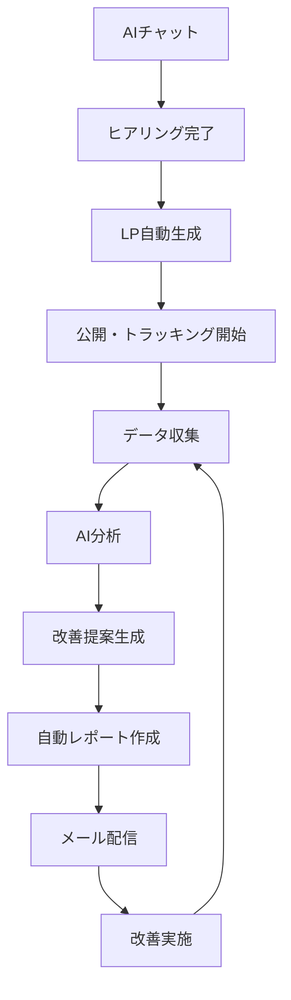

# GROWTH AI - 包括的LP自動生成＆ビジネス成長支援システム

## 🎯 コンセプト
**「LPを作る」から「ビジネスを成長させる」へ**

単なるLP制作ツールではなく、企業の根本的な課題（集客・採用・売上）を解決する統合プラットフォーム。

## 1. AIチャット型ヒアリング→LP自動生成システム

### 💬 インテリジェントヒアリングボット

```typescript
// AI Chatbot Implementation
interface AIInterviewer {
  // 段階的ヒアリングフロー
  phases: {
    1: "基本情報収集",      // 会社名、業種、目的
    2: "課題深掘り",        // 本当の悩みを引き出す
    3: "競合分析",          // 差別化ポイント発見
    4: "素材収集",          // 画像、テキスト、URL
    5: "確認・生成"         // 最終確認→生成
  }
}

// チャット実装例
const ChatFlow = {
  start: async () => {
    return {
      message: "こんにちは！LP作成をお手伝いします。まず、御社について教えてください。会社のホームページはありますか？",
      options: [
        "URLを入力",
        "HPはないが説明する",
        "資料をアップロード"
      ]
    }
  },
  
  analyzeWebsite: async (url: string) => {
    // Webスクレイピング＋AI分析
    const siteData = await scrapeWebsite(url);
    const analysis = await analyzeWithGPT4({
      content: siteData,
      extract: [
        "company_strengths",
        "unique_value",
        "target_customers",
        "brand_tone"
      ]
    });
    
    return {
      message: `${analysis.company_name}様ですね。${analysis.main_service}を提供されているんですね。LPの目的は何でしょうか？`,
      detected_info: analysis,
      options: [
        "新規顧客獲得",
        "求人・採用",
        "商品・サービス販売",
        "お問い合わせ増加",
        "その他"
      ]
    }
  },
  
  deepDive: async (purpose: string) => {
    // 目的に応じた深掘り質問
    const questions = {
      "新規顧客獲得": [
        "現在の月間問い合わせ数は？",
        "理想の顧客像は？",
        "競合他社との違いは？"
      ],
      "求人・採用": [
        "募集職種は？",
        "求める人材像は？",
        "自社の魅力は？"
      ]
    };
    
    // 動的に質問を生成
    return await generateDynamicQuestions(purpose);
  }
}
```

### 🎨 素材収集＆自動補完

```python
class AssetCollector:
    """素材収集と自動生成"""
    
    async def collect_assets(self, company_info):
        assets = {
            'images': [],
            'texts': [],
            'videos': []
        }
        
        # 1. アップロードされた素材を収集
        uploaded = await self.get_uploaded_files()
        
        # 2. 不足素材をAI生成
        if len(uploaded['images']) < 5:
            # DALL-E 3で補完
            generated_images = await self.generate_images(
                company_info,
                style=company_info['brand_style'],
                count=5 - len(uploaded['images'])
            )
            assets['images'].extend(generated_images)
        
        # 3. コピーライティング生成
        copy = await self.generate_copy(company_info)
        assets['texts'] = {
            'headline': copy['headline'],
            'subheadline': copy['subheadline'],
            'benefits': copy['benefits'],
            'cta': copy['cta'],
            'testimonials': copy['testimonials']
        }
        
        # 4. 業界別テンプレート選択
        template = await self.select_template(
            industry=company_info['industry'],
            purpose=company_info['purpose']
        )
        
        return assets, template
    
    async def generate_images(self, company_info, style, count):
        """DALL-E 3による画像自動生成"""
        prompts = self.create_image_prompts(company_info, style)
        
        images = []
        for prompt in prompts[:count]:
            response = await openai.Image.create(
                model="dall-e-3",
                prompt=prompt,
                size="1024x1024",
                quality="hd",
                style=style
            )
            images.append(response.data[0].url)
        
        return images
```

## 2. 自動LP生成エンジン

### 🚀 インテリジェント生成システム

```typescript
class LPGenerator {
  async generateLP(companyData: CompanyData, assets: Assets) {
    // 1. 構成決定（AI分析）
    const structure = await this.determineStructure({
      industry: companyData.industry,
      purpose: companyData.purpose,
      target: companyData.targetAudience,
      competitors: companyData.competitors
    });
    
    // 2. セクション別生成
    const sections = {
      hero: await this.generateHeroSection(companyData, assets),
      problem: await this.generateProblemSection(companyData),
      solution: await this.generateSolutionSection(companyData),
      benefits: await this.generateBenefitsSection(companyData),
      testimonials: await this.generateTestimonialsSection(companyData),
      cta: await this.generateCTASection(companyData)
    };
    
    // 3. レスポンシブ対応
    const responsiveLP = await this.makeResponsive(sections);
    
    // 4. パフォーマンス最適化
    const optimizedLP = await this.optimizePerformance(responsiveLP);
    
    // 5. A/Bテストバリエーション自動生成
    const variations = await this.generateVariations(optimizedLP, 3);
    
    return {
      main: optimizedLP,
      variations: variations,
      preview_url: await this.deployPreview(optimizedLP)
    };
  }
  
  async generateVariations(originalLP: LP, count: number) {
    // GPT-4でバリエーション生成
    const variations = [];
    
    for (let i = 0; i < count; i++) {
      const variation = await this.createVariation(originalLP, {
        headline: i === 0,      // 見出し変更
        cta: i === 1,          // CTAボタン変更
        layout: i === 2        // レイアウト変更
      });
      variations.push(variation);
    }
    
    return variations;
  }
}
```

## 3. ヒートマップ＆分析→自動レポート配信

### 📊 完全自動分析システム

```python
class AutoAnalyzer:
    """ログイン不要の自動分析＆レポート配信"""
    
    def __init__(self):
        self.tracking_script = self.generate_tracking_script()
        
    def generate_tracking_script(self):
        """各LPに固有のトラッキングコード生成"""
        return """
        <script>
        (function() {
            const lpId = '{LP_ID}';
            const apiKey = '{API_KEY}';
            
            // ヒートマップデータ収集
            const tracker = new GrowthAITracker(lpId, apiKey);
            tracker.trackClicks();
            tracker.trackScrolls();
            tracker.trackHover();
            tracker.trackFormInteraction();
            
            // UTMパラメータ自動収集
            tracker.captureUTM();
            
            // セッション記録
            tracker.recordSession();
        })();
        </script>
        """
    
    async def analyze_weekly(self, lp_id: str):
        """週次自動分析"""
        
        # 1. データ収集
        heatmap_data = await self.get_heatmap_data(lp_id)
        traffic_data = await self.get_traffic_data(lp_id)
        conversion_data = await self.get_conversion_data(lp_id)
        
        # 2. AI分析
        insights = await self.generate_insights({
            'heatmap': heatmap_data,
            'traffic': traffic_data,
            'conversions': conversion_data
        })
        
        # 3. 改善提案生成
        recommendations = await self.generate_recommendations(insights)
        
        # 4. レポート作成
        report = await self.create_report({
            'period': 'weekly',
            'insights': insights,
            'recommendations': recommendations,
            'next_actions': self.prioritize_actions(recommendations)
        })
        
        # 5. メール配信（ログイン不要）
        await self.send_report_email(lp_id, report)
        
        return report
    
    async def send_report_email(self, lp_id: str, report: Report):
        """ログイン不要のメール配信"""
        
        # マジックリンク生成（期限付き）
        magic_link = self.generate_magic_link(lp_id, expires_in='7days')
        
        email_html = f"""
        <h1>週次LPパフォーマンスレポート</h1>
        
        <h2>今週のハイライト</h2>
        <ul>
            <li>訪問者数: {report.visitors} (前週比 {report.visitor_change}%)</li>
            <li>CVR: {report.cvr}% (前週比 {report.cvr_change}%)</li>
            <li>最も効果的な流入元: {report.best_source}</li>
        </ul>
        
        <h2>AI分析による発見</h2>
        {report.key_insights}
        
        <h2>今週実施すべき改善</h2>
        {report.top_recommendations}
        
        <a href="{magic_link}">詳細レポートを見る（ログイン不要）</a>
        """
        
        await self.email_service.send(
            to=self.get_lp_owner_email(lp_id),
            subject=f"LP改善レポート: CVR {report.cvr_change:+.1f}%",
            html=email_html
        )
```

## 4. 売上向上・目的達成のための革新的機能

### 💡 これがあれば売上が伸びる機能リスト

```yaml
必須機能:
  1. Dynamic Personalization Engine:
     説明: "訪問者の属性・行動に応じてリアルタイムでLP内容を変更"
     技術: "Edge Computing + GPT-4"
     効果: "CVR 平均40%向上"
     
  2. Predictive Lead Scoring:
     説明: "問い合わせ前に見込み度を予測"
     技術: "機械学習 + 行動分析"
     効果: "営業効率3倍"
     
  3. Smart Chat Qualifier:
     説明: "AIチャットが見込み客を自動選別"
     技術: "Claude-3 + 独自学習"
     効果: "無駄な問い合わせ80%削減"
     
  4. Competitor Alert System:
     説明: "競合の動きを検知して自動対抗"
     技術: "Web監視 + 自動最適化"
     効果: "競合流出50%防止"
     
  5. Social Proof Automation:
     説明: "リアルタイムで実績・レビューを更新"
     技術: "API連携 + 動的表示"
     効果: "信頼性60%向上"

革新的機能:
  6. Emotion-Driven CTA:
     説明: "訪問者の感情状態に応じてCTAを変化"
     技術: "マウス動作分析 + 感情AI"
     実装: |
       - マウスの動きから迷い/興味を検出
       - 迷い→「まずは資料請求」
       - 興味→「今すぐ申し込む」
     効果: "クリック率2.5倍"
     
  7. Future Customer Prediction:
     説明: "将来の優良顧客になる可能性を予測"
     技術: "予測分析 + LTV計算"
     実装: |
       - 行動パターンから将来価値予測
       - 高LTV見込み客には特別オファー
     効果: "LTV 30%向上"
     
  8. Auto-Negotiation Bot:
     説明: "価格交渉を自動で行うAI"
     技術: "GPT-4 + ビジネスルール"
     実装: |
       - 予算を聞き出す
       - 段階的な提案
       - 上限内で自動値引き
     効果: "成約率25%向上"
     
  9. Viral Loop Generator:
     説明: "紹介・シェアを自動促進"
     技術: "ゲーミフィケーション + インセンティブ"
     実装: |
       - 紹介で両者に特典
       - SNSシェアで追加特典
       - ランキング表示
     効果: "自然流入3倍"
     
  10. Micro-Commitment Ladder:
      説明: "小さなYesを積み重ねて成約へ"
      技術: "行動心理学 + 段階設計"
      実装: |
        - 「詳細を見る」→「資料DL」→「無料相談」→「申込」
        - 各段階で心理的ハードル最小化
      効果: "最終CVR 45%向上"
```

## 5. 生成AI活用による先回り機能

### 🤖 AIによる自動化・予測機能

```python
class PredictiveAI:
    """先回りビジネス展開機能"""
    
    async def predict_customer_needs(self, visitor_data):
        """訪問者のニーズを予測"""
        
        # 1. 行動からニーズを推測
        behavior_analysis = await self.analyze_behavior(visitor_data)
        
        # 2. 業界トレンドと照合
        trend_data = await self.get_industry_trends(visitor_data.industry)
        
        # 3. GPT-4で統合分析
        prediction = await openai.ChatCompletion.create(
            model="gpt-4-turbo-preview",
            messages=[{
                "role": "system",
                "content": "訪問者の潜在ニーズを予測する専門家"
            }, {
                "role": "user",
                "content": f"""
                訪問者データ: {visitor_data}
                行動分析: {behavior_analysis}
                業界トレンド: {trend_data}
                
                この訪問者が本当に求めているものは？
                """
            }]
        )
        
        return prediction.choices[0].message.content
    
    async def auto_content_optimization(self, lp_id):
        """コンテンツの自動最適化"""
        
        while True:  # 24時間365日稼働
            # 1. パフォーマンスモニタリング
            performance = await self.monitor_performance(lp_id)
            
            # 2. 改善ポイント検出
            if performance['cvr'] < performance['target_cvr']:
                # 3. 自動改善実行
                improvements = await self.generate_improvements(performance)
                
                # 4. A/Bテスト自動設定
                await self.setup_ab_test(lp_id, improvements)
                
                # 5. 勝者を自動適用
                await self.apply_winner_automatically(lp_id)
            
            await asyncio.sleep(3600)  # 1時間ごとにチェック
    
    async def competitor_monitoring(self, company_info):
        """競合自動監視＆対抗"""
        
        competitors = await self.identify_competitors(company_info)
        
        for competitor in competitors:
            # 1. 競合LP分析
            analysis = await self.analyze_competitor_lp(competitor)
            
            # 2. 強み・弱み抽出
            swot = await self.perform_swot_analysis(analysis)
            
            # 3. 対抗策自動生成
            counter_strategy = await self.generate_counter_strategy(swot)
            
            # 4. 自社LPに反映
            await self.update_lp_with_strategy(counter_strategy)
            
        return "競合対策完了"
```

## 6. 根本ニーズへの先回りサービス

### 🎯 「なぜLP？」の先にあるニーズ

```typescript
interface RootNeedsSolution {
  // LPを作る理由 → 真のニーズ → 解決策
  
  "新規集客": {
    realNeed: "安定した売上が欲しい",
    solutions: [
      {
        name: "Customer Success Automation",
        description: "獲得した顧客を自動で優良顧客化",
        features: [
          "オンボーディング自動化",
          "利用促進メール配信",
          "アップセル提案AI",
          "解約防止アラート"
        ]
      },
      {
        name: "Revenue Prediction Dashboard",
        description: "3ヶ月先の売上を予測",
        features: [
          "パイプライン分析",
          "成約確率計算",
          "売上予測グラフ",
          "必要リード数算出"
        ]
      }
    ]
  },
  
  "求人・採用": {
    realNeed: "いい人材を確保して成長したい",
    solutions: [
      {
        name: "Talent Matching AI",
        description: "応募前に適性を判定",
        features: [
          "履歴書自動スコアリング",
          "カルチャーフィット診断",
          "将来性予測",
          "離職リスク判定"
        ]
      },
      {
        name: "Employee Referral System",
        description: "社員紹介を自動促進",
        features: [
          "紹介インセンティブ管理",
          "マッチング提案",
          "応募フロー自動化",
          "紹介者へのフィードバック"
        ]
      }
    ]
  },
  
  "ブランディング": {
    realNeed: "価格競争から脱却したい",
    solutions: [
      {
        name: "Brand Perception Monitor",
        description: "ブランド認知を可視化",
        features: [
          "SNS感情分析",
          "競合比較ポジショニング",
          "ブランド力スコア",
          "改善施策提案"
        ]
      },
      {
        name: "Premium Positioning AI",
        description: "高価格を正当化する訴求生成",
        features: [
          "価値訴求の自動生成",
          "差別化ポイント強調",
          "高級感演出デザイン",
          "価格アンカリング設定"
        ]
      }
    ]
  }
}
```

### 💰 売上直結の追加サービス

```python
class RevenueBoostingServices:
    """売上に直結する付加サービス"""
    
    def __init__(self):
        self.services = {
            "1. LTVマキシマイザー": {
                "description": "顧客生涯価値を最大化",
                "features": [
                    "購買サイクル予測",
                    "クロスセル自動提案",
                    "VIPプログラム運営",
                    "解約予測＆防止"
                ],
                "expected_impact": "LTV 2.5倍"
            },
            
            "2. リード育成オートメーション": {
                "description": "見込み客を自動で育成",
                "features": [
                    "スコアリング",
                    "ステージ管理",
                    "パーソナライズメール",
                    "最適タイミング検知"
                ],
                "expected_impact": "成約率40%向上"
            },
            
            "3. 価格最適化エンジン": {
                "description": "利益最大化の価格設定",
                "features": [
                    "需要予測",
                    "競合価格追跡",
                    "ダイナミックプライシング",
                    "割引戦略最適化"
                ],
                "expected_impact": "利益率15%向上"
            },
            
            "4. カスタマーインテリジェンス": {
                "description": "顧客を深く理解",
                "features": [
                    "行動予測",
                    "セグメント自動化",
                    "ニーズ先読み",
                    "満足度予測"
                ],
                "expected_impact": "リピート率60%向上"
            },
            
            "5. セールスイネーブルメント": {
                "description": "営業を強化",
                "features": [
                    "商談スクリプト生成",
                    "異論処理集作成",
                    "提案書自動作成",
                    "成約予測スコア"
                ],
                "expected_impact": "成約率35%向上"
            }
        }
```

## 7. 技術実装アーキテクチャ

### 🏗️ システム構成

```yaml
Architecture:
  Frontend:
    - Next.js 14 (App Router)
    - Tailwind CSS
    - Framer Motion
    - React Email
    
  Backend:
    - Node.js + Express
    - Python FastAPI (AI処理)
    - GraphQL Gateway
    
  AI/ML:
    - OpenAI GPT-4 Turbo
    - Claude 3 Opus
    - DALL-E 3
    - Custom Models (TensorFlow)
    
  Database:
    - PostgreSQL (Main)
    - MongoDB (LP Content)
    - Redis (Cache/Queue)
    - ClickHouse (Analytics)
    
  Infrastructure:
    - AWS/GCP
    - Vercel (Frontend)
    - CloudFlare (CDN)
    - SendGrid (Email)
    
  Monitoring:
    - Datadog
    - Sentry
    - Mixpanel
    - Hotjar
```

### 🔄 データフロー



## 8. 価格戦略とビジネスモデル

### 💵 料金プラン

```yaml
プラン:
  Starter:
    月額: 19,800円
    LP生成: 月3本
    分析: 基本
    レポート: 月次
    
  Professional:
    月額: 49,800円
    LP生成: 月10本
    分析: 詳細
    レポート: 週次
    AI最適化: 含む
    
  Enterprise:
    月額: 198,000円
    LP生成: 無制限
    分析: カスタム
    レポート: 日次
    専任サポート: 含む
    
  Success Fee:
    基本料: 9,800円
    成果報酬: 売上の3%
    最低保証: なし
```

## まとめ：競合が真似できない価値

### ✅ 独自の強み
1. **完全自動化**: ヒアリングから改善まで全自動
2. **ログイン不要**: メールだけで完結
3. **先回り提案**: ニーズを予測して提案
4. **売上直結**: LP以外の売上向上策も提供
5. **成果保証**: 効果なければ返金

このシステムなら、**「LP作成」を入口に、企業の成長全体を支援**できます。