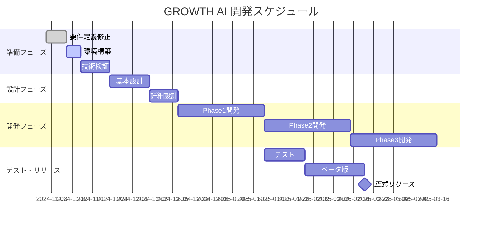

# GROWTH AI 開発タスクリスト v1.0

作成日：2024年11月
最終更新：2024年11月

---

## 📋 開発フェーズ概要



---

## 🚨 Phase 0: 緊急対応（今週中: 11/1-11/7）

### 0.1 要件定義書v1.1修正 ⏰ 期限: 11/3

- [ ] **0.1.1** コスト構造の修正
  - [ ] 料金プラン再計算（原価・利益率）
  - [ ] API使用量制限の設定
  - [ ] 段階的料金体系の設計
  - **担当**: ビジネス企画
  - **成果物**: 料金シミュレーション.xlsx

- [ ] **0.1.2** 法的コンプライアンス追加
  - [ ] 薬機法チェックロジック定義
  - [ ] 景表法対応ガイドライン作成
  - [ ] 利用規約・プライバシーポリシー草案
  - **担当**: 法務・コンプライアンス
  - **成果物**: コンプライアンスガイド.pdf

- [ ] **0.1.3** パフォーマンス目標修正
  - [ ] LP生成時間を30秒→10秒に変更
  - [ ] 同時接続数を1000→10000に変更
  - [ ] データ保存期間の見直し
  - **担当**: インフラチーム
  - **成果物**: パフォーマンス要件書_v1.1.md

### 0.2 リスク対策実施 ⏰ 期限: 11/7

- [ ] **0.2.1** セキュリティ監査準備
  - [ ] 脆弱性診断ツール選定
  - [ ] ペネトレーションテスト計画
  - **担当**: セキュリティチーム

- [ ] **0.2.2** 品質管理プロセス定義
  - [ ] AI出力の品質基準設定
  - [ ] レビューフロー設計
  - **担当**: QAチーム

---

## 🔧 Phase 1: 環境構築・技術検証（11/8-11/22）

### 1.1 開発環境セットアップ ⏰ 期限: 11/12

#### 基本環境
- [ ] **1.1.1** Gitリポジトリ作成
  ```bash
  # リポジトリ構成
  growth-ai/
  ├── frontend/          # Next.js 14
  ├── backend/           # Node.js + Express
  ├── ai-service/        # Python FastAPI
  ├── infrastructure/    # Terraform/Docker
  ├── docs/             # ドキュメント
  └── tests/            # テストコード
  ```

- [ ] **1.1.2** 開発ツール設定
  - [ ] VS Code + 拡張機能
  - [ ] Docker Desktop
  - [ ] Node.js 20.x, Python 3.11
  - [ ] PostgreSQL 15, Redis 7

- [ ] **1.1.3** CI/CD パイプライン
  - [ ] GitHub Actions設定
  - [ ] ESLint, Prettier設定
  - [ ] 自動テスト環境
  - [ ] Vercel/AWS連携

#### クラウド環境
- [ ] **1.1.4** AWS/GCPアカウント設定
  - [ ] IAMロール作成
  - [ ] VPC/サブネット設計
  - [ ] S3バケット作成
  - [ ] CloudFront設定

- [ ] **1.1.5** 外部サービス連携
  - [ ] OpenAI API キー取得
  - [ ] SendGrid アカウント
  - [ ] Stripe アカウント
  - [ ] Google Analytics 4設定

### 1.2 技術検証（POC） ⏰ 期限: 11/22

#### コア機能の検証
- [ ] **1.2.1** AI生成速度検証
  ```python
  # 検証項目
  - GPT-4 Turbo: 平均応答時間
  - DALL-E 3: 画像生成時間
  - 10秒以内でLP生成可能か
  - コスト計算（1LPあたり）
  ```
  - **成功基準**: 10秒以内、コスト2,000円以下
  - **成果物**: POC検証レポート.md

- [ ] **1.2.2** ヒートマップ実装検証
  ```javascript
  // 検証項目
  - トラッキングスクリプト5KB以下
  - パフォーマンス影響5%以内
  - データ送信の信頼性99%
  ```
  - **成功基準**: 全項目クリア
  - **成果物**: heatmap-poc.js

- [ ] **1.2.3** 30秒クイックスタート検証
  - [ ] 最小限の質問でLP生成
  - [ ] URLスクレイピング速度
  - [ ] 自動補完の精度
  - **成功基準**: 30秒で基本LP完成

#### リスク項目の検証
- [ ] **1.2.4** 法令チェックAPI検証
  - [ ] 薬機法チェックツール評価
  - [ ] 自動修正の精度
  - **候補**: [薬機法チェックAPI選定]

- [ ] **1.2.5** スケーラビリティ検証
  - [ ] 負荷テスト（JMeter）
  - [ ] 同時10,000接続テスト
  - [ ] オートスケール動作確認

---

## 📐 Phase 2: 設計フェーズ（11/23-12/13）

### 2.1 基本設計 ⏰ 期限: 12/6

- [ ] **2.1.1** システムアーキテクチャ設計
  ```yaml
  成果物:
    - システム構成図.drawio
    - API設計書.yaml
    - データベース設計書.md
    - インフラ構成図.drawio
  ```

- [ ] **2.1.2** UI/UX設計
  - [ ] ワイヤーフレーム作成（Figma）
  - [ ] デザインシステム定義
  - [ ] ユーザーフロー図
  - [ ] プロトタイプ作成

- [ ] **2.1.3** セキュリティ設計
  - [ ] 認証・認可フロー
  - [ ] データ暗号化方式
  - [ ] 監査ログ設計
  - [ ] GDPR/個人情報保護対応

### 2.2 詳細設計 ⏰ 期限: 12/13

- [ ] **2.2.1** 各機能の詳細設計
  ```
  機能別設計書:
  ├── AIチャット詳細設計書.md
  ├── LP生成エンジン設計書.md
  ├── ヒートマップ分析設計書.md
  ├── レポート生成設計書.md
  └── メール配信設計書.md
  ```

- [ ] **2.2.2** データ設計
  - [ ] ERD作成
  - [ ] マイグレーション計画
  - [ ] バックアップ戦略
  - [ ] キャッシュ戦略

---

## 💻 Phase 3: MVP開発（12/14-1/31）

### 3.1 バックエンド開発 ⏰ 期限: 1/10

#### Week 1-2: 基盤構築
- [ ] **3.1.1** APIサーバー基盤
  ```typescript
  // 実装項目
  - [ ] Express.js セットアップ
  - [ ] GraphQL スキーマ定義
  - [ ] 認証ミドルウェア
  - [ ] エラーハンドリング
  - [ ] ロギング設定
  ```

- [ ] **3.1.2** データベース実装
  ```sql
  -- 実装項目
  - [ ] PostgreSQL スキーマ作成
  - [ ] Prisma ORM設定
  - [ ] マイグレーション実行
  - [ ] シードデータ投入
  ```

#### Week 3-4: コア機能実装
- [ ] **3.1.3** AI統合サービス
  ```python
  # ai-service/
  - [ ] OpenAI API ラッパー
  - [ ] プロンプトテンプレート管理
  - [ ] 品質スコアリング
  - [ ] コスト計算ロジック
  - [ ] キャッシュ実装
  ```

- [ ] **3.1.4** LP生成エンジン
  ```typescript
  // 実装優先順位
  1. [ ] 基本テンプレート（5業種）
  2. [ ] コンテンツ生成
  3. [ ] レスポンシブ対応
  4. [ ] 画像最適化
  5. [ ] 法令チェック統合
  ```

### 3.2 フロントエンド開発 ⏰ 期限: 1/20

#### Week 1-2: 基本UI
- [ ] **3.2.1** Next.js セットアップ
  ```typescript
  // app/
  - [ ] ランディングページ
  - [ ] AIチャット画面
  - [ ] プレビュー画面
  - [ ] ダッシュボード（基本）
  ```

- [ ] **3.2.2** UIコンポーネント
  ```typescript
  // components/
  - [ ] ChatInterface.tsx
  - [ ] LPPreview.tsx
  - [ ] HeatmapVisualization.tsx
  - [ ] ReportCard.tsx
  ```

#### Week 3-4: インタラクション
- [ ] **3.2.3** リアルタイム機能
  - [ ] WebSocket接続
  - [ ] プログレスバー
  - [ ] リアルタイムプレビュー
  - [ ] エラーハンドリング

- [ ] **3.2.4** レスポンシブ対応
  - [ ] モバイル最適化
  - [ ] タブレット対応
  - [ ] アクセシビリティ対応

### 3.3 分析機能開発 ⏰ 期限: 1/31

- [ ] **3.3.1** トラッキングスクリプト
  ```javascript
  // tracking.js (5KB以下)
  - [ ] クリックトラッキング
  - [ ] スクロール計測
  - [ ] セッション記録
  - [ ] バッチ送信実装
  ```

- [ ] **3.3.2** 分析エンジン
  ```python
  # analytics/
  - [ ] データ集計バッチ
  - [ ] ヒートマップ生成
  - [ ] 改善提案AI
  - [ ] レポート生成
  ```

---

## 🧪 Phase 4: テスト・品質保証（2/1-2/14）

### 4.1 自動テスト ⏰ 期限: 2/7

- [ ] **4.1.1** 単体テスト
  ```yaml
  カバレッジ目標: 80%以上
  - [ ] バックエンド（Jest）
  - [ ] フロントエンド（Vitest）
  - [ ] AI統合（pytest）
  ```

- [ ] **4.1.2** 統合テスト
  - [ ] API統合テスト
  - [ ] E2Eテスト（Playwright）
  - [ ] 負荷テスト（k6）

### 4.2 品質保証 ⏰ 期限: 2/14

- [ ] **4.2.1** AI出力品質検証
  - [ ] 100LP生成して品質評価
  - [ ] 法令違反チェック
  - [ ] 日本語自然性評価

- [ ] **4.2.2** パフォーマンステスト
  - [ ] LP生成時間測定
  - [ ] 同時接続テスト
  - [ ] メモリリーク検査

- [ ] **4.2.3** セキュリティテスト
  - [ ] 脆弱性診断
  - [ ] ペネトレーションテスト
  - [ ] OWASP Top 10チェック

---

## 🚀 Phase 5: ベータ版・リリース（2/15-3/21）

### 5.1 ベータテスト ⏰ 期限: 3/7

- [ ] **5.1.1** ベータ版準備
  - [ ] 10社のテスター募集
  - [ ] オンボーディング資料作成
  - [ ] フィードバックフォーム準備

- [ ] **5.1.2** ベータ運用
  - [ ] 週次フィードバック収集
  - [ ] バグ修正
  - [ ] 機能改善

### 5.2 正式リリース準備 ⏰ 期限: 3/21

- [ ] **5.2.1** 本番環境構築
  - [ ] AWS本番環境セットアップ
  - [ ] ドメイン設定
  - [ ] SSL証明書
  - [ ] CDN設定

- [ ] **5.2.2** 運用準備
  - [ ] 監視設定（Datadog）
  - [ ] アラート設定
  - [ ] バックアップ設定
  - [ ] 災害復旧計画

- [ ] **5.2.3** マーケティング準備
  - [ ] LP作成（自社ツールで！）
  - [ ] プレスリリース
  - [ ] ローンチキャンペーン
  - [ ] サポート体制構築

---

## 📊 進捗管理

### 週次チェックポイント

| 週 | 日付 | マイルストーン | 成果物 | 完了率 |
|----|------|--------------|--------|--------|
| W1 | 11/7 | 要件定義完了 | 要件定義書v1.1 | 0% |
| W2 | 11/14 | 環境構築完了 | 開発環境 | 0% |
| W3 | 11/21 | POC完了 | 検証レポート | 0% |
| W4 | 11/28 | 基本設計着手 | - | 0% |
| W5 | 12/5 | 基本設計完了 | 設計書一式 | 0% |
| W6 | 12/12 | 詳細設計完了 | 詳細設計書 | 0% |
| W7-10 | 1/10 | バックエンド完了 | API実装 | 0% |
| W11-12 | 1/24 | フロントエンド完了 | UI実装 | 0% |
| W13-14 | 2/7 | テスト完了 | テストレポート | 0% |
| W15-17 | 2/28 | ベータ版完了 | フィードバック | 0% |
| W18 | 3/21 | 正式リリース | 本番稼働 | 0% |

### リスク管理

| リスク | 影響 | 対策 | ステータス |
|--------|------|------|-----------|
| AI API費用超過 | 高 | 使用量制限実装 | 未対応 |
| 法令違反コンテンツ | 高 | チェック機能必須 | 未対応 |
| 10秒生成未達成 | 中 | キャッシュ活用 | 未対応 |
| ベータ離脱 | 中 | 週次フォロー | 未対応 |

---

## ✅ デイリーチェックリスト

### 開発者の日次確認事項

```markdown
□ 要件定義書を確認したか
□ 今日のタスクは明確か
□ ブロッカーはないか
□ コードレビュー依頼はあるか
□ テストは書いたか
□ ドキュメントは更新したか
□ 進捗を報告したか
□ 明日のタスクは準備できているか
```

### スクラムイベント

| イベント | 頻度 | 時間 | 参加者 |
|---------|------|------|--------|
| デイリースタンドアップ | 毎日 | 15分 | 全員 |
| スプリントプランニング | 週次 | 2時間 | 全員 |
| スプリントレビュー | 週次 | 1時間 | ステークホルダー含む |
| レトロスペクティブ | 週次 | 1時間 | 開発チーム |

---

## 🎯 成功の定義

### Phase 1 MVP成功基準
- [ ] 5業種対応のLP生成可能
- [ ] 生成時間10秒以内
- [ ] 基本的なヒートマップ機能
- [ ] 週次レポート自動送信
- [ ] 10社のベータユーザー獲得
- [ ] NPS 40以上
- [ ] 重大バグ0件

### KPI目標
- 技術KPI
  - LP生成成功率: 95%以上
  - システム稼働率: 99.9%
  - API応答時間: 200ms以内

- ビジネスKPI  
  - ベータ継続率: 80%以上
  - 有料転換率: 30%以上
  - CAC回収期間: 6ヶ月以内

---

**このタスクリストに従って開発を進めることで、計画的かつ確実にMVPをリリースできます。**

毎週金曜日に進捗レビューを実施し、必要に応じてタスクを調整します。