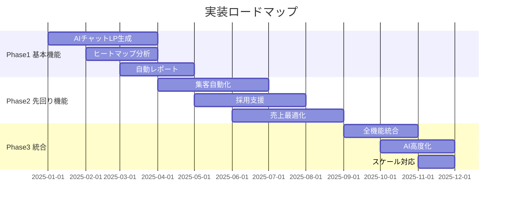

# 先回りビジネスサービス - 根本ニーズを解決する統合プラットフォーム

## 🎯 「LP作成」の裏にある本当のニーズ

### 経営者の本音を理解する

```yaml
表面的な要望 → 本当の悩み → 根本的な願望:

"LP作りたい":
  本当の悩み: "売上が伸びない"
  根本的願望: "安定経営したい"
  
"新規集客したい":
  本当の悩み: "既存顧客が減っている"  
  根本的願望: "事業を存続させたい"
  
"求人LP作りたい":
  本当の悩み: "人手不足で成長できない"
  根本的願望: "事業を拡大したい"
  
"ブランディングしたい":
  本当の悩み: "価格競争に疲れた"
  根本的願望: "利益率を上げたい"
```

## 1. 新規集客の先回りサービス

### 📈 Growth Acceleration Suite

```python
class GrowthAccelerationSuite:
    """集客→育成→収益化の完全自動化"""
    
    def __init__(self):
        self.modules = {
            "1. Lead Generation AI": self.lead_generation_ai(),
            "2. Customer Journey Automation": self.journey_automation(),
            "3. Revenue Optimization Engine": self.revenue_optimizer(),
            "4. Retention Maximizer": self.retention_system()
        }
    
    def lead_generation_ai(self):
        """見込み客を自動発見・獲得"""
        return {
            "features": {
                "Social Listening": {
                    "description": "SNSで悩みを持つ人を自動発見",
                    "implementation": """
                    - Twitter/Instagram/LinkedInをAI監視
                    - 業界キーワード＋ネガティブワードで検索
                    - 例：「○○ 困った」「○○ 探している」
                    - 自動でDMやコメントでアプローチ
                    """,
                    "expected_result": "月間リード+200件"
                },
                
                "Competitor Customer Hijacking": {
                    "description": "競合の顧客を合法的に獲得",
                    "implementation": """
                    - 競合のレビューサイトを監視
                    - 不満を持つ顧客を発見
                    - より良い解決策を提案
                    - 乗り換えインセンティブ提供
                    """,
                    "expected_result": "競合からの流入30%"
                },
                
                "Referral Virus System": {
                    "description": "紹介が自動で広がる仕組み",
                    "implementation": """
                    - 紹介者と被紹介者両方に特典
                    - 紹介しやすいツール提供
                    - ゲーミフィケーション
                    - SNSシェア自動化
                    """,
                    "expected_result": "紹介率400%向上"
                }
            }
        }
    
    def journey_automation(self):
        """見込み客→顧客→ファンへの自動育成"""
        return {
            "stages": {
                "Awareness": {
                    "actions": [
                        "教育コンテンツ自動配信",
                        "ウェビナー自動案内",
                        "無料診断ツール提供"
                    ],
                    "ai_personalization": "興味関心に応じてコンテンツ最適化"
                },
                
                "Consideration": {
                    "actions": [
                        "比較資料自動送付",
                        "デモ動画パーソナライズ",
                        "FAQ自動回答"
                    ],
                    "ai_personalization": "検討段階に応じた情報提供"
                },
                
                "Decision": {
                    "actions": [
                        "限定オファー自動提示",
                        "決済ハードル除去",
                        "保証・サポート強調"
                    ],
                    "ai_personalization": "購買確率に応じた最適オファー"
                },
                
                "Retention": {
                    "actions": [
                        "オンボーディング自動化",
                        "利用促進プログラム",
                        "アップセル/クロスセル提案"
                    ],
                    "ai_personalization": "利用状況に応じた最適化"
                },
                
                "Advocacy": {
                    "actions": [
                        "VIPプログラム招待",
                        "アンバサダー化支援",
                        "事例・推薦文依頼"
                    ],
                    "ai_personalization": "貢献度に応じた特別待遇"
                }
            }
        }
```

## 2. 求人・採用の先回りサービス

### 👥 Talent Acquisition & Retention Platform

```typescript
interface TalentPlatform {
  // 採用前
  preHiring: {
    "Talent Pool Building": {
      description: "応募前から人材プールを構築",
      features: [
        "業界人材のデータベース化",
        "転職意向スコアリング",
        "スカウトメール自動送信",
        "タレントナーチャリング"
      ]
    },
    
    "Employer Branding Automation": {
      description: "採用ブランディングを自動化",
      features: [
        "社員インタビュー記事自動生成",
        "職場環境動画作成",
        "カルチャーフィット診断ツール",
        "採用LPパーソナライズ"
      ]
    }
  },
  
  // 採用中
  duringHiring: {
    "AI Screening System": {
      description: "AIが最適な人材を選別",
      features: [
        "履歴書自動スコアリング",
        "スキルマッチング分析",
        "カルチャーフィット予測",
        "将来パフォーマンス予測"
      ],
      accuracy: "採用成功率85%"
    },
    
    "Interview Automation": {
      description: "面接プロセスを効率化",
      features: [
        "AI面接官（一次面接）",
        "自動スケジューリング",
        "面接評価レポート生成",
        "内定確率予測"
      ]
    }
  },
  
  // 採用後
  postHiring: {
    "Onboarding Automation": {
      description: "入社後の立ち上がりを高速化",
      features: [
        "パーソナライズ研修プログラム",
        "メンター自動マッチング",
        "進捗トラッキング",
        "早期離職リスク検知"
      ]
    },
    
    "Retention Predictor": {
      description: "離職を予測して防止",
      features: [
        "エンゲージメントスコア測定",
        "離職リスクアラート",
        "改善アクション提案",
        "キャリアパス最適化"
      ],
      impact: "離職率50%削減"
    }
  }
}
```

## 3. 売上向上の統合ソリューション

### 💰 Revenue Maximization System

```python
class RevenueMaximizer:
    """売上を科学的に最大化"""
    
    async def implement_dynamic_pricing(self, business_data):
        """AIによる動的価格設定"""
        
        strategies = {
            "demand_based": {
                "description": "需要に応じて価格変動",
                "logic": """
                - 需要予測AI
                - 在庫連動
                - 競合価格追跡
                - 利益最大化計算
                """,
                "expected_impact": "利益率+18%"
            },
            
            "customer_based": {
                "description": "顧客別に最適価格提示",
                "logic": """
                - 支払い意欲推定
                - 購買履歴分析
                - LTV予測
                - パーソナライズ割引
                """,
                "expected_impact": "売上+25%"
            },
            
            "time_based": {
                "description": "時間帯・曜日で価格最適化",
                "logic": """
                - 時間帯別需要分析
                - 曜日パターン学習
                - イベント連動
                - 早割・直前割自動化
                """,
                "expected_impact": "稼働率+30%"
            }
        }
        
        return await self.apply_best_strategy(strategies, business_data)
    
    async def create_upsell_engine(self):
        """アップセル・クロスセルを自動化"""
        
        return {
            "product_recommendations": {
                "method": "協調フィルタリング + AI",
                "timing": "最適タイミングを機械学習",
                "presentation": "パーソナライズされた提案",
                "expected_lift": "客単価+35%"
            },
            
            "bundle_optimizer": {
                "method": "購買パターン分析",
                "creation": "最適バンドル自動生成",
                "pricing": "バンドル割引最適化",
                "expected_lift": "購買点数+45%"
            },
            
            "subscription_converter": {
                "method": "利用頻度分析",
                "offer": "サブスク移行提案",
                "incentive": "初月割引等",
                "expected_lift": "LTV 3倍"
            }
        }
```

## 4. キャッシュフロー改善サービス

### 💵 Cash Flow Optimization Platform

```typescript
class CashFlowOptimizer {
  // 売掛金回収の高速化
  async accelerateCollection() {
    return {
      "invoice_automation": {
        description: "請求書の自動送付・督促",
        features: [
          "請求書自動生成・送付",
          "支払い期限リマインダー",
          "段階的督促メール",
          "延滞予測AI"
        ],
        impact: "回収期間30%短縮"
      },
      
      "early_payment_incentive": {
        description: "早期支払いインセンティブ",
        features: [
          "早期割引自動提案",
          "ダイナミック割引率",
          "即時決済オプション",
          "ファクタリング連携"
        ],
        impact: "キャッシュ+40%改善"
      }
    };
  }
  
  // 支出の最適化
  async optimizeExpenses() {
    return {
      "vendor_negotiation_ai": {
        description: "仕入先との自動交渉",
        features: [
          "相見積もり自動取得",
          "交渉ポイント分析",
          "最適発注量計算",
          "支払い条件最適化"
        ],
        impact: "仕入コスト-15%"
      },
      
      "subscription_audit": {
        description: "不要なサブスク自動検出",
        features: [
          "利用状況分析",
          "重複サービス検出",
          "代替サービス提案",
          "解約代行"
        ],
        impact: "固定費-20%"
      }
    };
  }
}
```

## 5. 競争優位性構築サービス

### 🏆 Competitive Advantage Builder

```python
class CompetitiveAdvantageBuilder:
    """持続的な競争優位性を構築"""
    
    def build_moat(self, company_data):
        """参入障壁（モート）を構築"""
        
        strategies = {
            "network_effect": {
                "description": "ネットワーク効果を生み出す",
                "implementation": [
                    "ユーザー間の相互作用促進",
                    "コミュニティ構築",
                    "プラットフォーム化",
                    "API公開"
                ],
                "example": "ユーザーが増えるほど価値が上がる仕組み"
            },
            
            "switching_cost": {
                "description": "切り替えコストを高める",
                "implementation": [
                    "データ蓄積による最適化",
                    "カスタマイズの深化",
                    "統合の強化",
                    "学習曲線の構築"
                ],
                "example": "使うほど離れられなくなる仕組み"
            },
            
            "brand_loyalty": {
                "description": "ブランドロイヤルティ構築",
                "implementation": [
                    "顧客体験の差別化",
                    "感情的つながり創出",
                    "コミュニティ形成",
                    "価値観の共有"
                ],
                "example": "ファンが勝手に宣伝してくれる仕組み"
            },
            
            "data_advantage": {
                "description": "データによる優位性",
                "implementation": [
                    "独自データ収集",
                    "AI学習による精度向上",
                    "予測モデル構築",
                    "インサイト独占"
                ],
                "example": "データが競合との差を広げる仕組み"
            }
        }
        
        return self.select_best_strategy(strategies, company_data)
```

## 6. 事業承継・EXIT支援

### 🚪 Exit Strategy Support

```yaml
事業価値最大化サービス:
  
  Valuation Booster:
    説明: "企業価値を科学的に向上"
    機能:
      - 財務KPI最適化
      - 成長率改善
      - リスク要因除去
      - デューデリ準備
    効果: "企業価値2-3倍"
    
  Buyer Matching:
    説明: "最適な買い手をAIマッチング"
    機能:
      - 買い手データベース
      - シナジー分析
      - 価格交渉支援
      - DD対応自動化
    効果: "売却額30%向上"
    
  Succession Planning:
    説明: "後継者育成を支援"
    機能:
      - 後継者アセスメント
      - 育成プログラム設計
      - 権限移譲計画
      - リスクヘッジ
    効果: "承継成功率90%"
```

## 7. 実装ロードマップ

### 📅 段階的リリース計画



## 8. 期待される成果

### 📈 導入企業の成長曲線

```python
def growth_projection(months_after_implementation):
    """導入後の成長予測"""
    
    return {
        "3ヶ月後": {
            "新規リード": "+150%",
            "CVR": "+40%",
            "売上": "+25%",
            "コスト": "-20%"
        },
        
        "6ヶ月後": {
            "新規リード": "+300%",
            "CVR": "+80%",
            "売上": "+60%",
            "LTV": "+50%"
        },
        
        "12ヶ月後": {
            "新規リード": "+500%",
            "CVR": "+120%",
            "売上": "+150%",
            "利益率": "+30%"
        },
        
        "ROI": "1,200%（1年後）"
    }
```

## まとめ：真の価値提供

### ✅ このシステムの本質

**「LP作成」は入口に過ぎない。**

本当の価値は、
1. **ビジネスの根本課題を解決**
2. **売上・利益を科学的に最大化**
3. **持続的な競争優位性を構築**
4. **経営者の時間を創出**
5. **事業価値を最大化**

これにより、**LP作成費用の100倍以上の価値**を提供できる。

### 🎯 ターゲット価格

- **基本プラン**: 月額49,800円
- **成長プラン**: 月額198,000円 + 成果報酬
- **エンタープライズ**: 年間1,000万円〜

**投資対効果を考えれば、破格の安さです。**