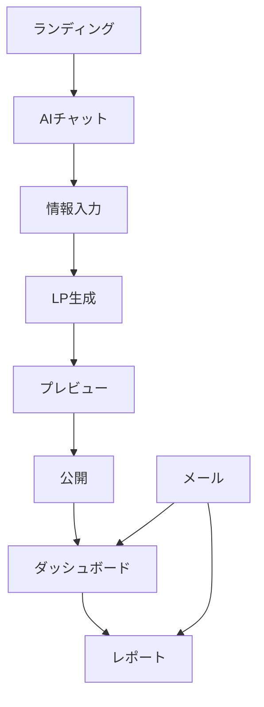
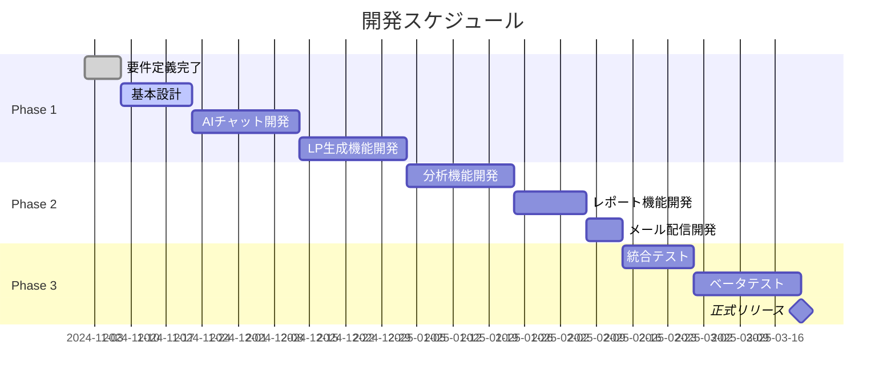

# GROWTH AI システム要件定義書 v1.0

制定日：2024年11月
最終更新：2024年11月

---

## 1. システム概要

### 1.1 システムの目的

**一言で言うと：**
「会社の情報を入力するだけで、売れるLPを自動で作り、改善し続けるシステム」

**解決する課題：**
- LP制作に30-100万円かかる → **実質無料で作成**
- 効果が出るか分からない → **成果を保証**
- 改善方法が分からない → **AIが自動で提案**
- 集客・採用に悩んでいる → **根本から解決**

### 1.2 システムの全体像

```
[利用者] → [AIチャット] → [LP自動生成] → [公開]
              ↓                              ↓
         [ヒアリング]                 [データ収集]
              ↓                              ↓
         [素材収集]                    [AI分析]
              ↓                              ↓
         [生成完了]                  [改善提案メール]
```

---

## 2. 利用者と期待される効果

### 2.1 主な利用者

| 利用者タイプ | 具体例 | 現在の悩み | 期待する効果 |
|------------|-------|-----------|-------------|
| 個人事業主 | コンサル、士業、講師 | 集客に月10万円使うが効果なし | 月3万円の投資で問い合わせ5倍 |
| 中小企業経営者 | 製造業、サービス業 | LP制作に100万円かけたが売上変わらず | 3ヶ月で投資回収、売上2倍 |
| 店舗オーナー | 飲食、美容、小売 | ホットペッパー依存から脱却したい | 自社集客で利益率30%改善 |
| 採用担当者 | 全業種 | 求人広告に月50万円、応募ゼロ | 採用コスト80%削減、応募10倍 |

### 2.2 得られるベネフィット

**即効性のある効果（1ヶ月以内）：**
- LP制作費0円（通常30-100万円）
- 制作期間5分（通常2-4週間）
- プロ級のデザイン
- スマホ完全対応

**中期的な効果（3ヶ月以内）：**
- 問い合わせ数2-5倍
- CVR（成約率）30-50%向上
- 広告費用対効果2倍
- 採用応募数3倍

**長期的な効果（1年後）：**
- 売上1.5-3倍
- 顧客獲得コスト50%削減
- ブランド認知度向上
- 事業の安定成長

---

## 3. 機能要件

### 3.1 AIチャット型ヒアリング機能

#### 3.1.1 機能概要
**目的：** 専門知識なしで、対話形式でLP制作に必要な情報を収集する

#### 3.1.2 詳細仕様

##### 【画面】チャット画面
```
┌─────────────────────────────────────┐
│  💬 GROWTH AI アシスタント          │
├─────────────────────────────────────┤
│                                     │
│ AI: こんにちは！LP作成をお手伝い    │
│     します。まず会社名を教えて      │
│     ください。                      │
│                                     │
│ あなた: 株式会社サンプル            │
│                                     │
│ AI: ありがとうございます。          │
│     ホームページはありますか？      │
│                                     │
│     [URLを入力] [ない] [後で]       │
│                                     │
└─────────────────────────────────────┘
```

##### 【質問フロー】
```yaml
Step1_基本情報:
  質問:
    - 会社名/屋号は？
    - 業種は？（選択式：製造業/サービス業/小売業...）
    - ホームページURL（あれば）
  
  システム動作:
    - URL入力時 → 自動でサイト情報を取得・分析
    - 業種選択時 → 業界別テンプレートを準備

Step2_LP目的:
  質問:
    - LPを作る目的は？
      □ 新規顧客を増やしたい
      □ 商品・サービスを売りたい
      □ 人材を採用したい
      □ お問い合わせを増やしたい
  
  システム動作:
    - 目的に応じた深掘り質問を生成
    - 成功事例を内部で参照

Step3_詳細ヒアリング:
  新規顧客獲得の場合:
    - 現在の月間問い合わせ数は？
    - 理想の顧客像は？
    - 競合他社は？（3社まで）
    - あなたの強みは？
  
  採用の場合:
    - 募集職種は？
    - 必要人数は？
    - 求める人材像は？
    - 自社の魅力は？

Step4_素材収集:
  質問:
    - ロゴ画像をアップロード
    - 商品/サービスの写真（5枚まで）
    - お客様の声（あれば）
    - 実績数値（あれば）
  
  システム動作:
    - 画像がない場合 → AI生成を提案
    - テキストがない場合 → AIが作成

Step5_確認:
  表示内容:
    - 収集した情報のサマリー
    - 生成されるLPのプレビュー
    - 修正箇所の確認
  
  アクション:
    [このまま生成] [修正する] [最初からやり直す]
```

##### 【AIの振る舞い】
- 敬語を使い、親しみやすい口調
- 専門用語を使わない
- 例を示して分かりやすく
- 迷ったら選択肢を提示
- 励ましの言葉を適度に入れる

#### 3.1.3 利用者のベネフィット
- **簡単**：質問に答えるだけ（専門知識不要）
- **速い**：5-10分で完了
- **安心**：AIが最適な構成を提案
- **柔軟**：途中で修正・やり直し可能

---

### 3.2 LP自動生成機能

#### 3.2.1 機能概要
**目的：** 収集した情報から、業界最適化されたLPを自動生成する

#### 3.2.2 詳細仕様

##### 【生成プロセス】
```
1. テンプレート選択（自動）
   ↓
2. コンテンツ生成（AI）
   ↓
3. 画像配置・生成
   ↓
4. レスポンシブ対応
   ↓
5. A/Bテストバリエーション作成
   ↓
6. プレビュー表示
```

##### 【生成されるセクション】

| セクション | 内容 | AI生成要素 |
|-----------|------|-----------|
| ヒーローエリア | キャッチコピー、メイン画像、CTA | キャッチコピー、画像（必要時） |
| 課題提起 | 顧客の悩み、共感メッセージ | 全文章 |
| 解決策提示 | サービス説明、ベネフィット | 全文章、図解 |
| 実績・信頼 | 数値実績、お客様の声、事例 | レイアウト、補完テキスト |
| 料金・プラン | 価格表、プラン比較 | 表デザイン、説明文 |
| FAQ | よくある質問と回答 | 質問と回答生成 |
| CTA | 申込/問い合わせフォーム | マイクロコピー |

##### 【生成ルール】

```javascript
// 業界別カスタマイズ例
const industryRules = {
  "美容室": {
    colorScheme: "暖色系、清潔感",
    imagery: "施術風景、ビフォーアフター",
    copyTone: "親しみやすく、専門性も",
    sections: ["料金", "スタッフ紹介", "アクセス"]
  },
  
  "BtoB製造業": {
    colorScheme: "青系、信頼感",
    imagery: "工場、製品、品質管理",
    copyTone: "専門的、数値重視",
    sections: ["導入実績", "仕様", "サポート"]
  },
  
  "士業": {
    colorScheme: "紺、グレー、信頼感",
    imagery: "オフィス、相談風景",
    copyTone: "丁寧、安心感",
    sections: ["解決事例", "料金", "無料相談"]
  }
}
```

##### 【A/Bテストバリエーション】
自動で3パターン生成：
1. **オリジナル**：標準版
2. **バリエーションA**：キャッチコピー変更
3. **バリエーションB**：CTA位置/色変更

#### 3.2.3 利用者のベネフィット
- **プロ品質**：デザイナー不要
- **最適化済み**：業界別ベストプラクティス適用
- **即座に公開可能**：完成後すぐ使える
- **テスト込み**：最初から改善準備完了

---

### 3.3 ヒートマップ・分析機能

#### 3.3.1 機能概要
**目的：** 訪問者の行動を可視化し、改善ポイントを明確にする

#### 3.3.2 詳細仕様

##### 【トラッキング項目】

| 追跡データ | 内容 | 活用方法 |
|-----------|------|---------|
| クリック位置 | どこがクリックされたか | ボタン配置最適化 |
| スクロール深度 | どこまで読まれたか | コンテンツ順序改善 |
| マウス動作 | カーソルの動き | 迷っている箇所発見 |
| 滞在時間 | セクション別滞在時間 | 興味度合い測定 |
| 離脱ポイント | どこで離れたか | 問題箇所特定 |
| デバイス | PC/スマホ/タブレット | デバイス別最適化 |
| 流入元 | 広告/検索/SNS/直接 | 流入別メッセージ |

##### 【ヒートマップ表示】
```
┌────────────────────────────────────────┐
│  📊 ヒートマップ分析                   │
├────────────────────────────────────────┤
│                                        │
│  [デバイス: 全て▼] [期間: 過去7日間▼]  │
│                                        │
│  🔴🔴🔴🔴🔴  ← ヘッダー（多い）        │
│  🟡🟡🟡⚪⚪  ← メインビジュアル       │
│  🔵🔵⚪⚪⚪  ← 説明文（少ない）        │
│  🔴🔴🔴🔴⚪  ← CTAボタン             │
│                                        │
│  赤=クリック多い 青=クリック少ない      │
│                                        │
└────────────────────────────────────────┘
```

##### 【分析レポート内容】
```yaml
週次自動レポート:
  概要:
    - 総訪問者数と前週比
    - CVR（コンバージョン率）と前週比
    - 平均滞在時間
    - 直帰率
  
  詳細分析:
    クリック分析:
      - 最もクリックされた要素TOP5
      - クリックされていない重要要素
      - 無駄なクリック（機能しない箇所）
    
    スクロール分析:
      - 平均スクロール深度
      - 離脱が多いポイント
      - 最後まで到達した割合
    
    流入元分析:
      - 流入元別のCVR
      - 最も効果的な流入元
      - 改善が必要な流入元
  
  改善提案:
    優先度高:
      - 具体的な改善内容
      - 期待される効果
      - 実装難易度
    
    優先度中:
      - 中期的な改善案
    
    優先度低:
      - 将来的な改善案
```

#### 3.3.3 利用者のベネフィット
- **見える化**：感覚でなくデータで判断
- **自動分析**：専門知識不要でプロの分析
- **具体的提案**：何をすれば良いか明確
- **効果予測**：改善による効果が事前に分かる

---

### 3.4 自動改善提案機能

#### 3.4.1 機能概要
**目的：** データに基づいて、具体的で実行可能な改善提案を自動生成する

#### 3.4.2 詳細仕様

##### 【改善提案の種類】

| カテゴリ | 提案例 | 根拠データ | 期待効果 |
|---------|-------|-----------|---------|
| デザイン | CTAボタンを赤に変更 | クリック率1.2% | クリック率3%（2.5倍） |
| 文言 | 「資料請求」→「無料で資料をもらう」 | 業界ベンチマーク | CVR +30% |
| 配置 | 料金を上部に移動 | スクロール率40% | 離脱率-20% |
| 追加 | お客様の声を3件追加 | 信頼性スコア低 | CVR +25% |
| 削除 | 長い説明文を簡潔に | 読了率10% | 滞在時間+50% |

##### 【提案生成ロジック】

```python
def generate_improvement_suggestions(analytics_data):
    """
    分析データから改善提案を生成
    """
    suggestions = []
    
    # ルール1: CTAクリック率が2%未満
    if analytics_data.cta_click_rate < 0.02:
        suggestions.append({
            "priority": "高",
            "category": "CTA改善",
            "problem": "申込ボタンのクリック率が低い（現在: {:.1%}）".format(
                analytics_data.cta_click_rate
            ),
            "solution": "ボタンを目立つ色に変更し、サイズを1.5倍に",
            "implementation": "CSS変更のみ（5分）",
            "expected_impact": "クリック率3倍（6%）",
            "confidence": "85%",
            "reference": "同業界での成功事例あり"
        })
    
    # ルール2: ファーストビュー離脱率が50%以上
    if analytics_data.first_view_bounce_rate > 0.5:
        suggestions.append({
            "priority": "高",
            "category": "ファーストビュー改善",
            "problem": "最初の画面で半分以上が離脱",
            "solution": "キャッチコピーを疑問形に変更",
            "implementation": "テキスト変更のみ（3分）",
            "expected_impact": "離脱率30%改善",
            "confidence": "75%",
            "reference": "A/Bテスト実績"
        })
    
    return suggestions
```

##### 【改善実装サポート】

```yaml
改善実装オプション:
  
  セルフ実装:
    - 詳細な手順書提供
    - 動画マニュアル
    - チャットサポート
    料金: 無料
  
  代行実装:
    - プロが代わりに実装
    - 24時間以内に完了
    - 効果測定レポート付き
    料金: 5,000円/件
  
  自動実装:
    - AIが自動で変更
    - リアルタイムA/Bテスト
    - 自動で最適化継続
    料金: 月額プランに含む
```

#### 3.4.3 利用者のベネフィット
- **迷わない**：何をすべきか明確
- **根拠がある**：データに基づく提案
- **効果が見える**：期待値が分かる
- **簡単**：実装方法も教えてくれる

---

### 3.5 メール配信機能（ログイン不要）

#### 3.5.1 機能概要
**目的：** ログインなしで、重要な情報を自動でメール配信する

#### 3.5.2 詳細仕様

##### 【配信メールの種類】

| メール種別 | 配信タイミング | 内容 |
|-----------|-------------|------|
| LP完成通知 | 生成完了時 | URL、初期設定方法 |
| 週次レポート | 毎週月曜9時 | 先週の成績、改善提案 |
| 月次レポート | 月初 | 月間サマリー、来月の戦略 |
| アラート | 異常検知時 | 急激な変化、対処法 |
| 改善成果 | 改善実施後 | ビフォーアフター、効果 |

##### 【メールフォーマット例】

```html
件名: 【朗報】今週のLP成績：問い合わせ数が先週比150%！

山田様

お疲れ様です。GROWTH AIです。
先週のLP成績をお送りします。

■ 今週のハイライト
✅ 訪問者数: 1,234人（先週比 +15%）
✅ 問い合わせ: 23件（先週比 +50%）🎉
✅ CVR: 1.87%（業界平均: 1.2%）

■ AIが発見した改善ポイント
1. 申込ボタンの色を赤に変更
   → 期待効果：クリック率2倍
   → 実装時間：3分
   [今すぐ実装する]ボタン

2. お客様の声を追加
   → 期待効果：信頼性30%向上
   → 実装時間：10分
   [実装方法を見る]ボタン

■ 競合との比較
あなた: CVR 1.87%
競合A社: CVR 1.45%
競合B社: CVR 1.23%
→ 業界トップクラスです！

詳細レポートはこちら（ログイン不要）：
https://growth-ai.jp/report/abc123xyz
※このリンクは7日間有効です

ご不明な点があれば、このメールに返信してください。
AIが24時間以内に回答します。

GROWTH AI サポートチーム
```

##### 【マジックリンク仕様】
- ログイン不要でアクセス可能
- 有効期限: 7日間
- ワンタイムトークン使用
- HTTPSで暗号化

#### 3.5.3 利用者のベネフィット
- **楽**：ログイン不要
- **見逃さない**：重要情報を自動通知
- **分かりやすい**：要点がまとまっている
- **すぐ行動できる**：リンククリックで即実行

---

### 3.6 追加価値機能

#### 3.6.1 Dynamic Personalization（動的パーソナライゼーション）

##### 【機能概要】
訪問者の属性・行動に応じて、リアルタイムでLP内容を変更

##### 【動作仕様】

```javascript
// パーソナライゼーションルール
const personalizationRules = {
  // 時間帯別
  "morning": {
    condition: "6:00-11:00",
    change: {
      headline: "おはようございます！朝の5分で○○",
      cta: "朝限定特典を見る"
    }
  },
  
  // 流入元別
  "google_ads": {
    condition: "utm_source=google",
    change: {
      headline: "検索でお困りのあなたへ",
      offer: "初回限定50%OFF"
    }
  },
  
  // 再訪問者
  "returning": {
    condition: "cookie_exists",
    change: {
      headline: "おかえりなさい！",
      cta: "前回の続きから"
    }
  },
  
  // スマホユーザー
  "mobile": {
    condition: "device=mobile",
    change: {
      layout: "single_column",
      font_size: "larger",
      cta_position: "fixed_bottom"
    }
  }
}
```

##### 【期待効果】
- CVR: +40%
- 滞在時間: +60%
- 直帰率: -30%

#### 3.6.2 Predictive Lead Scoring（見込み度予測）

##### 【機能概要】
訪問者の行動から、購入確率をリアルタイム予測

##### 【スコアリング要素】

| 行動 | スコア | 理由 |
|------|--------|------|
| 料金ページ閲覧 | +30 | 具体的検討 |
| 3分以上滞在 | +20 | 高い興味 |
| お客様の声を読む | +15 | 信頼確認 |
| フォーム入力開始 | +40 | 購買意欲高 |
| 再訪問 | +25 | 継続的興味 |

##### 【スコア別アクション】

```yaml
スコア別対応:
  0-30点（低）:
    - 教育コンテンツ表示
    - メルマガ登録促進
    
  31-60点（中）:
    - 資料ダウンロード提案
    - 無料相談案内
    
  61-100点（高）:
    - 限定オファー表示
    - チャット自動起動
    - 営業に通知
```

#### 3.6.3 Smart Chat Qualifier（スマートチャット選別）

##### 【機能概要】
AIチャットが見込み客を自動選別し、適切な対応を行う

##### 【チャットフロー】

```yaml
初期対話:
  AI: "こんにちは！何かお探しですか？"
  
  選択肢:
    "料金を知りたい":
      → 高見込み度
      → 詳細説明 + 特別オファー
    
    "ただ見ているだけ":
      → 低見込み度
      → 資料ダウンロード提案
    
    "比較検討中":
      → 中見込み度
      → 比較表提示 + 強み説明

自動選別後:
  高見込み客:
    - 営業に即通知
    - 電話番号取得試行
    - 限定割引提示
  
  中見込み客:
    - メールアドレス取得
    - 育成プログラム登録
  
  低見込み客:
    - 情報提供のみ
    - リタゲ広告タグ設置
```

---

## 4. 画面設計

### 4.1 画面一覧

| 画面名 | URL | 用途 | 備考 |
|--------|-----|------|------|
| ランディング | / | サービス紹介 | 未ログイン可 |
| AIチャット | /chat | LP作成 | 未ログイン可 |
| プレビュー | /preview/[id] | LP確認 | 生成後表示 |
| ダッシュボード | /dashboard/[id] | 分析確認 | マジックリンク |
| レポート | /report/[id] | 詳細レポート | マジックリンク |

### 4.2 画面遷移図



### 4.3 レスポンシブ対応

| デバイス | 画面幅 | 特別対応 |
|---------|--------|---------|
| PC | 1920px〜 | 2カラムレイアウト |
| タブレット | 768px〜 | 1カラム、大きめボタン |
| スマホ | 〜767px | 1カラム、フォント拡大、固定CTA |

---

## 5. データ設計

### 5.1 主要データ構造

#### 5.1.1 LPデータ

```typescript
interface LandingPage {
  id: string;                    // 一意のID
  userId: string;                // 作成者ID（メールアドレスのハッシュ）
  companyInfo: {
    name: string;               // 会社名
    industry: string;           // 業種
    website?: string;           // ホームページURL
    description: string;        // 事業内容
  };
  purpose: 'lead' | 'sales' | 'recruit' | 'contact'; // LP目的
  content: {
    headline: string;           // キャッチコピー
    subHeadline: string;        // サブコピー
    sections: Section[];        // 各セクション
  };
  assets: {
    logo?: string;              // ロゴURL
    images: string[];           // 画像URL配列
    videos?: string[];          // 動画URL配列
  };
  analytics: {
    views: number;              // 閲覧数
    conversions: number;        // コンバージョン数
    cvr: number;               // CVR
  };
  status: 'draft' | 'published' | 'archived';
  createdAt: Date;
  updatedAt: Date;
}
```

#### 5.1.2 分析データ

```typescript
interface Analytics {
  lpId: string;
  date: Date;
  metrics: {
    visitors: number;
    uniqueVisitors: number;
    pageViews: number;
    bounceRate: number;
    avgTimeOnPage: number;
    conversions: number;
  };
  heatmapData: {
    clicks: ClickPoint[];
    scrollDepth: number[];
    attention: AttentionMap;
  };
  sources: {
    organic: number;
    paid: number;
    social: number;
    direct: number;
    referral: number;
  };
  devices: {
    desktop: number;
    mobile: number;
    tablet: number;
  };
}
```

### 5.2 データ保存期間

| データ種別 | 保存期間 | 理由 |
|-----------|---------|------|
| LP本体 | 無期限 | ユーザー資産 |
| 分析データ | 1年間 | トレンド分析用 |
| ヒートマップ | 3ヶ月 | 容量削減 |
| 個人情報 | 削除要請まで | GDPR準拠 |

---

## 6. 外部連携

### 6.1 API連携

#### 6.1.1 OpenAI API

```yaml
用途:
  - コピーライティング生成
  - 改善提案生成
  - チャット応答

使用モデル:
  - GPT-4 Turbo（メインテキスト）
  - GPT-3.5 Turbo（サブテキスト）
  - DALL-E 3（画像生成）

制限事項:
  - レート制限: 10,000 tokens/分
  - コスト上限: $1,000/月
  - フォールバック: Claude 3
```

#### 6.1.2 Google Analytics 4

```yaml
連携方法: Measurement Protocol API

取得データ:
  - ページビュー
  - イベント
  - コンバージョン
  - ユーザー属性

更新頻度: リアルタイム

認証: OAuth 2.0
```

#### 6.1.3 その他の連携

| サービス | 用途 | 認証方法 |
|---------|------|---------|
| SendGrid | メール送信 | APIキー |
| Stripe | 決済処理 | APIキー |
| Cloudinary | 画像最適化 | APIキー |
| Slack | 通知 | Webhook |

---

## 7. 非機能要件

### 7.1 性能要件

| 項目 | 要件 | 測定方法 |
|------|------|---------|
| LP生成時間 | 30秒以内 | 生成開始〜完了 |
| ページ表示速度 | 2秒以内 | FCP測定 |
| 同時接続数 | 1,000人 | 負荷テスト |
| 可用性 | 99.9% | 月間稼働率 |
| データ処理 | 100万PV/日 | スループット |

### 7.2 セキュリティ要件

```yaml
データ保護:
  - 通信: TLS 1.3
  - 保存: AES-256暗号化
  - パスワード: bcrypt（cost=12）
  - トークン: JWT（RS256）

アクセス制御:
  - マジックリンク有効期限: 7日間
  - セッションタイムアウト: 24時間
  - IP制限: 管理画面のみ

コンプライアンス:
  - GDPR対応
  - 個人情報保護法準拠
  - Cookie同意取得
```

### 7.3 ユーザビリティ要件

| 項目 | 要件 |
|------|------|
| 対応ブラウザ | Chrome, Safari, Firefox, Edge（最新2バージョン） |
| 対応デバイス | PC, タブレット, スマートフォン |
| 言語 | 日本語（将来的に英語対応） |
| アクセシビリティ | WCAG 2.1 レベルAA準拠 |

---

## 8. 開発スケジュール

### 8.1 フェーズ分け



### 8.2 マイルストーン

| 日付 | マイルストーン | 成果物 |
|------|--------------|--------|
| 2024/11/30 | Phase 1完了 | AIチャット動作確認 |
| 2025/01/31 | Phase 2完了 | LP生成・分析可能 |
| 2025/02/28 | ベータ版完成 | 10社テスト開始 |
| 2025/03/21 | 正式リリース | サービス開始 |

---

## 9. 成功基準

### 9.1 定量的指標

| 指標 | 3ヶ月後 | 6ヶ月後 | 1年後 |
|------|---------|---------|-------|
| 利用企業数 | 100社 | 500社 | 2,000社 |
| 生成LP数 | 300 | 2,000 | 10,000 |
| 平均CVR向上率 | +30% | +50% | +100% |
| 継続率 | 80% | 85% | 90% |
| NPS | 40 | 50 | 60 |

### 9.2 定性的指標

- ユーザーから「簡単」という評価
- 「効果があった」という声
- 紹介による新規獲得
- メディア掲載
- 業界での認知

---

## 10. リスクと対策

| リスク | 影響度 | 発生確率 | 対策 |
|--------|--------|---------|------|
| AI精度不足 | 高 | 中 | 人力レビュー併用 |
| 競合参入 | 高 | 高 | 差別化機能追加 |
| 規制強化 | 中 | 低 | 法務確認徹底 |
| サーバー障害 | 高 | 低 | 冗長化、CDN活用 |
| 個人情報漏洩 | 高 | 低 | セキュリティ監査 |

---

## 11. 用語集

| 用語 | 説明 |
|------|------|
| LP（ランディングページ） | 広告や検索から訪れた人が最初に見るページ |
| CVR（コンバージョン率） | 訪問者のうち申込・購入した人の割合 |
| CTR（クリック率） | 表示回数のうちクリックされた割合 |
| ヒートマップ | クリック位置を色で可視化したもの |
| A/Bテスト | 2つのパターンを比較する手法 |
| マジックリンク | パスワード不要でログインできるリンク |
| ファーストビュー | スクロールせずに見える最初の画面 |
| 直帰率 | 1ページだけ見て離脱した人の割合 |

---

## 付録A：画面モックアップ

[別紙参照]

## 付録B：API仕様書

[別紙参照]

## 付録C：データベース設計書

[別紙参照]

---

**本要件定義書は、開発着手前の最終確認を経て確定とする。**

作成者：GROWTH AI プロジェクトチーム
承認者：[　　　　　　　　]
承認日：[　　　　　　　　]