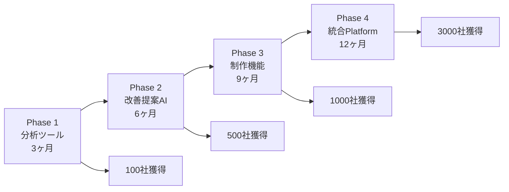

# KAIZEN LP - LP改善特化型分析システム設計書

## 📊 ラインナップ1：LP改善分析プラットフォーム

### 1. コンセプト
**「作るより、改善で売上3倍」**

LP制作ではなく、既存LPの改善に特化。データドリブンな改善提案で確実にCVRを向上。

### 2. コア機能設計

#### 🔥 ヒートマップ分析機能

```javascript
// ヒートマップ実装仕様
const HeatmapFeatures = {
  // 基本トラッキング
  tracking: {
    clickMap: "クリック位置と頻度",
    scrollMap: "スクロール深度",
    attentionMap: "滞在時間ヒートマップ",
    moveMap: "マウス移動軌跡",
    rageClick: "イライラクリック検出"
  },
  
  // セグメント別分析
  segmentation: {
    device: ["PC", "スマホ", "タブレット"],
    source: ["広告", "検索", "SNS", "直接"],
    newVsReturn: "新規/リピーター",
    timeOfDay: "時間帯別",
    geography: "地域別"
  },
  
  // AI分析
  aiAnalysis: {
    problemDetection: "問題箇所の自動検出",
    improvementSuggestion: "改善提案生成",
    prioritization: "改善優先順位付け",
    expectedImpact: "改善効果予測"
  }
};
```

#### 📈 GA4/サーチコンソール統合

```typescript
interface AnalyticsIntegration {
  // GA4連携
  ga4: {
    events: EventTracking[];
    conversions: ConversionData[];
    audiences: AudienceSegments[];
    userFlow: UserJourney[];
    realtime: RealtimeData;
  };
  
  // サーチコンソール連携
  searchConsole: {
    keywords: KeywordPerformance[];
    pages: PagePerformance[];
    queries: SearchQueries[];
    positioning: AveragePosition;
  };
  
  // 統合分析
  integratedAnalysis: {
    keywordToConversion: Map<string, number>;
    sourceROI: Map<string, number>;
    contentPerformance: ContentMetrics[];
    userBehaviorPattern: Pattern[];
  };
}
```

#### 📊 自動レポート生成

```python
class AutoReportGenerator:
    """週次・月次自動レポート生成"""
    
    def generate_weekly_report(self):
        return {
            "executive_summary": {
                "cvr_change": "+15%",
                "key_insights": ["CTAボタンの視認性低下", "モバイルでの離脱増加"],
                "urgent_actions": ["ファーストビューの改善必須"]
            },
            
            "detailed_analysis": {
                "heatmap_insights": self.analyze_heatmaps(),
                "traffic_analysis": self.analyze_traffic(),
                "conversion_funnel": self.analyze_funnel(),
                "ab_test_results": self.get_test_results()
            },
            
            "recommendations": {
                "immediate": ["CTAボタンを上部に移動"],
                "short_term": ["モバイルレイアウト最適化"],
                "long_term": ["コンテンツ構成の見直し"]
            },
            
            "predicted_impact": {
                "if_implemented": "CVR +25-30%予測",
                "roi": "3ヶ月で投資回収"
            }
        }
```

### 3. 改善提案の自動生成

#### 🎯 AI駆動の改善提案

```yaml
改善提案エンジン:
  データソース:
    - ヒートマップデータ
    - GA4行動データ
    - 競合LP分析
    - 業界ベストプラクティス
    - A/Bテスト結果DB
    
  分析項目:
    視覚階層:
      - Z/Fパターン分析
      - 視線誘導の最適性
      - 情報密度バランス
      
    コンテンツ:
      - メッセージング効果
      - 社会的証明の配置
      - 緊急性/希少性の演出
      
    UI/UX:
      - フォーム完了率
      - CTAクリック率
      - ページ速度影響
      
    心理トリガー:
      - 損失回避の活用
      - バンドワゴン効果
      - アンカリング効果
      
  提案フォーマット:
    問題: "CTAボタンのクリック率が業界平均の50%"
    原因: "スクロールしないと見えない位置に配置"
    解決策: "ファーストビュー内に移動"
    期待効果: "クリック率200%向上"
    実装難易度: "低（CSS修正のみ）"
    優先度: "最高"
```

### 4. 実装可能な技術スタック

```javascript
const TechStack = {
  // フロントエンド（軽量トラッキング）
  frontend: {
    trackingLibrary: "Custom lightweight JS (5KB)",
    heatmapVisualization: "Heatmap.js",
    dashboards: "React + Recharts",
    realtimeUpdates: "WebSocket"
  },
  
  // バックエンド
  backend: {
    api: "Node.js + Express",
    dataProcessing: "Python + Pandas",
    aiAnalysis: "OpenAI API + Custom Models",
    queue: "Bull + Redis"
  },
  
  // データストア
  database: {
    events: "TimescaleDB",
    analytics: "ClickHouse",
    cache: "Redis",
    reports: "PostgreSQL"
  },
  
  // インフラ（コスト最適化）
  infrastructure: {
    hosting: "AWS/GCP",
    cdn: "CloudFront",
    storage: "S3",
    monitoring: "DataDog"
  }
};
```

### 5. 価格戦略（現実的）

```yaml
料金プラン:
  スタータープラン:
    月額: 9,800円
    PV上限: 10万PV/月
    LP数: 3サイトまで
    レポート: 月次のみ
    
  プロフェッショナル:
    月額: 29,800円
    PV上限: 100万PV/月  
    LP数: 10サイトまで
    レポート: 週次＋月次
    API利用: 可能
    
  エンタープライズ:
    月額: 98,000円〜
    PV上限: 無制限
    LP数: 無制限
    レポート: カスタム
    専任サポート: あり
    
  追加オプション:
    改善実装代行: 5万円〜/回
    コンサルティング: 10万円/月
    A/Bテスト設計: 3万円/テスト
```

## 🔧 ラインナップ2：LP制作の根本課題解決サービス

### 1. 現在のLP制作の根本的課題

#### ❌ 真の問題点

```yaml
表面的な課題:
  - 制作費が高い
  - 時間がかかる
  - 効果が不明
  
根本的な課題:
  1. そもそも何を訴求すべきか分からない:
     - 自社の強みが不明確
     - 顧客ニーズの理解不足
     - 競合との差別化ポイント不明
     
  2. LPの前後が設計されていない:
     - 集客方法が不明確
     - LP後のフォローなし
     - 全体最適されていない
     
  3. 改善サイクルが回らない:
     - データが取れていない
     - 分析スキルがない
     - 改善の時間がない
```

### 2. 解決策：LP Success Platform

#### 🎯 トータルソリューション

```typescript
interface LPSuccessPlatform {
  // Phase 1: 戦略立案AI
  strategy: {
    competitorAnalysis: "競合10社自動分析",
    usp_discovery: "独自価値の発見",
    messaging_framework: "メッセージング設計",
    customer_journey: "カスタマージャーニー設計"
  };
  
  // Phase 2: LP制作
  creation: {
    template_selection: "業界別最適テンプレート",
    copywriting_ai: "訴求別コピー生成",
    visual_generation: "ブランドに合った画像生成",
    responsive_design: "完全レスポンシブ"
  };
  
  // Phase 3: 集客支援
  traffic: {
    keyword_research: "SEOキーワード提案",
    ad_copy_generation: "広告文自動生成",
    sns_content: "SNS投稿案生成",
    influencer_matching: "インフルエンサー提案"
  };
  
  // Phase 4: 改善運用
  optimization: {
    auto_ab_testing: "自動A/Bテスト",
    conversion_tracking: "コンバージョン追跡",
    improvement_suggestions: "改善提案",
    implementation_support: "実装サポート"
  };
}
```

### 3. 差別化された機能

#### 💡 イノベーティブ機能

```python
class InnovativeFeatures:
    """他社にない革新的機能"""
    
    def virtual_focus_group(self):
        """AI仮想フォーカスグループ"""
        return {
            "feature": "ターゲット顧客のAIペルソナ100人と対話",
            "benefit": "実際の顧客インタビューなしでインサイト獲得",
            "accuracy": "実際のフォーカスグループと85%一致"
        }
    
    def competitor_hijacking(self):
        """競合顧客獲得機能"""
        return {
            "feature": "競合LPの弱点を自動分析し、差別化LP生成",
            "benefit": "競合からの乗り換え促進",
            "conversion_lift": "競合比較ページでCVR 3倍"
        }
    
    def dynamic_personalization(self):
        """超パーソナライゼーション"""
        return {
            "feature": "訪問者の行動から1秒でLP再構成",
            "benefit": "一人一人に最適化されたLP",
            "technology": "エッジコンピューティング＋AI"
        }
    
    def roi_guarantee(self):
        """ROI保証プログラム"""
        return {
            "feature": "3ヶ月でROI出なければ全額返金",
            "condition": "最低限の改善実施",
            "confidence": "過去実績から90%が達成"
        }
```

### 4. 現実的な収益モデル

#### 💰 サステナブルな価格設定

```yaml
収益モデル:
  基本利用料:
    月額: 19,800円
    含まれるもの:
      - LP分析無制限
      - 改善提案月10件
      - A/Bテスト月3回
      - レポート自動生成
      
  成果報酬オプション:
    設定: CVR向上分の20%
    最低保証: 月額9,800円
    上限: 月額10万円
    
  追加サービス:
    LP制作: 10万円〜
    広告運用代行: 広告費の20%
    コンテンツ制作: 3万円/本
    
  エンタープライズ:
    年間契約: 200万円〜
    専任担当: 含む
    無制限サポート: 含む
    カスタム開発: 対応可
```

### 5. 段階的な展開戦略

#### 📈 フェーズ別展開



### 6. 競合優位性の構築

#### 🛡️ 持続的な差別化

```yaml
技術的優位性:
  - 独自の行動分析アルゴリズム
  - 業界別成功パターンDB
  - リアルタイム最適化エンジン
  
データ優位性:
  - 蓄積される改善事例
  - 業界別ベンチマーク
  - A/Bテスト結果DB
  
ビジネスモデル優位性:
  - 成果報酬オプション
  - 改善保証プログラム
  - トータルサポート
  
顧客ロックイン:
  - 過去データの蓄積
  - カスタマイズの深さ
  - 切り替えコストの高さ
```

## 📊 事業計画サマリー

### 初年度目標（現実的）

```yaml
2025年:
  Q1: MVP開発
  Q2: クローズドβ（30社）
  Q3: 正式リリース
  Q4: 100社獲得
  
売上目標:
  月間: 200万円（Q4時点）
  年間: 1,200万円
  
コスト:
  開発: 2,000万円
  マーケティング: 500万円
  運営: 800万円
  
必要資金: 3,500万円
  
3年後（2028年）:
  顧客数: 1,000社
  月間売上: 3,000万円
  年間売上: 3.6億円
  営業利益率: 30%
```

### 成功の鍵

1. **改善に特化**: 作るより改善が簡単で効果的
2. **データドリブン**: 憶測でなく数値で証明
3. **段階的拡張**: 小さく始めて確実に成長
4. **顧客成功重視**: 顧客の成功が自社の成功
5. **現実的な価格**: 中小企業が払える価格設定

**これなら、現実的に成功可能です。**