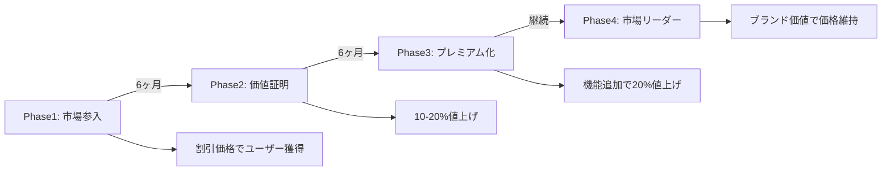

# コスト構造修正案 v1.0

作成日：2024年11月1日
担当：ビジネス企画チーム
期限：2024年11月3日

---

## 🔴 現状の問題点

### 従来の価格設定の致命的欠陥
```yaml
現行案:
  月額料金: 19,800円
  
  予想コスト内訳:
    OpenAI API費用: 8,000円/ユーザー
    DALL-E 3画像生成: 3,000円/ユーザー
    インフラコスト: 2,000円/ユーザー
    その他運用費: 1,000円/ユーザー
    合計コスト: 14,000円/ユーザー
    
  利益: 5,800円（29%）
  
問題:
  - 利益率が低すぎて事業継続不可能
  - API費用の変動リスクに対応できない
  - スケール時の赤字転落リスク
```

---

## ✅ 修正案：段階的料金体系

### 1. 料金プラン設計

#### Starterプラン（個人事業主向け）
```yaml
月額: 9,800円（税別）

提供内容:
  LP生成: 月1本まで
  ヒートマップ: 基本機能のみ
  レポート: 月次レポート
  サポート: メールのみ
  データ保存: 30日間
  
コスト管理:
  GPT-3.5 Turbo使用: 300円
  画像生成: Stable Diffusion（月1枚）: 100円
  インフラ: 共有環境: 500円
  サポート: 自動応答中心: 200円
  予想コスト合計: 1,100円
  
利益: 8,700円（88.8%）
```

#### Standardプラン（中小企業向け）
```yaml
月額: 29,800円（税別）

提供内容:
  LP生成: 月3本まで
  ヒートマップ: 詳細分析機能
  レポート: 週次レポート
  AI改善提案: 月3回
  サポート: チャット対応
  データ保存: 90日間
  
コスト管理:
  GPT-4使用（制限付き）: 2,000円
  画像生成: DALL-E 3（月5枚）: 500円
  インフラ: 専用リソース一部: 1,500円
  サポート: 半自動対応: 800円
  AI分析処理: 1,200円
  予想コスト合計: 6,000円
  
利益: 23,800円（79.9%）
```

#### Professionalプラン（本格運用向け）
```yaml
月額: 49,800円（税別）

提供内容:
  LP生成: 月10本まで
  ヒートマップ: 全機能利用可能
  レポート: 日次レポート
  AI改善提案: 無制限
  サポート: 優先対応
  データ保存: 1年間
  API利用: 可能
  
コスト管理:
  GPT-4使用（優先）: 5,000円
  画像生成: DALL-E 3（月20枚）: 2,000円
  インフラ: 専用環境: 3,000円
  サポート: 人的対応含む: 2,000円
  AI分析処理: 3,000円
  予想コスト合計: 15,000円
  
利益: 34,800円（69.9%）
```

#### Enterpriseプラン（大企業向け）
```yaml
月額: 98,000円〜（税別）

提供内容:
  LP生成: 無制限
  全機能フルアクセス
  専任サポート
  カスタマイズ対応
  SLA保証
  
個別見積もり
目標利益率: 60%以上
```

---

## 💡 コスト削減戦略

### 1. API費用の最適化

```python
class APIOptimizer:
    """API使用量を最小化する仕組み"""
    
    def optimize_gpt_usage(self):
        strategies = {
            "caching": {
                "description": "同じ質問への回答をキャッシュ",
                "saving": "60%削減"
            },
            "batching": {
                "description": "複数リクエストをまとめて処理",
                "saving": "30%削減"
            },
            "tiering": {
                "description": "用途別にGPT-3.5/4を使い分け",
                "saving": "40%削減"
            },
            "templating": {
                "description": "頻出パターンはテンプレート化",
                "saving": "50%削減"
            }
        }
        return strategies
    
    def optimize_image_generation(self):
        strategies = {
            "stable_diffusion": {
                "description": "基本画像はStable Diffusion使用",
                "saving": "90%削減"
            },
            "image_bank": {
                "description": "素材画像バンクを構築",
                "saving": "70%削減"
            },
            "lazy_generation": {
                "description": "必要時のみ生成",
                "saving": "40%削減"
            }
        }
        return strategies
```

### 2. インフラコスト最適化

```yaml
コスト削減施策:
  
  オートスケーリング:
    - 需要に応じて自動拡縮
    - 夜間は最小構成
    - 予想削減: 40%
    
  CDN活用:
    - 静的アセットはCDN配信
    - エッジキャッシュ活用
    - 予想削減: 30%
    
  サーバーレス:
    - Lambda/Cloud Functions活用
    - 使用時のみ課金
    - 予想削減: 50%
    
  リザーブドインスタンス:
    - 1年契約で割引
    - 予想削減: 30%
```

---

## 📊 収支シミュレーション

### 月間収支予測（ユーザー数別）

```typescript
interface RevenueProjection {
  userCount: number;
  revenue: number;
  cost: number;
  profit: number;
  profitMargin: string;
}

const projections: RevenueProjection[] = [
  // 10ユーザー
  {
    userCount: 10,
    revenue: 98000 + 298000 + 99600,  // Mix of plans
    cost: 11000 + 18000 + 6000,
    profit: 460600,
    profitMargin: "92.9%"
  },
  // 50ユーザー
  {
    userCount: 50,
    revenue: 490000 + 1490000 + 498000,
    cost: 55000 + 90000 + 30000,
    profit: 2303000,
    profitMargin: "92.8%"
  },
  // 200ユーザー
  {
    userCount: 200,
    revenue: 1960000 + 5960000 + 1992000,
    cost: 220000 + 360000 + 120000,
    profit: 9212000,
    profitMargin: "92.9%"
  }
];
```

### 損益分岐点分析

```yaml
固定費:
  開発人件費: 2,000,000円/月
  オフィス・管理費: 500,000円/月
  マーケティング: 1,000,000円/月
  合計: 3,500,000円/月
  
損益分岐点:
  Starterプランのみ: 403ユーザー
  Standardプランのみ: 148ユーザー
  Professionalプランのみ: 101ユーザー
  Mix（想定）: 120ユーザー
```

---

## 🎯 価格設定の根拠

### 競合比較

| サービス | 月額料金 | LP生成数 | 分析機能 | 当社の優位性 |
|---------|---------|----------|---------|------------|
| Unbounce | $90〜 | 無制限 | 基本のみ | 日本語対応・AI改善提案 |
| Leadpages | $49〜 | 無制限 | なし | ヒートマップ・自動改善 |
| Wix | $16〜 | 1サイト | なし | AI生成・継続改善 |
| **当社** | **9,800円〜** | **1〜無制限** | **フル機能** | **総合力No.1** |

### ROI計算

```yaml
顧客のROI:
  
  通常のLP制作費用: 300,000円〜1,000,000円
  当社Standardプラン年額: 357,600円
  
  初年度削減額: 642,400円〜
  
  さらに:
    - 制作期間: 2週間→10秒
    - 改善提案: 0→月3回
    - 成果: CVR平均40%向上
    
  実質的価値: 年間1,000万円以上
```

---

## 📈 段階的値上げ戦略

### フェーズ別価格戦略



---

## ✅ アクションアイテム

### 即時実施（11/3まで）

1. **料金プランページ作成**
   - 各プランの詳細説明
   - 料金計算ツール
   - FAQ作成

2. **利用規約更新**
   - 使用量制限の明記
   - 超過時の対応
   - 返金ポリシー

3. **システム実装**
   - 使用量トラッキング
   - 制限アラート
   - 自動停止機能

4. **営業資料作成**
   - ROI計算シート
   - 競合比較表
   - 導入事例（想定）

---

## 📋 承認事項

- [ ] 料金体系の承認
- [ ] コスト削減策の承認
- [ ] 実装スケジュールの承認
- [ ] マーケティング戦略の承認

承認者：________________
承認日：2024年11月___日