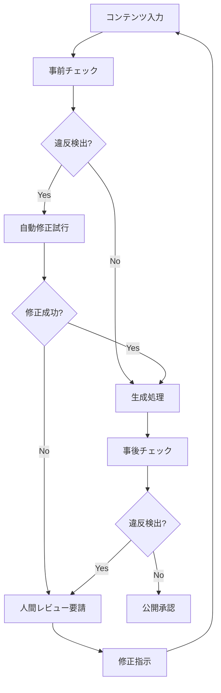

# 法的コンプライアンスフレームワーク v1.0

作成日：2024年11月1日
担当：法務・コンプライアンスチーム
期限：2024年11月3日

---

## 🚨 対応が必要な法規制

### 1. 薬機法（医薬品医療機器等法）

#### 違反リスクの高い表現
```yaml
禁止表現パターン:
  医療効果:
    - "○○が治る"
    - "○○に効く"
    - "医師推奨"
    - "臨床試験済み"
    
  美容・健康:
    - "痩せる"
    - "シミが消える"
    - "若返る"
    - "体質改善"
    
  サプリメント:
    - "予防効果"
    - "治療効果"
    - "医薬品同等"
```

#### チェックロジック実装

```typescript
interface MedicalLawChecker {
  // 薬機法違反チェック
  checkMedicalClaims(content: string): ComplianceResult {
    const violations: Violation[] = [];
    
    // NGワードリスト
    const ngWords = [
      /治[るす]/g,
      /効[くき]/g,
      /医師.*推奨/g,
      /臨床試験/g,
      /痩せる/g,
      /消える/g,
      /改善/g,
      /予防/g
    ];
    
    // パターンマッチング
    ngWords.forEach(pattern => {
      const matches = content.match(pattern);
      if (matches) {
        violations.push({
          type: 'MEDICAL_LAW',
          severity: 'HIGH',
          text: matches[0],
          suggestion: this.getSuggestion(matches[0]),
          law: '薬機法第66条（誇大広告の禁止）'
        });
      }
    });
    
    return {
      isCompliant: violations.length === 0,
      violations,
      riskScore: this.calculateRiskScore(violations)
    };
  }
  
  // 代替表現の提案
  getSuggestion(ngWord: string): string {
    const suggestions = {
      '治る': 'サポートする、整える',
      '効く': '期待できる、働きかける',
      '痩せる': 'ダイエットをサポート',
      '消える': '目立ちにくくする',
      '改善': 'サポート、維持',
      '予防': '健康維持'
    };
    
    return suggestions[ngWord] || '表現の見直しが必要です';
  }
}
```

### 2. 景品表示法（景表法）

#### 優良誤認・有利誤認のチェック

```typescript
interface MisleadingAdChecker {
  // 景表法違反チェック
  checkMisleadingClaims(content: string): ComplianceResult {
    const checks = {
      // 優良誤認（品質の誤認）
      qualityMisleading: {
        patterns: [
          /No\.?1/gi,
          /日本一/g,
          /世界一/g,
          /最[高上]/g,
          /唯一/g,
          /オンリーワン/g
        ],
        validator: (match: string, content: string) => {
          // 根拠の確認
          return this.hasEvidence(match, content);
        }
      },
      
      // 有利誤認（価格・条件の誤認）
      priceMisleading: {
        patterns: [
          /今だけ/g,
          /期間限定/g,
          /先着.*名/g,
          /通常.*円/g,
          /.*%.*OFF/g
        ],
        validator: (match: string, content: string) => {
          // 条件の明確性チェック
          return this.isConditionClear(match, content);
        }
      },
      
      // 二重価格表示
      dualPricing: {
        patterns: [
          /定価.*円.*→.*円/g,
          /メーカー希望.*価格/g
        ],
        validator: (match: string) => {
          // 比較対象価格の妥当性
          return this.isPriceComparison Valid(match);
        }
      }
    };
    
    const violations = this.performChecks(content, checks);
    
    return {
      isCompliant: violations.length === 0,
      violations,
      autoFixAvailable: this.canAutoFix(violations)
    };
  }
}
```

### 3. 著作権・商標権

```python
class IntellectualPropertyChecker:
    """知的財産権チェッカー"""
    
    def check_copyright(self, content, images):
        """著作権侵害チェック"""
        
        violations = []
        
        # テキストの盗用チェック
        text_check = self.check_plagiarism(content)
        if text_check['similarity'] > 0.8:
            violations.append({
                'type': 'COPYRIGHT_TEXT',
                'severity': 'HIGH',
                'source': text_check['source'],
                'similarity': text_check['similarity']
            })
        
        # 画像の著作権チェック
        for image in images:
            image_check = self.check_image_copyright(image)
            if not image_check['is_safe']:
                violations.append({
                    'type': 'COPYRIGHT_IMAGE',
                    'severity': 'HIGH',
                    'image': image['url'],
                    'owner': image_check['owner']
                })
        
        # 商標チェック
        trademark_check = self.check_trademarks(content)
        violations.extend(trademark_check)
        
        return {
            'is_compliant': len(violations) == 0,
            'violations': violations,
            'risk_level': self.calculate_risk_level(violations)
        }
    
    def check_trademarks(self, content):
        """商標権侵害チェック"""
        
        # 登録商標データベースとの照合
        trademarks = self.load_trademark_database()
        violations = []
        
        for trademark in trademarks:
            if trademark['name'] in content:
                # 使用文脈の確認
                context = self.get_context(trademark['name'], content)
                if self.is_trademark_misuse(context, trademark):
                    violations.append({
                        'type': 'TRADEMARK',
                        'severity': 'MEDIUM',
                        'trademark': trademark['name'],
                        'owner': trademark['owner'],
                        'suggestion': 'R記号または™記号の付与、または削除'
                    })
        
        return violations
```

### 4. 個人情報保護法・GDPR

```yaml
個人情報取扱いチェックリスト:
  
  収集時:
    - 利用目的の明示
    - 同意取得の確認
    - 必要最小限の収集
    - SSL/TLS暗号化
    
  保管時:
    - アクセス制御
    - 暗号化保存
    - ログ記録
    - 定期監査
    
  利用時:
    - 目的外使用禁止
    - 第三者提供制限
    - 本人確認
    - 履歴記録
    
  削除時:
    - 削除権の保証
    - 完全削除の実施
    - 削除証明書発行
    - バックアップからも削除
```

---

## 🛡️ コンプライアンスチェックシステム

### 統合チェックフロー



### 実装アーキテクチャ

```typescript
class ComplianceEngine {
  private checkers: IComplianceChecker[] = [
    new MedicalLawChecker(),
    new MisleadingAdChecker(),
    new IntellectualPropertyChecker(),
    new PrivacyChecker()
  ];
  
  async performCompleteCheck(content: LPContent): Promise<ComplianceReport> {
    const results = await Promise.all(
      this.checkers.map(checker => checker.check(content))
    );
    
    const report: ComplianceReport = {
      timestamp: new Date(),
      overallCompliant: results.every(r => r.isCompliant),
      violations: results.flatMap(r => r.violations),
      riskScore: this.calculateOverallRisk(results),
      autoFixAvailable: results.some(r => r.autoFixAvailable),
      requiresHumanReview: this.needsHumanReview(results)
    };
    
    // 監査ログ記録
    await this.logComplianceCheck(report);
    
    // 高リスクの場合は管理者に通知
    if (report.riskScore > 0.7) {
      await this.notifyAdministrators(report);
    }
    
    return report;
  }
  
  async autoFix(content: LPContent, violations: Violation[]): Promise<LPContent> {
    let fixedContent = { ...content };
    
    for (const violation of violations) {
      if (violation.autoFixAvailable) {
        fixedContent = await this.applyFix(fixedContent, violation);
      }
    }
    
    // 修正後の再チェック
    const recheck = await this.performCompleteCheck(fixedContent);
    
    if (!recheck.overallCompliant) {
      throw new Error('自動修正後も違反が残っています');
    }
    
    return fixedContent;
  }
}
```

---

## 📋 利用規約・プライバシーポリシー（草案）

### 利用規約の重要条項

```markdown
## 第X条（生成コンテンツの責任）

1. 当社は、AIが生成したコンテンツについて、法令遵守のための
   合理的な努力を行いますが、完全性を保証するものではありません。

2. 利用者は、生成されたコンテンツを公開する前に、自己の責任で
   内容を確認し、必要に応じて修正を行うものとします。

3. 生成コンテンツに起因する第三者からのクレーム、損害賠償請求
   等については、利用者が全責任を負うものとします。

## 第Y条（禁止事項）

利用者は、以下の目的での本サービスの利用を禁止します：
- 薬機法、景表法その他の法令に違反するコンテンツの生成
- 第三者の知的財産権を侵害するコンテンツの生成
- 公序良俗に反するコンテンツの生成
- その他、当社が不適切と判断するコンテンツの生成
```

### プライバシーポリシーの重要項目

```markdown
## 個人情報の取扱い

### 収集する情報
- アカウント情報（メールアドレス、会社名等）
- 利用履歴（生成したLP、アクセスログ等）
- 分析データ（ヒートマップ、CVR等）

### 利用目的
- サービスの提供・改善
- カスタマーサポート
- 利用状況の分析
- マーケティング（同意取得済みの場合）

### 第三者提供
原則として、個人情報を第三者に提供することはありません。
ただし、以下の場合を除きます：
- 法令に基づく場合
- 人の生命、身体または財産の保護のために必要な場合
- 利用者の同意がある場合

### データの削除
利用者からの請求により、24時間以内に個人データを削除します。
```

---

## ⚖️ リスク評価マトリックス

| 法令 | 違反時の影響 | 発生確率 | リスクレベル | 対策優先度 |
|------|------------|---------|------------|-----------|
| 薬機法 | 行政処分・罰金 | 中 | 高 | 最優先 |
| 景表法 | 措置命令・課徴金 | 高 | 高 | 最優先 |
| 著作権法 | 損害賠償・差止 | 中 | 中 | 優先 |
| 個人情報保護法 | 罰金・信用失墜 | 低 | 中 | 標準 |
| GDPR | 巨額制裁金 | 低 | 中 | 標準 |

---

## ✅ 実装チェックリスト

### Phase 0（11/3まで）
- [ ] 法令チェックAPIの選定・契約
- [ ] 基本的なNGワードリスト作成
- [ ] 利用規約・プライバシーポリシー作成
- [ ] コンプライアンス体制の構築

### Phase 1（MVP）
- [ ] 自動チェック機能の実装
- [ ] 違反検出時のアラート機能
- [ ] 修正提案機能の基本実装
- [ ] 監査ログシステム

### Phase 2以降
- [ ] AI学習による精度向上
- [ ] 業界別チェックルール
- [ ] 多言語対応
- [ ] 法改正への自動対応

---

## 📞 法務相談窓口

- 顧問弁護士：[連絡先]
- 薬機法専門家：[連絡先]
- 知財専門家：[連絡先]
- 個人情報保護専門家：[連絡先]

緊急時対応フロー：
1. 違反の疑いを検知
2. 自動的にコンテンツを非公開化
3. 法務チームに通知
4. 24時間以内に対応方針決定