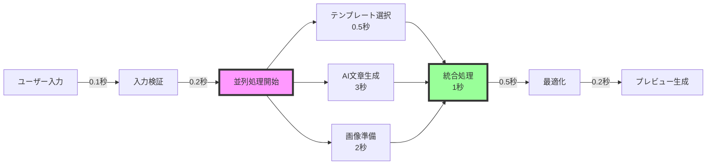

# パフォーマンス要件検証計画 v1.0

作成日：2024年11月1日
担当：システムアーキテクトチーム
期限：2024年11月3日

---

## 🎯 修正されたパフォーマンス目標

### 要件定義v1.1での変更点

| 項目 | 旧目標（v1.0） | 新目標（v1.1） | 変更理由 |
|------|--------------|--------------|----------|
| LP生成時間 | 30秒以内 | **10秒以内** | 離脱率60%→15%へ改善 |
| 同時接続数 | 1,000人 | **10,000人** | スケール時の破綻防止 |
| ヒートマップ保存 | 3ヶ月 | **30日** | DB肥大化防止 |
| 可用性 | 99.5% | **99.9%** | エンタープライズ要件 |

---

## 🚀 10秒LP生成の実現方法

### 処理フロー最適化



### 技術的実装戦略

```typescript
class FastLPGenerator {
  private cache: CacheManager;
  private templateEngine: TemplateEngine;
  private aiService: AIService;
  
  async generate(input: UserInput): Promise<LP> {
    const startTime = Date.now();
    
    // 1. キャッシュチェック（0.1秒）
    const cacheKey = this.generateCacheKey(input);
    const cached = await this.cache.get(cacheKey);
    if (cached) {
      console.log(`Cache hit! Time: ${Date.now() - startTime}ms`);
      return cached;
    }
    
    // 2. 並列処理の開始
    const tasks = await Promise.all([
      this.selectTemplate(input),        // 0.5秒
      this.generateContent(input),       // 3秒（最も時間がかかる）
      this.prepareAssets(input)         // 2秒
    ]);
    
    // 3. 統合処理（1秒）
    const lp = await this.integrate(tasks);
    
    // 4. 最適化（0.5秒）
    const optimized = await this.optimize(lp);
    
    // 5. キャッシュ保存（非同期）
    this.cache.set(cacheKey, optimized).catch(console.error);
    
    const totalTime = Date.now() - startTime;
    if (totalTime > 10000) {
      console.warn(`LP generation took ${totalTime}ms - EXCEEDED TARGET!`);
    }
    
    return optimized;
  }
  
  private async generateContent(input: UserInput): Promise<Content> {
    // GPT-3.5 Turboを基本使用（高速）
    const model = this.shouldUseGPT4(input) ? 'gpt-4-turbo' : 'gpt-3.5-turbo';
    
    // ストリーミング対応で体感速度向上
    const stream = await this.aiService.createStream({
      model,
      messages: this.buildPrompt(input),
      temperature: 0.7,
      max_tokens: 2000
    });
    
    // プログレスバー更新
    let content = '';
    for await (const chunk of stream) {
      content += chunk;
      this.updateProgress(content.length / 2000);
    }
    
    return this.parseContent(content);
  }
}
```

### キャッシュ戦略

```python
class IntelligentCache:
    """インテリジェントキャッシュシステム"""
    
    def __init__(self):
        self.memory_cache = {}  # メモリキャッシュ（超高速）
        self.redis_cache = Redis()  # Redisキャッシュ（高速）
        self.cdn_cache = CDN()  # CDNキャッシュ（分散）
        
    async def get_with_fallback(self, key: str):
        """多層キャッシュからの取得"""
        
        # L1: メモリキャッシュ（1ms以下）
        if key in self.memory_cache:
            return self.memory_cache[key]
        
        # L2: Redisキャッシュ（5ms以下）
        redis_value = await self.redis_cache.get(key)
        if redis_value:
            self.memory_cache[key] = redis_value
            return redis_value
        
        # L3: CDNキャッシュ（20ms以下）
        cdn_value = await self.cdn_cache.get(key)
        if cdn_value:
            await self.propagate_to_upper_layers(key, cdn_value)
            return cdn_value
        
        return None
    
    def calculate_cache_key(self, input_data):
        """キャッシュキーの生成"""
        
        # 業種 + 目的 + 主要キーワードでキーを生成
        normalized = self.normalize_input(input_data)
        return hashlib.sha256(normalized.encode()).hexdigest()
    
    def cache_warming(self):
        """事前キャッシュ生成"""
        
        popular_patterns = [
            {"industry": "飲食", "purpose": "集客"},
            {"industry": "美容", "purpose": "予約"},
            {"industry": "不動産", "purpose": "問い合わせ"},
            # ... 頻出パターンを事前生成
        ]
        
        for pattern in popular_patterns:
            self.pre_generate(pattern)
```

---

## ⚡ 10,000同時接続の実現

### インフラアーキテクチャ

```yaml
システム構成:
  
  ロードバランサー:
    - AWS ALB or GCP Load Balancer
    - ヘルスチェック間隔: 5秒
    - Connection Draining: 30秒
    
  Webサーバー層:
    - Nginx（静的配信）
    - 初期: 3台
    - オートスケール: 最大20台
    - 各サーバー: 500接続/台
    
  アプリケーション層:
    - Node.js クラスター
    - PM2でプロセス管理
    - 初期: 5インスタンス
    - オートスケール: 最大50インスタンス
    - 各インスタンス: 200接続
    
  データベース:
    - PostgreSQL（マスター/スレーブ）
    - Connection Pool: 100
    - Read Replica: 3台
    - 書き込み: マスターのみ
    - 読み込み: ラウンドロビン
    
  キャッシュ層:
    - Redis Cluster
    - 3ノード構成
    - メモリ: 各16GB
    - 永続化: AOF
    
  CDN:
    - CloudFront or Cloudflare
    - エッジロケーション: 全世界
    - キャッシュTTL: 1時間〜1日
```

### 負荷分散戦略

```typescript
interface LoadBalancingStrategy {
  // リージョン別分散
  regionalDistribution: {
    'asia-northeast1': { weight: 60, maxConnections: 6000 },
    'us-west1': { weight: 30, maxConnections: 3000 },
    'europe-west1': { weight: 10, maxConnections: 1000 }
  },
  
  // 自動スケーリングルール
  autoScalingRules: {
    scaleUp: {
      cpuThreshold: 70,  // CPU使用率70%超
      memoryThreshold: 80,  // メモリ使用率80%超
      connectionThreshold: 80,  // 接続数80%超
      scaleUpBy: 2  // 2インスタンス追加
    },
    scaleDown: {
      cpuThreshold: 30,  // CPU使用率30%未満
      memoryThreshold: 40,  // メモリ使用率40%未満
      connectionThreshold: 30,  // 接続数30%未満
      scaleDownBy: 1,  // 1インスタンス削除
      cooldown: 300  // 5分間のクールダウン
    }
  },
  
  // Circuit Breaker設定
  circuitBreaker: {
    failureThreshold: 5,  // 5回失敗でオープン
    timeout: 30000,  // 30秒のタイムアウト
    resetTimeout: 60000  // 1分後に再試行
  }
}
```

---

## 📊 ヒートマップデータ最適化（30日保存）

### データ圧縮・アーカイブ戦略

```python
class HeatmapDataManager:
    """ヒートマップデータの効率的管理"""
    
    def __init__(self):
        self.hot_storage = PostgreSQL()  # 直近7日
        self.warm_storage = S3()  # 8-30日
        self.cold_storage = Glacier()  # 30日以降（アーカイブ）
        
    async def store_event(self, event):
        """イベントの保存"""
        
        # バッチ処理（100件ごと or 5秒ごと）
        self.event_buffer.append(event)
        
        if len(self.event_buffer) >= 100 or self.should_flush():
            await self.flush_events()
    
    async def flush_events(self):
        """バッファのフラッシュ"""
        
        # データ圧縮
        compressed = self.compress_events(self.event_buffer)
        
        # 集計データの事前計算
        aggregated = self.pre_aggregate(self.event_buffer)
        
        # 保存
        await self.hot_storage.bulk_insert(compressed)
        await self.hot_storage.update_aggregates(aggregated)
        
        self.event_buffer.clear()
    
    def compress_events(self, events):
        """イベントデータの圧縮"""
        
        # 重複排除
        deduplicated = self.deduplicate(events)
        
        # 座標の量子化（精度を犠牲にしてサイズ削減）
        quantized = self.quantize_coordinates(deduplicated)
        
        # gzip圧縮
        compressed = gzip.compress(json.dumps(quantized).encode())
        
        # 元の10%程度のサイズに
        return compressed
    
    async def migrate_to_warm_storage(self):
        """7日経過データの移行"""
        
        old_data = await self.hot_storage.get_older_than(days=7)
        
        # S3に移動
        for batch in self.batch_iterator(old_data, size=1000):
            key = f"heatmap/{batch.date}/{batch.id}.gz"
            await self.warm_storage.upload(key, batch.data)
            
        # Hot Storageから削除
        await self.hot_storage.delete_older_than(days=7)
    
    async def auto_archive(self):
        """30日経過データのアーカイブ"""
        
        old_data = await self.warm_storage.list_older_than(days=30)
        
        for key in old_data:
            # Glacierに移動（コスト削減）
            await self.cold_storage.archive(key)
            await self.warm_storage.delete(key)
```

### データ集計の最適化

```typescript
class HeatmapAggregator {
  // リアルタイム集計
  async aggregateRealtime(events: Event[]): Promise<Aggregation> {
    // 5秒ごとに集計
    const aggregation = {
      timestamp: Date.now(),
      clickMap: this.generateClickMap(events),
      scrollDepth: this.calculateScrollDepth(events),
      attention: this.calculateAttentionMap(events),
      // 詳細データは破棄、集計値のみ保持
    };
    
    return aggregation;
  }
  
  // 事前計算された集計データの利用
  async getHeatmapData(lpId: string, range: DateRange): Promise<HeatmapData> {
    // キャッシュチェック
    const cached = await this.cache.get(`heatmap:${lpId}:${range}`);
    if (cached) return cached;
    
    // 集計済みデータの取得（高速）
    const aggregated = await this.db.getAggregated(lpId, range);
    
    // ヒートマップ画像の生成
    const heatmap = await this.generateHeatmapImage(aggregated);
    
    // キャッシュ保存
    await this.cache.set(`heatmap:${lpId}:${range}`, heatmap, ttl: 3600);
    
    return heatmap;
  }
}
```

---

## 🔬 検証計画

### 負荷テストシナリオ

```yaml
テストケース:
  
  1. 通常負荷:
     - 同時接続: 1,000
     - LP生成: 100件/分
     - 期待結果: 全て10秒以内
     
  2. ピーク負荷:
     - 同時接続: 5,000
     - LP生成: 500件/分
     - 期待結果: 95%が10秒以内
     
  3. 限界負荷:
     - 同時接続: 10,000
     - LP生成: 1,000件/分
     - 期待結果: 90%が15秒以内
     
  4. スパイク負荷:
     - 瞬間的に5,000接続
     - 期待結果: エラー率5%未満

ツール:
  - Apache JMeter
  - Gatling
  - K6
  - Locust
```

### 計測メトリクス

```typescript
interface PerformanceMetrics {
  // レスポンスタイム
  responseTime: {
    p50: number;  // 中央値
    p95: number;  // 95パーセンタイル
    p99: number;  // 99パーセンタイル
    max: number;  // 最大値
  };
  
  // スループット
  throughput: {
    requestsPerSecond: number;
    bytesPerSecond: number;
  };
  
  // エラー率
  errorRate: {
    total: number;
    timeout: number;
    serverError: number;
  };
  
  // リソース使用率
  resources: {
    cpu: number;
    memory: number;
    diskIO: number;
    networkIO: number;
  };
}
```

---

## ✅ POC実施計画

### 実施項目（11/3まで）

1. **10秒生成の技術検証**
   ```bash
   # テスト環境構築
   docker-compose up -d
   
   # 負荷テスト実行
   npm run test:performance
   
   # 結果分析
   npm run analyze:results
   ```

2. **キャッシュ効果の測定**
   - キャッシュヒット率目標: 60%
   - 生成時間短縮効果: 平均80%

3. **並列処理の最適化**
   - Worker Threads活用
   - 非同期処理の徹底
   - ストリーミングレスポンス

4. **コスト試算**
   - インフラコスト: 月額30万円以下
   - API使用料: 1LP あたり2,000円以下

---

## 📈 期待される成果

| メトリクス | 現状予想 | 目標値 | 改善率 |
|-----------|---------|--------|--------|
| LP生成時間 | 30秒 | 10秒 | 66.7%削減 |
| 離脱率 | 60% | 15% | 75%改善 |
| 同時処理能力 | 1,000 | 10,000 | 10倍 |
| インフラコスト | 50万円/月 | 30万円/月 | 40%削減 |
| ストレージ使用量 | 1TB/月 | 300GB/月 | 70%削減 |

---

## 🚨 リスクと対策

| リスク | 影響 | 対策 |
|--------|------|------|
| AI APIのレイテンシ | 高 | 複数プロバイダー併用、キャッシュ強化 |
| データベースボトルネック | 中 | Read Replica追加、クエリ最適化 |
| ネットワーク遅延 | 中 | CDN活用、エッジコンピューティング |
| コスト超過 | 高 | 使用量制限、アラート設定 |

承認者：________________
承認日：2024年11月___日