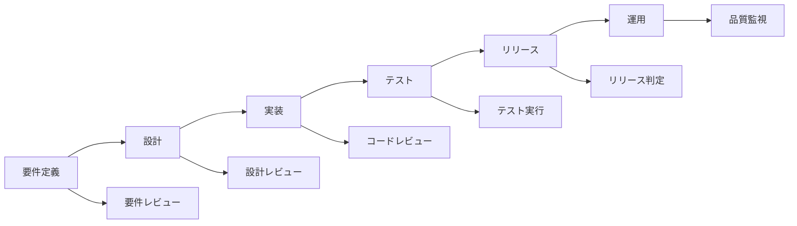

# 品質管理プロセス定義書 v1.0

作成日：2024年11月1日  
担当：QAチーム
期限：2024年11月7日

---

## 🎯 品質管理の目的と範囲

### GROWTH AIシステムの品質目標

```yaml
品質特性:
  機能性:
    - LP生成精度: 95%以上
    - 法令遵守率: 100%
    - 日本語自然性: 90点以上
    
  信頼性:
    - システム稼働率: 99.9%
    - データ損失率: 0%
    - エラー率: 1%未満
    
  使用性:
    - タスク完了率: 90%以上
    - ユーザー満足度: NPS 40以上
    - 学習曲線: 5分以内で基本操作習得
    
  効率性:
    - LP生成時間: 10秒以内
    - レスポンスタイム: 2秒以内
    - リソース使用率: 70%以下
    
  保守性:
    - コードカバレッジ: 80%以上
    - 技術的負債: 10%以下
    - ドキュメント充実度: 100%
```

---

## 📊 AI出力品質管理

### LP生成品質の評価基準

```python
class LPQualityEvaluator:
    """LP品質評価システム"""
    
    def __init__(self):
        self.criteria = {
            "content_quality": {
                "weight": 0.3,
                "metrics": {
                    "grammar_score": self.check_grammar,
                    "readability": self.check_readability,
                    "keyword_density": self.check_keyword_density,
                    "tone_consistency": self.check_tone
                }
            },
            
            "design_quality": {
                "weight": 0.2,
                "metrics": {
                    "visual_hierarchy": self.check_hierarchy,
                    "color_harmony": self.check_colors,
                    "responsive_design": self.check_responsive,
                    "loading_speed": self.check_performance
                }
            },
            
            "business_effectiveness": {
                "weight": 0.3,
                "metrics": {
                    "cta_clarity": self.check_cta,
                    "value_proposition": self.check_value_prop,
                    "trust_signals": self.check_trust,
                    "conversion_potential": self.predict_conversion
                }
            },
            
            "compliance": {
                "weight": 0.2,
                "metrics": {
                    "legal_compliance": self.check_legal,
                    "accessibility": self.check_a11y,
                    "privacy": self.check_privacy,
                    "copyright": self.check_copyright
                }
            }
        }
    
    def evaluate_lp(self, lp_content):
        """総合品質スコアの算出"""
        
        scores = {}
        total_score = 0
        
        for category, config in self.criteria.items():
            category_score = 0
            
            for metric_name, metric_func in config["metrics"].items():
                score = metric_func(lp_content)
                scores[f"{category}.{metric_name}"] = score
                category_score += score / len(config["metrics"])
            
            scores[category] = category_score
            total_score += category_score * config["weight"]
        
        return {
            "total_score": total_score,
            "category_scores": scores,
            "pass": total_score >= 80,
            "recommendations": self.generate_recommendations(scores)
        }
    
    def check_grammar(self, content):
        """文法チェック"""
        # 日本語文法チェッカー使用
        # GiNZA, Sudachi等のNLPライブラリ活用
        errors = self.grammar_checker.check(content.text)
        
        if len(errors) == 0:
            return 100
        elif len(errors) < 3:
            return 85
        elif len(errors) < 5:
            return 70
        else:
            return 50
    
    def predict_conversion(self, content):
        """CVR予測モデル"""
        features = self.extract_features(content)
        prediction = self.ml_model.predict(features)
        
        # 業界平均との比較
        industry_avg = self.get_industry_average(content.industry)
        
        if prediction > industry_avg * 1.5:
            return 100
        elif prediction > industry_avg:
            return 80
        else:
            return 60
```

### 日本語品質チェック

```typescript
interface JapaneseQualityChecker {
  // 自然性チェック
  checkNaturalness(text: string): QualityScore {
    const checks = {
      // 敬語の一貫性
      keigo: this.checkKeigoConsistency(text),
      
      // カタカナ・ひらがなのバランス
      kanaBalance: this.checkKanaBalance(text),
      
      // 漢字使用率（30-40%が理想）
      kanjiRatio: this.checkKanjiRatio(text),
      
      // 文の長さ（40文字以内推奨）
      sentenceLength: this.checkSentenceLength(text),
      
      // 専門用語の適切性
      terminology: this.checkTerminology(text),
      
      // 読点の適切な配置
      punctuation: this.checkPunctuation(text)
    };
    
    return this.calculateScore(checks);
  }
  
  // 業界別表現チェック
  checkIndustryTone(text: string, industry: string): QualityScore {
    const industryTones = {
      'BtoB': {
        expectedTone: 'formal',
        ngWords: ['お得', 'チャンス', '今すぐ'],
        preferredWords: ['効率化', '生産性', 'ROI']
      },
      'BtoC': {
        expectedTone: 'friendly',
        ngWords: ['弊社', '拝承'],
        preferredWords: ['お得', '簡単', '安心']
      },
      '医療': {
        expectedTone: 'professional',
        ngWords: ['絶対', '必ず', '治る'],
        preferredWords: ['サポート', '改善', '維持']
      }
    };
    
    const tone = industryTones[industry];
    return this.evaluateTone(text, tone);
  }
}
```

---

## 🔄 品質保証プロセス

### 開発フェーズ別QAアクティビティ



### テスト戦略

```yaml
テストレベル:
  
  単体テスト:
    責任: 開発者
    カバレッジ目標: 80%
    自動化率: 100%
    ツール:
      - Jest (JavaScript)
      - pytest (Python)
      - React Testing Library
    
  統合テスト:
    責任: QAチーム
    カバレッジ目標: 70%
    自動化率: 80%
    ツール:
      - Postman/Newman
      - Supertest
      - TestContainers
    
  E2Eテスト:
    責任: QAチーム
    カバレッジ目標: 主要シナリオ100%
    自動化率: 70%
    ツール:
      - Playwright
      - Cypress
      - Selenium
    
  性能テスト:
    責任: パフォーマンスチーム
    目標:
      - 10秒以内のLP生成
      - 10,000同時接続
    ツール:
      - JMeter
      - K6
      - Gatling
    
  セキュリティテスト:
    責任: セキュリティチーム
    頻度: スプリント毎
    ツール:
      - OWASP ZAP
      - Snyk
      - SonarQube
```

### コードレビュープロセス

```typescript
class CodeReviewProcess {
  private readonly checkpoints = {
    functionality: {
      priority: 'HIGH',
      items: [
        '要件を満たしているか',
        'エッジケースの処理',
        'エラーハンドリング',
        'ログ出力の適切性'
      ]
    },
    
    performance: {
      priority: 'HIGH',
      items: [
        'アルゴリズムの効率性',
        'メモリ使用量',
        'データベースクエリ最適化',
        'キャッシュ戦略'
      ]
    },
    
    security: {
      priority: 'CRITICAL',
      items: [
        '入力検証',
        'SQLインジェクション対策',
        'XSS対策',
        '認証・認可'
      ]
    },
    
    maintainability: {
      priority: 'MEDIUM',
      items: [
        'コードの可読性',
        'DRY原則',
        'SOLID原則',
        'テストの充実度'
      ]
    },
    
    aiSpecific: {
      priority: 'HIGH',
      items: [
        'プロンプトエンジニアリング',
        'トークン使用量',
        'レスポンス検証',
        'フォールバック処理'
      ]
    }
  };
  
  async performReview(pr: PullRequest): Promise<ReviewResult> {
    const results = [];
    
    // 自動チェック
    results.push(await this.runAutomatedChecks(pr));
    
    // チェックリストベースレビュー
    for (const [category, config] of Object.entries(this.checkpoints)) {
      const categoryResult = await this.reviewCategory(pr, category, config);
      results.push(categoryResult);
    }
    
    // AI支援レビュー
    const aiSuggestions = await this.getAISuggestions(pr);
    
    return {
      approved: results.every(r => r.passed),
      results,
      aiSuggestions,
      requiredActions: this.extractRequiredActions(results)
    };
  }
}
```

---

## 📈 品質メトリクス管理

### KPIダッシュボード

```python
class QualityMetricsDashboard:
    """品質メトリクスダッシュボード"""
    
    def __init__(self):
        self.metrics = {
            "code_quality": {
                "coverage": {
                    "current": None,
                    "target": 80,
                    "trend": "improving"
                },
                "complexity": {
                    "cyclomatic": None,
                    "target": 10,
                    "trend": "stable"
                },
                "duplication": {
                    "percentage": None,
                    "target": 5,
                    "trend": "improving"
                }
            },
            
            "defect_metrics": {
                "defect_density": {
                    "current": None,
                    "target": 0.5,  # per KLOC
                    "trend": "improving"
                },
                "escape_rate": {
                    "current": None,
                    "target": 5,  # %
                    "trend": "stable"
                },
                "mttr": {
                    "critical": None,
                    "high": None,
                    "target_critical": 4,  # hours
                    "target_high": 24  # hours
                }
            },
            
            "ai_quality": {
                "generation_success_rate": {
                    "current": None,
                    "target": 95,
                    "trend": "improving"
                },
                "content_quality_score": {
                    "current": None,
                    "target": 85,
                    "trend": "stable"
                },
                "compliance_rate": {
                    "current": None,
                    "target": 100,
                    "trend": "stable"
                }
            },
            
            "user_satisfaction": {
                "nps": {
                    "current": None,
                    "target": 40,
                    "trend": "improving"
                },
                "task_success_rate": {
                    "current": None,
                    "target": 90,
                    "trend": "stable"
                },
                "support_tickets": {
                    "per_user": None,
                    "target": 0.1,
                    "trend": "decreasing"
                }
            }
        }
    
    def generate_weekly_report(self):
        """週次品質レポート生成"""
        
        report = {
            "summary": self.calculate_overall_health(),
            "highlights": self.identify_highlights(),
            "concerns": self.identify_concerns(),
            "action_items": self.generate_action_items(),
            "trends": self.analyze_trends()
        }
        
        return report
```

### 不具合管理

```yaml
不具合分類:
  
  重要度:
    Critical:
      定義: "サービス停止、データ損失、セキュリティ侵害"
      SLA: "4時間以内対応"
      エスカレーション: "即時"
      
    High:
      定義: "主要機能の不具合、性能劣化"
      SLA: "24時間以内対応"
      エスカレーション: "1時間以内"
      
    Medium:
      定義: "副次機能の不具合、UXの問題"
      SLA: "3営業日以内対応"
      エスカレーション: "通常フロー"
      
    Low:
      定義: "軽微な表示崩れ、改善要望"
      SLA: "次スプリント検討"
      エスカレーション: "不要"
  
  原因分析:
    必須項目:
      - 発生条件
      - 根本原因
      - 影響範囲
      - 修正方法
      - 再発防止策
```

---

## 🤖 AI品質の継続的改善

### フィードバックループ

```typescript
class AIQualityImprovement {
  // ユーザーフィードバック収集
  async collectFeedback(lpId: string): Promise<Feedback> {
    return {
      satisfaction: await this.getSatisfactionScore(lpId),
      issues: await this.getReportedIssues(lpId),
      suggestions: await this.getSuggestions(lpId),
      actualPerformance: await this.trackActualCVR(lpId)
    };
  }
  
  // 学習データ生成
  generateTrainingData(feedback: Feedback[]): TrainingData {
    const positiveExamples = feedback
      .filter(f => f.satisfaction > 4)
      .map(f => ({
        input: f.originalRequest,
        output: f.generatedContent,
        score: f.actualPerformance
      }));
    
    const negativeExamples = feedback
      .filter(f => f.satisfaction <= 2)
      .map(f => ({
        input: f.originalRequest,
        output: f.generatedContent,
        issues: f.issues
      }));
    
    return {
      positive: positiveExamples,
      negative: negativeExamples,
      improvements: this.extractPatterns(feedback)
    };
  }
  
  // モデル改善
  async improveModel(trainingData: TrainingData): Promise<void> {
    // Fine-tuning
    await this.fineTuneModel(trainingData);
    
    // プロンプト最適化
    await this.optimizePrompts(trainingData);
    
    // A/Bテスト設定
    await this.setupABTest({
      variant_a: 'current_model',
      variant_b: 'improved_model',
      traffic_split: 0.1,  // 10%でテスト
      success_metric: 'quality_score'
    });
  }
}
```

### 品質保証の自動化

```python
class QualityAutomation:
    """品質保証プロセスの自動化"""
    
    def setup_ci_cd_quality_gates(self):
        """CI/CDパイプラインの品質ゲート設定"""
        
        return {
            "pre_commit": {
                "linting": ["eslint", "prettier", "ruff"],
                "type_check": ["typescript", "mypy"],
                "security_scan": ["gitleaks", "trufflehog"]
            },
            
            "ci_pipeline": {
                "unit_tests": {
                    "threshold": "all pass",
                    "coverage": "> 80%"
                },
                "integration_tests": {
                    "threshold": "critical pass"
                },
                "code_quality": {
                    "sonarqube": "quality gate pass",
                    "complexity": "< 10"
                }
            },
            
            "pre_deployment": {
                "e2e_tests": "smoke tests pass",
                "performance": "SLA met",
                "security": "no critical vulnerabilities"
            },
            
            "post_deployment": {
                "health_check": "all endpoints responsive",
                "monitoring": "no alerts in 10 minutes",
                "rollback": "automatic on failure"
            }
        }
```

---

## 📝 品質ドキュメント

### 必須ドキュメント一覧

```yaml
技術ドキュメント:
  - [ ] アーキテクチャ設計書
  - [ ] API仕様書
  - [ ] データベース設計書
  - [ ] インフラ構成書
  
開発ドキュメント:
  - [ ] コーディング規約
  - [ ] Git運用ルール
  - [ ] テスト設計書
  - [ ] デプロイ手順書
  
運用ドキュメント:
  - [ ] 運用手順書
  - [ ] 障害対応手順書
  - [ ] バックアップ・リストア手順
  - [ ] 監視設定書
  
ユーザードキュメント:
  - [ ] ユーザーマニュアル
  - [ ] FAQ
  - [ ] トラブルシューティングガイド
  - [ ] API利用ガイド
```

---

## ✅ 実装チェックリスト

### Phase 0（11/7まで）
- [ ] 品質基準の定義完了
- [ ] レビュープロセス確立
- [ ] 基本的な自動テスト環境構築
- [ ] 不具合管理プロセス確立

### Phase 1（MVP）
- [ ] AI品質評価システム実装
- [ ] 自動テストカバレッジ60%達成
- [ ] 品質ダッシュボード構築
- [ ] フィードバックループ確立

### Phase 2以降
- [ ] 機械学習による品質予測
- [ ] 完全自動化されたQAプロセス
- [ ] リアルタイム品質監視
- [ ] 予防的品質管理

---

## 🎓 チーム教育計画

```yaml
品質教育プログラム:
  
  全員必須:
    - 品質管理基礎
    - コードレビューの進め方
    - テスト駆動開発
    - セキュアコーディング
    
  役割別:
    開発者:
      - 単体テストの書き方
      - リファクタリング技法
      - パフォーマンスチューニング
      
    QAエンジニア:
      - テスト設計技法
      - 自動テストフレームワーク
      - 探索的テスト
      
    AIエンジニア:
      - プロンプトエンジニアリング
      - モデル評価手法
      - バイアス検出と対策
```

承認者：________________
承認日：2024年11月___日