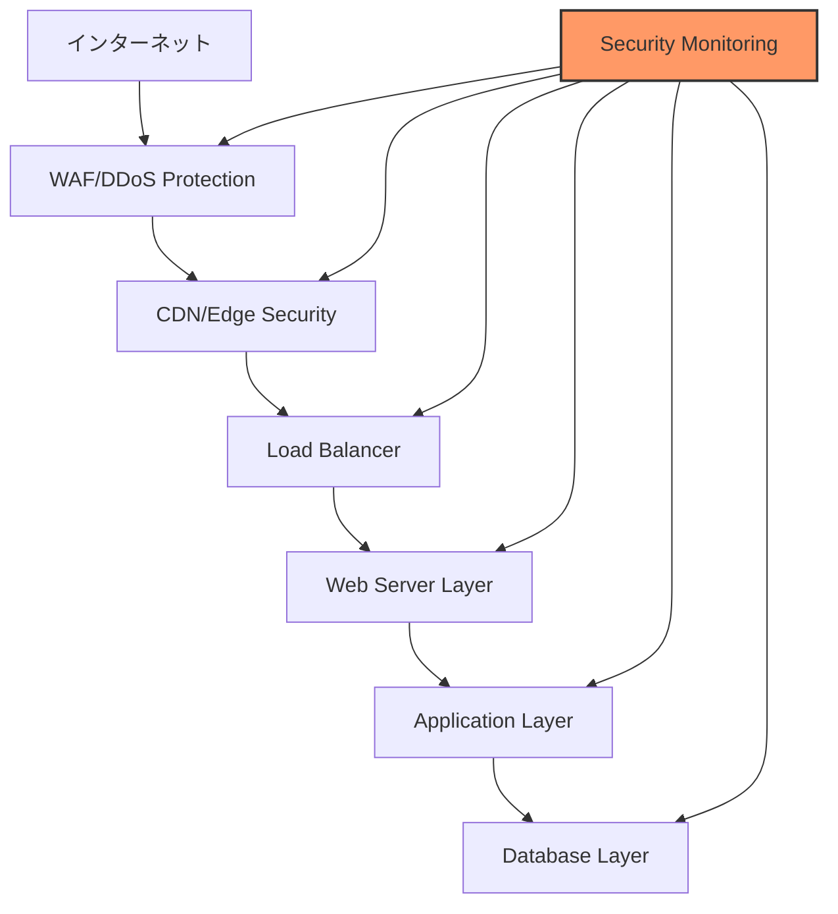
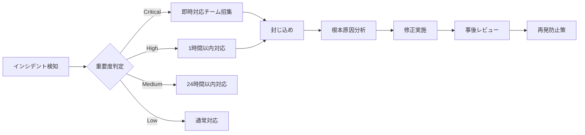

# セキュリティ監査準備計画 v1.0

作成日：2024年11月1日
担当：セキュリティチーム
期限：2024年11月7日

---

## 🔒 セキュリティ要件概要

### GROWTH AI システムの保護対象

```yaml
重要資産:
  顧客データ:
    - 個人情報（メール、会社名、連絡先）
    - LP生成履歴
    - 分析データ（ヒートマップ、CVR）
    - 決済情報
    
  システム資産:
    - APIキー（OpenAI、DALL-E、その他）
    - ソースコード
    - 機械学習モデル
    - ビジネスロジック
    
  ブランド資産:
    - 顧客の信頼
    - サービス可用性
    - データの完全性
```

---

## 🛡️ セキュリティアーキテクチャ

### 多層防御モデル



### セキュリティコンポーネント設計

```typescript
interface SecurityArchitecture {
  // 境界防御
  perimeter: {
    waf: {
      provider: 'Cloudflare' | 'AWS WAF',
      rules: [
        'OWASP Core Rule Set',
        'Custom Rules for LP Generation',
        'Rate Limiting Rules'
      ],
      ddosProtection: true,
      botManagement: true
    },
    
    cdn: {
      provider: 'CloudFront' | 'Cloudflare',
      security: {
        tlsVersion: 'TLS 1.3',
        originShield: true,
        geoBlocking: ['sanctioned_countries']
      }
    }
  },
  
  // アプリケーションセキュリティ
  application: {
    authentication: {
      method: 'JWT + Magic Link',
      mfa: {
        optional: true,
        methods: ['TOTP', 'SMS', 'Email']
      },
      sessionTimeout: 86400, // 24時間
      refreshToken: true
    },
    
    authorization: {
      model: 'RBAC', // Role-Based Access Control
      roles: ['admin', 'user', 'viewer'],
      permissions: {
        admin: ['*'],
        user: ['create_lp', 'view_analytics', 'edit_own'],
        viewer: ['view_lp', 'view_basic_analytics']
      }
    },
    
    encryption: {
      atRest: 'AES-256-GCM',
      inTransit: 'TLS 1.3',
      keyManagement: 'AWS KMS' | 'GCP KMS'
    }
  },
  
  // データ保護
  dataProtection: {
    pii: {
      masking: true,
      tokenization: ['credit_card', 'email'],
      retention: '30_days_active_7_years_archive'
    },
    
    backup: {
      frequency: 'daily',
      encryption: true,
      offsite: true,
      testing: 'monthly'
    }
  }
}
```

---

## 🔍 脆弱性診断計画

### 診断ツール選定

```yaml
自動診断ツール:
  
  SAST（静的解析）:
    - SonarQube
    - Snyk Code
    - GitHub Advanced Security
    
  DAST（動的解析）:
    - OWASP ZAP
    - Burp Suite Pro
    - Acunetix
    
  依存関係スキャン:
    - Snyk Open Source
    - npm audit
    - OWASP Dependency Check
    
  コンテナスキャン:
    - Trivy
    - Clair
    - Anchore
    
  インフラスキャン:
    - Terraform Security Scanner
    - AWS Security Hub
    - CloudSploit
```

### 診断実施計画

```python
class SecurityAuditPlan:
    """セキュリティ診断実施計画"""
    
    def __init__(self):
        self.phases = {
            "phase1_preparation": {
                "duration": "2 days",
                "tasks": [
                    "環境準備",
                    "ツール設定",
                    "スコープ定義",
                    "ベースライン作成"
                ]
            },
            
            "phase2_automated_scan": {
                "duration": "3 days",
                "tasks": [
                    "SAST実行",
                    "DAST実行",
                    "依存関係スキャン",
                    "設定スキャン"
                ]
            },
            
            "phase3_manual_testing": {
                "duration": "5 days",
                "tasks": [
                    "認証・認可テスト",
                    "入力検証テスト",
                    "セッション管理テスト",
                    "ビジネスロジックテスト"
                ]
            },
            
            "phase4_penetration_test": {
                "duration": "3 days",
                "tasks": [
                    "外部ペンテスト",
                    "内部ペンテスト",
                    "ソーシャルエンジニアリング",
                    "物理セキュリティ"
                ]
            },
            
            "phase5_remediation": {
                "duration": "5 days",
                "tasks": [
                    "脆弱性分類",
                    "優先順位付け",
                    "修正実施",
                    "再テスト"
                ]
            }
        }
    
    def generate_test_cases(self):
        """OWASP Top 10ベースのテストケース生成"""
        
        return {
            "A01_broken_access_control": [
                "権限昇格テスト",
                "横断的アクセステスト",
                "CORS設定テスト",
                "ディレクトリトラバーサル"
            ],
            
            "A02_cryptographic_failures": [
                "暗号化強度テスト",
                "証明書検証",
                "鍵管理テスト",
                "ハッシュアルゴリズム確認"
            ],
            
            "A03_injection": [
                "SQLインジェクション",
                "NoSQLインジェクション",
                "コマンドインジェクション",
                "XSS（反射型、格納型、DOM型）"
            ],
            
            "A04_insecure_design": [
                "脅威モデリング",
                "セキュアコーディング確認",
                "ビジネスロジック欠陥",
                "レート制限テスト"
            ],
            
            "A05_security_misconfiguration": [
                "デフォルト設定確認",
                "不要サービス確認",
                "エラーハンドリング",
                "セキュリティヘッダー"
            ]
        }
```

---

## 🚨 ペネトレーションテスト計画

### テストシナリオ

```typescript
interface PenetrationTestScenarios {
  // 外部攻撃シナリオ
  external: {
    reconnaissance: {
      description: "情報収集フェーズ",
      techniques: [
        "DNS enumeration",
        "Subdomain discovery",
        "Port scanning",
        "Technology fingerprinting"
      ]
    },
    
    exploitation: {
      description: "侵入フェーズ",
      techniques: [
        "Vulnerability exploitation",
        "Password attacks",
        "Session hijacking",
        "API abuse"
      ]
    },
    
    postExploitation: {
      description: "権限昇格フェーズ",
      techniques: [
        "Privilege escalation",
        "Lateral movement",
        "Data exfiltration",
        "Persistence"
      ]
    }
  },
  
  // 内部攻撃シナリオ
  internal: {
    insiderThreat: {
      description: "内部犯行シミュレーション",
      scenarios: [
        "Malicious employee",
        "Compromised account",
        "Supply chain attack"
      ]
    }
  },
  
  // API特化テスト
  apiSecurity: {
    tests: [
      "Authentication bypass",
      "Rate limiting bypass",
      "IDOR (Insecure Direct Object Reference)",
      "Mass assignment",
      "GraphQL specific attacks"
    ]
  }
}
```

### レッドチーム演習

```yaml
レッドチーム演習計画:
  
  目的:
    - 実際の攻撃者視点での評価
    - 検知・対応能力の検証
    - 改善点の特定
    
  スコープ:
    対象システム:
      - 本番環境（制限付き）
      - ステージング環境（フル）
    
    除外事項:
      - 物理的破壊
      - ソーシャルエンジニアリング（限定的）
      - DDoS攻撃
    
  実施期間: 5日間
  
  成功基準:
    - 個人情報へのアクセス
    - 管理者権限の取得
    - サービス停止（30分以上）
    - データの改ざん
```

---

## 📊 セキュリティメトリクス

### KPI設定

```python
class SecurityMetrics:
    """セキュリティKPIの定義と測定"""
    
    def __init__(self):
        self.kpis = {
            "vulnerability_metrics": {
                "critical_vulns": {
                    "target": 0,
                    "current": None,
                    "measurement": "monthly"
                },
                "high_vulns": {
                    "target": "< 5",
                    "current": None,
                    "measurement": "monthly"
                },
                "mttr": {  # Mean Time To Remediate
                    "target": "< 24 hours for critical",
                    "current": None,
                    "measurement": "per incident"
                }
            },
            
            "compliance_metrics": {
                "pci_dss": {
                    "required": False,  # 決済情報を直接扱わない
                    "level": "N/A"
                },
                "gdpr": {
                    "required": True,
                    "compliance_rate": None,
                    "target": "100%"
                },
                "privacy_law_jp": {
                    "required": True,
                    "compliance_rate": None,
                    "target": "100%"
                }
            },
            
            "operational_metrics": {
                "security_training": {
                    "completion_rate": None,
                    "target": "100%",
                    "frequency": "quarterly"
                },
                "incident_response_time": {
                    "p50": None,
                    "p95": None,
                    "target_p95": "< 1 hour"
                },
                "false_positive_rate": {
                    "current": None,
                    "target": "< 10%"
                }
            }
        }
    
    def calculate_security_score(self):
        """総合セキュリティスコアの算出"""
        
        weights = {
            "vulnerability": 0.4,
            "compliance": 0.3,
            "operational": 0.3
        }
        
        scores = {
            "vulnerability": self.calc_vuln_score(),
            "compliance": self.calc_compliance_score(),
            "operational": self.calc_ops_score()
        }
        
        total = sum(scores[k] * weights[k] for k in scores)
        
        return {
            "total_score": total,
            "breakdown": scores,
            "grade": self.get_grade(total)
        }
```

---

## 🔐 セキュリティ設定チェックリスト

### インフラストラクチャ

```yaml
AWS/GCP設定:
  IAM:
    - [ ] MFA必須化
    - [ ] 最小権限の原則
    - [ ] 定期的なアクセスレビュー
    - [ ] サービスアカウントの管理
    
  ネットワーク:
    - [ ] VPC設計レビュー
    - [ ] セキュリティグループ最小化
    - [ ] NACLs設定
    - [ ] プライベートサブネット活用
    
  ストレージ:
    - [ ] S3バケットポリシー
    - [ ] 暗号化設定
    - [ ] バージョニング有効化
    - [ ] アクセスログ有効化
    
  監視:
    - [ ] CloudTrail/Cloud Audit Logs
    - [ ] GuardDuty/Security Command Center
    - [ ] Config Rules/Policy
    - [ ] アラート設定
```

### アプリケーション

```typescript
// セキュリティヘッダー設定
const securityHeaders = {
  'Strict-Transport-Security': 'max-age=31536000; includeSubDomains',
  'X-Content-Type-Options': 'nosniff',
  'X-Frame-Options': 'DENY',
  'X-XSS-Protection': '1; mode=block',
  'Content-Security-Policy': `
    default-src 'self';
    script-src 'self' 'unsafe-inline' https://cdn.jsdelivr.net;
    style-src 'self' 'unsafe-inline';
    img-src 'self' data: https:;
    font-src 'self' data:;
    connect-src 'self' https://api.growth-ai.com;
  `.replace(/\s+/g, ' ').trim(),
  'Referrer-Policy': 'strict-origin-when-cross-origin',
  'Permissions-Policy': 'geolocation=(), microphone=(), camera=()'
};

// 入力検証
const inputValidation = {
  email: /^[^\s@]+@[^\s@]+\.[^\s@]+$/,
  url: /^https?:\/\/.+/,
  companyName: /^[a-zA-Z0-9\u3040-\u309F\u30A0-\u30FF\u4E00-\u9FAF\s]{1,100}$/,
  
  sanitize: (input: string): string => {
    return input
      .replace(/[<>]/g, '')  // HTMLタグ除去
      .replace(/javascript:/gi, '')  // JSインジェクション防止
      .trim()
      .slice(0, 1000);  // 長さ制限
  }
};
```

---

## 🚀 実装優先順位

### Phase 0（即時対応）- 11/7まで

1. **必須セキュリティ設定**
   - [ ] HTTPS強制
   - [ ] 基本的な認証実装
   - [ ] SQLインジェクション対策
   - [ ] XSS対策

2. **監査準備**
   - [ ] ログ設定
   - [ ] 監視ツール設定
   - [ ] インシデント対応手順書

### Phase 1（MVP）

1. **認証・認可**
   - [ ] JWT実装
   - [ ] マジックリンク
   - [ ] セッション管理
   - [ ] RBAC実装

2. **データ保護**
   - [ ] 暗号化実装
   - [ ] PII masking
   - [ ] バックアップ設定

### Phase 2以降

1. **高度なセキュリティ**
   - [ ] MFA実装
   - [ ] 異常検知AI
   - [ ] SIEM統合
   - [ ] Zero Trust実装

---

## 📞 セキュリティインシデント対応

### インシデント対応フロー



### 連絡先

```yaml
セキュリティチーム:
  リーダー: security-lead@growth-ai.com
  24時間ホットライン: +81-XX-XXXX-XXXX
  
外部専門家:
  ペンテスト会社: [Company Name]
  インシデント対応: [CSIRT Contact]
  法務アドバイザー: [Legal Contact]
```

承認者：________________
承認日：2024年11月___日