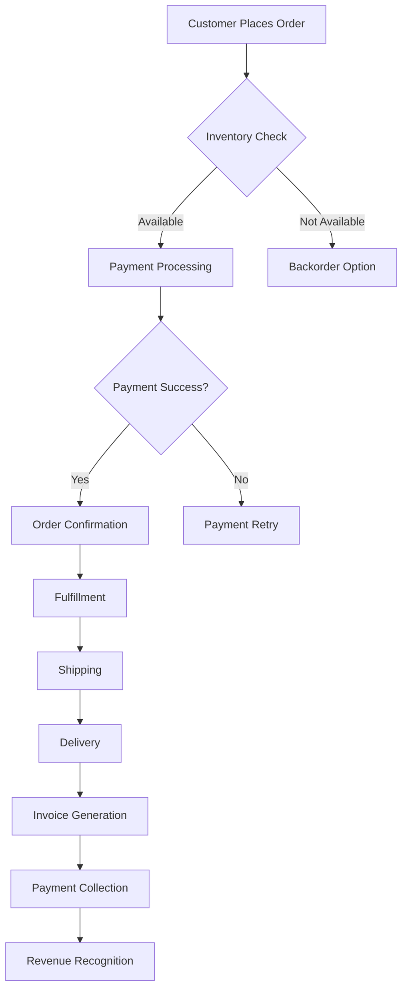
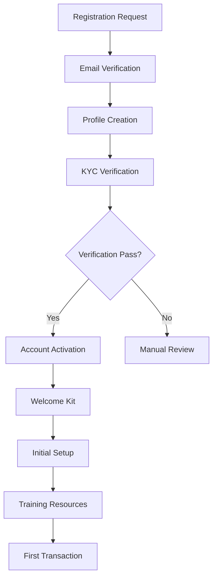
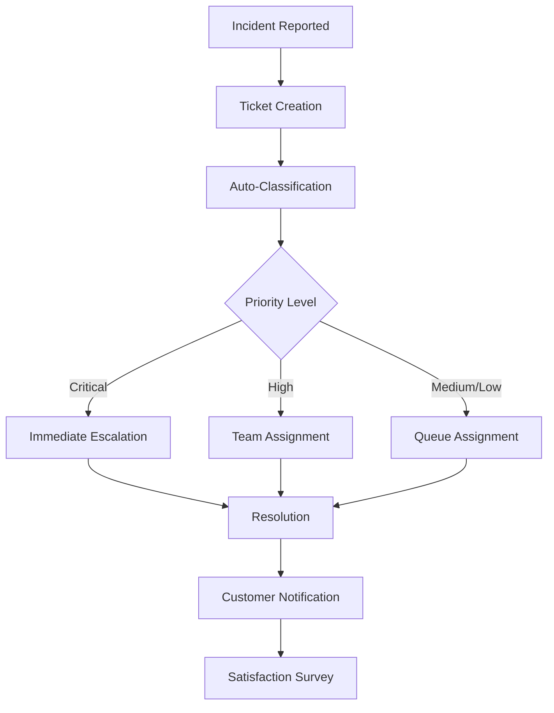

# Detailed Functional Requirements Specification

## Table of Contents
1. [User Stories and Use Cases](#user-stories-and-use-cases)
2. [Process Flows](#process-flows)
3. [Data Requirements](#data-requirements)
4. [Business Rules](#business-rules)
5. [User Interface Requirements](#user-interface-requirements)
6. [Integration Specifications](#integration-specifications)

## User Stories and Use Cases

### Epic 1: Customer Management

#### US1.1: Customer Registration
**As a** new customer  
**I want to** create an account quickly  
**So that** I can start using the system immediately

**Acceptance Criteria:**
- Registration completes in <3 steps
- Social media login options available
- Email verification within 5 minutes
- Welcome email with onboarding guide
- Profile completion incentives
- GDPR consent collection
- Age verification for restricted content

#### US1.2: Profile Management
**As a** registered user  
**I want to** manage my profile information  
**So that** I can keep my data current

**Acceptance Criteria:**
- Edit all profile fields
- Upload profile picture
- Manage communication preferences
- View activity history
- Download personal data (GDPR)
- Delete account option
- Multi-language support

### Epic 2: Order Processing

#### US2.1: Product Search and Selection
**As a** customer  
**I want to** find products quickly  
**So that** I can make purchases efficiently

**Acceptance Criteria:**
- Search response <500ms
- Auto-complete suggestions
- Filter by multiple attributes
- Sort by relevance/price/rating
- Visual product search
- Comparison feature
- Saved searches

#### US2.2: Shopping Cart Management
**As a** customer  
**I want to** manage my cart items  
**So that** I can control my purchases

**Acceptance Criteria:**
- Add/remove items instantly
- Update quantities
- Save cart for later
- Apply discount codes
- Calculate shipping costs
- Tax calculation by location
- Multiple payment options

### Epic 3: Analytics and Reporting

#### US3.1: Executive Dashboard
**As an** executive  
**I want to** view key metrics at a glance  
**So that** I can make informed decisions

**Acceptance Criteria:**
- Real-time data updates
- Customizable widgets
- Drill-down capabilities
- Export to PDF/PPT
- Mobile responsive
- Offline access mode
- Scheduled email reports

#### US3.2: Operational Analytics
**As an** operations manager  
**I want to** monitor system performance  
**So that** I can optimize operations

**Acceptance Criteria:**
- Live performance metrics
- Historical trend analysis
- Anomaly detection alerts
- Capacity planning tools
- Cost analysis reports
- Predictive insights
- Custom KPI definition

## Process Flows

### PF1: Order-to-Cash Process



### PF2: Customer Onboarding Process



### PF3: Incident Management Process



## Data Requirements

### DR1: Customer Data Model

```yaml
Customer:
  - customerId: UUID (Primary Key)
  - email: String (Unique, Required)
  - firstName: String (Required)
  - lastName: String (Required)
  - phoneNumber: String (Optional)
  - dateOfBirth: Date (Optional)
  - createdAt: Timestamp
  - updatedAt: Timestamp
  - status: Enum [Active, Inactive, Suspended]
  
  Relationships:
    - Addresses: One-to-Many
    - Orders: One-to-Many
    - PaymentMethods: One-to-Many
    - Preferences: One-to-One
    - ActivityLog: One-to-Many
```

### DR2: Order Data Model

```yaml
Order:
  - orderId: UUID (Primary Key)
  - customerId: UUID (Foreign Key)
  - orderNumber: String (Unique)
  - orderDate: Timestamp
  - status: Enum [Pending, Processing, Shipped, Delivered, Cancelled]
  - totalAmount: Decimal
  - currency: String
  - shippingAddress: JSON
  - billingAddress: JSON
  
  Relationships:
    - Customer: Many-to-One
    - OrderItems: One-to-Many
    - Payments: One-to-Many
    - Shipments: One-to-Many
    - StatusHistory: One-to-Many
```

### DR3: Product Data Model

```yaml
Product:
  - productId: UUID (Primary Key)
  - sku: String (Unique)
  - name: String (Required)
  - description: Text
  - category: String
  - price: Decimal
  - cost: Decimal
  - weight: Decimal
  - dimensions: JSON
  - status: Enum [Active, Discontinued, OutOfStock]
  
  Relationships:
    - Inventory: One-to-One
    - Pricing: One-to-Many
    - Images: One-to-Many
    - Reviews: One-to-Many
    - Categories: Many-to-Many
```

## Business Rules

### BR1: Pricing Rules

#### BR1.1: Dynamic Pricing
- **Rule**: Adjust prices based on demand and inventory
- **Conditions**:
  - If inventory < 10% then increase price by 15%
  - If demand > 150% average then increase price by 10%
  - If competitor price < our price by 20% then match
  - If customer segment = VIP then apply 10% discount
  
#### BR1.2: Bulk Discount
- **Rule**: Apply tiered discounts for quantity purchases
- **Conditions**:
  - 10-49 units: 5% discount
  - 50-99 units: 10% discount
  - 100-499 units: 15% discount
  - 500+ units: 20% discount

### BR2: Inventory Rules

#### BR2.1: Reorder Point
- **Rule**: Automatic reorder when inventory reaches threshold
- **Formula**: Reorder Point = (Average Daily Usage × Lead Time) + Safety Stock
- **Conditions**:
  - Safety Stock = 20% of average monthly demand
  - Emergency reorder if stock < 5% of monthly demand
  - Seasonal adjustment factor applied

#### BR2.2: Allocation Rules
- **Rule**: Prioritize order fulfillment based on criteria
- **Priority Order**:
  1. VIP customers
  2. Orders with expedited shipping
  3. Oldest orders first
  4. Largest order value

### BR3: Credit Management

#### BR3.1: Credit Limit Assignment
- **Rule**: Assign credit limits based on customer profile
- **Criteria**:
  - New customer: $1,000 limit
  - 6 months history: $5,000 limit
  - 1 year + good payment: $10,000 limit
  - Enterprise customer: Custom evaluation

#### BR3.2: Payment Terms
- **Rule**: Define payment terms by customer segment
- **Terms**:
  - Retail: Payment on order
  - Small Business: Net 30
  - Enterprise: Net 60
  - Government: Net 90

## User Interface Requirements

### UIR1: Design Principles

#### Accessibility
- WCAG 2.1 Level AA compliance
- Keyboard navigation support
- Screen reader compatibility
- High contrast mode
- Font size adjustment
- Color blind friendly palette
- Multi-language support (15 languages)

#### Responsive Design
- Mobile-first approach
- Breakpoints: 320px, 768px, 1024px, 1440px
- Touch-friendly controls (44px minimum)
- Adaptive layouts
- Progressive enhancement
- Offline capability
- Performance budget: <3MB initial load

### UIR2: Component Library

#### Navigation
- Mega menu for desktop
- Hamburger menu for mobile
- Breadcrumb navigation
- Search bar with auto-complete
- User account dropdown
- Quick links footer
- Sticky header option

#### Forms
- Inline validation
- Error messaging standards
- Progress indicators
- Auto-save functionality
- Smart defaults
- Conditional fields
- Input masking

#### Data Display
- Sortable tables
- Infinite scroll
- Pagination options
- Filter panels
- Export functions
- Print-friendly views
- Data visualization charts

### UIR3: Page Templates

#### Dashboard Template
```
+------------------+
|     Header       |
+----+-------------+
|Nav |  KPI Cards  |
|    +-------------+
|    |   Charts    |
|    +-------------+
|    |   Tables    |
+----+-------------+
|     Footer       |
+------------------+
```

#### Form Template
```
+------------------+
|     Header       |
+----+-------------+
|Nav | Form Title  |
|    +-------------+
|    | Section 1   |
|    | Section 2   |
|    | Section 3   |
|    +-------------+
|    | Actions     |
+----+-------------+
```

## Integration Specifications

### IS1: API Standards

#### RESTful API Design
```yaml
Base URL: https://api.enterprise.com/v1

Authentication:
  Type: OAuth 2.0
  Token: Bearer <token>
  Expiry: 3600 seconds
  Refresh: Supported

Rate Limiting:
  Default: 1000 requests/hour
  Burst: 100 requests/minute
  Headers: X-RateLimit-Limit, X-RateLimit-Remaining

Pagination:
  Style: Cursor-based
  Parameters: limit, cursor
  Max Limit: 100
  Default: 20

Response Format:
  Success:
    {
      "data": {},
      "meta": {
        "timestamp": "2023-01-01T00:00:00Z",
        "version": "1.0"
      }
    }
  
  Error:
    {
      "error": {
        "code": "ERROR_CODE",
        "message": "Human readable message",
        "details": {}
      }
    }
```

### IS2: Event Schema

#### Order Events
```json
{
  "eventId": "uuid",
  "eventType": "order.created",
  "timestamp": "2023-01-01T00:00:00Z",
  "data": {
    "orderId": "uuid",
    "customerId": "uuid",
    "totalAmount": 99.99,
    "items": [
      {
        "productId": "uuid",
        "quantity": 1,
        "price": 99.99
      }
    ]
  },
  "metadata": {
    "source": "web",
    "version": "1.0"
  }
}
```

### IS3: Integration Patterns

#### Synchronous Integration
- **Use Cases**: Real-time data queries, immediate responses
- **Implementation**: REST API, GraphQL
- **Timeout**: 30 seconds maximum
- **Retry Policy**: 3 attempts with exponential backoff
- **Circuit Breaker**: Open after 5 consecutive failures

#### Asynchronous Integration
- **Use Cases**: Batch processing, event notifications
- **Implementation**: Message queues, webhooks
- **Delivery**: At-least-once guarantee
- **Dead Letter Queue**: After 5 failed attempts
- **Message Retention**: 7 days

#### Batch Integration
- **Use Cases**: Data synchronization, bulk updates
- **Implementation**: SFTP, S3 bucket drops
- **Schedule**: Configurable (hourly, daily, weekly)
- **File Formats**: CSV, JSON, XML
- **Validation**: Schema validation before processing

## Acceptance Test Scenarios

### ATS1: User Registration
```gherkin
Feature: User Registration
  As a new user
  I want to register for an account
  So that I can access the system

  Scenario: Successful registration
    Given I am on the registration page
    When I enter valid registration details
    And I click submit
    Then I should receive a verification email
    And I should see a success message
    
  Scenario: Duplicate email registration
    Given I am on the registration page
    When I enter an email that already exists
    And I click submit
    Then I should see an error message
    And the email field should be highlighted
```

### ATS2: Order Processing
```gherkin
Feature: Order Processing
  As a customer
  I want to place an order
  So that I can purchase products

  Scenario: Successful order placement
    Given I have items in my cart
    When I proceed to checkout
    And I enter valid payment information
    Then the order should be created
    And I should receive a confirmation email
    
  Scenario: Out of stock handling
    Given I have an out-of-stock item in cart
    When I proceed to checkout
    Then I should see a stock warning
    And be given options to proceed
```

---

This detailed functional requirements specification provides comprehensive coverage of user stories, process flows, data models, business rules, UI requirements, and integration specifications necessary for successful enterprise system implementation.