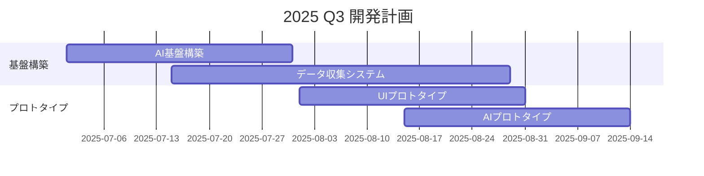
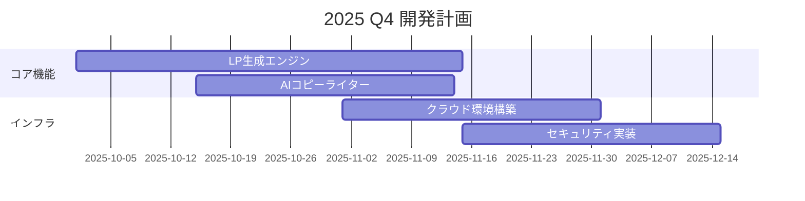
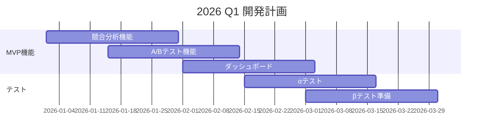
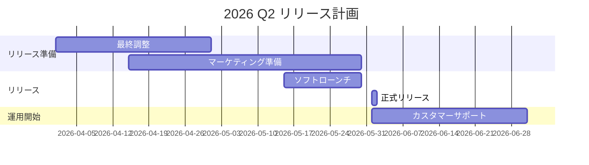

# QUANTUM LP - MVP開発ロードマップ（2026年Q2リリース）

## 📱 MVP製品ビジョン

**ミッション:** 「5分で作れて、確実に売れるLP」
**ターゲット:** 個人事業主・中小企業（月商100万〜1億円）
**価格帯:** 月額4,980円〜（成果報酬オプション有）

## 1. MVP機能リスト（優先順位順）

### 🔴 P0：必須機能（Day1リリース）

#### 1. ワンクリックLP生成
```yaml
機能詳細:
  入力:
    - 業種選択（20業種）
    - 商品・サービス名
    - ターゲット顧客（選択式）
  
  出力:
    - 完成LP（5秒以内）
    - モバイル最適化済み
    - SEO基本設定済み
    
  技術:
    - GPT-4 Turbo
    - 業界別テンプレート
    - 自動レスポンシブ
```

#### 2. AIコピーライティング
```yaml
機能:
  - キャッチコピー自動生成
  - ベネフィット抽出
  - 証拠・実績の構造化
  - CTA最適化
  - 感情トリガー配置
  
差別化:
  - 日本語特化チューニング
  - 業界別成功パターンDB
  - A/Bテスト結果学習
```

#### 3. 競合分析＆差別化
```yaml
機能:
  - 競合LP自動収集
  - 強み・弱み分析
  - 差別化ポイント提案
  - 価格戦略アドバイス
  
実装:
  - Webスクレイピング
  - 画像認識AI
  - テキスト分析
  - ポジショニングマップ
```

#### 4. 基本的なA/Bテスト
```yaml
機能:
  - 2パターン同時公開
  - 自動トラフィック振り分け
  - 統計的有意性判定
  - 勝者の自動採用
  
指標:
  - CVR（コンバージョン率）
  - 滞在時間
  - スクロール深度
  - クリック率
```

#### 5. 成果ダッシュボード
```yaml
表示項目:
  - リアルタイムCVR
  - 売上金額
  - 訪問者数
  - 改善提案
  - 競合比較
  
更新頻度:
  - リアルタイム（1分）
  - 日次レポート
  - 週次サマリー
```

### 🟡 P1：準必須機能（Launch後1ヶ月）

#### 6. 動的パーソナライゼーション
```yaml
セグメント:
  - 流入元別（広告/検索/SNS）
  - デバイス別
  - 時間帯別
  - 地域別
  - リピーター識別
  
カスタマイズ:
  - メッセージ変更
  - 画像切り替え
  - 価格表示
  - 特典表示
```

#### 7. フォーム最適化
```yaml
機能:
  - 項目数最適化
  - 入力補助
  - エラー予防
  - 離脱防止
  - 確認画面省略オプション
```

#### 8. チャットボット統合
```yaml
タイプ:
  - FAQ自動応答
  - 商品案内
  - 見積もり提供
  - アポイント調整
  - 人間へのエスカレーション
```

### 🟢 P2：差別化機能（Launch後3ヶ月）

#### 9. 感情AI（簡易版）
```yaml
検出:
  - マウス動作パターン
  - スクロール速度
  - 滞在時間パターン
  
対応:
  - コンテンツ動的調整
  - CTA強調度変更
  - 不安解消コンテンツ表示
```

#### 10. 予測分析
```yaml
予測項目:
  - CVR予測（70%精度）
  - 最適公開時間
  - 必要トラフィック量
  - ROI予測
```

#### 11. 成果保証プラン（β版）
```yaml
条件:
  - 最低トラフィック: 月1000PV
  - 継続期間: 3ヶ月以上
  - 改善実施率: 80%以上
  
保証内容:
  - CVR向上保証（+20%）
  - 未達成時返金（50%）
```

## 2. 開発ロードマップ

### 📅 2025年 Q3-Q4：準備フェーズ

#### Q3（7-9月）


- **7月**: チーム編成、技術選定
- **8月**: 基盤システム構築、データ収集開始
- **9月**: プロトタイプ開発、内部テスト

#### Q4（10-12月）


- **10月**: コア機能開発
- **11月**: インフラ構築、セキュリティ実装
- **12月**: 統合テスト、バグ修正

### 📅 2026年 Q1-Q2：MVP開発・リリース

#### Q1（1-3月）


- **1月**: MVP機能完成
- **2月**: 内部αテスト、フィードバック反映
- **3月**: クローズドβテスト開始（100社限定）

#### Q2（4-6月）


- **4月**: 最終調整、マーケティング準備
- **5月**: ソフトローンチ（限定500社）
- **6月**: 正式リリース🎉

## 3. 技術スタック（MVP版）

### 🛠️ フロントエンド
```javascript
const FrontendStack = {
  framework: "Next.js 14",
  ui_library: "Tailwind CSS + Shadcn UI",
  state_management: "Zustand",
  animation: "Framer Motion",
  real_time: "Socket.io",
  analytics: "Mixpanel + Hotjar"
};
```

### 🔧 バックエンド
```python
backend_stack = {
    "framework": "FastAPI",
    "language": "Python 3.11",
    "ai_framework": "LangChain + OpenAI",
    "task_queue": "Celery + Redis",
    "database": "PostgreSQL + Supabase",
    "cache": "Redis",
    "search": "Elasticsearch"
}
```

### 🤖 AI/ML
```yaml
AI Stack:
  LLM:
    - OpenAI GPT-4 Turbo
    - Claude 3 (Backup)
    - Fine-tuned models
    
  Image:
    - DALL-E 3
    - Stable Diffusion XL
    - Background Remover
    
  Analytics:
    - TensorFlow 2.0
    - scikit-learn
    - Prophet (時系列予測)
```

### ☁️ インフラ
```yaml
Infrastructure:
  Cloud: AWS (Tokyo Region)
  
  Compute:
    - ECS Fargate
    - Lambda Functions
    - EC2 (GPU instances)
    
  Storage:
    - S3 (Static files)
    - RDS (PostgreSQL)
    - DynamoDB (Sessions)
    
  Network:
    - CloudFront CDN
    - Route 53
    - API Gateway
    
  Security:
    - WAF
    - Secrets Manager
    - IAM
```

## 4. チーム構成

### 👥 必要人員（MVP開発）

```yaml
Core Team (10名):
  Engineering (6名):
    - Tech Lead: 1名
    - Backend Engineer: 2名
    - Frontend Engineer: 2名
    - AI Engineer: 1名
    
  Product (2名):
    - Product Manager: 1名
    - UX Designer: 1名
    
  Business (2名):
    - Marketing: 1名
    - Customer Success: 1名

Extended Team (5名):
  - DevOps Engineer: 1名
  - QA Engineer: 1名
  - Data Analyst: 1名
  - Content Writer: 1名
  - Legal Advisor: 1名 (Part-time)
```

## 5. 予算計画

### 💰 MVP開発コスト（9ヶ月）

```yaml
開発費用:
  人件費: 9,000万円
    - エンジニア: 6,000万円
    - その他: 3,000万円
    
  インフラ: 900万円
    - AWS: 600万円
    - AI API: 300万円
    
  ツール・サービス: 600万円
    - 開発ツール: 300万円
    - マーケティング: 300万円
    
  その他: 500万円
    - 法務: 200万円
    - 雑費: 300万円
    
合計: 1.1億円
```

### 📈 収益予測

```yaml
2026年（6ヶ月）:
  ユーザー数: 1,000社
  月額平均: 15,000円
  月間収益: 1,500万円
  6ヶ月収益: 9,000万円
  
2027年:
  ユーザー数: 10,000社
  月額平均: 20,000円
  月間収益: 2億円
  年間収益: 24億円
  
2028年:
  ユーザー数: 50,000社
  月額平均: 25,000円
  月間収益: 12.5億円
  年間収益: 150億円
```

## 6. KPI・成功指標

### 📊 MVP成功基準

```yaml
技術指標:
  - ページ生成時間: < 5秒
  - システム稼働率: > 99.9%
  - レスポンス時間: < 200ms
  - 同時接続数: > 10,000
  
ビジネス指標:
  - 有料転換率: > 10%
  - 月次解約率: < 5%
  - NPS: > 50
  - CAC/LTV: < 0.3
  
ユーザー指標:
  - 平均CVR向上率: > 30%
  - LP作成時間: < 5分
  - 満足度: > 4.5/5
  - リピート率: > 80%
```

## 7. リスク管理

### ⚠️ 主要リスクと対策

```yaml
技術リスク:
  AI精度不足:
    対策: 継続的な学習とフィードバックループ
    
  スケーラビリティ:
    対策: マイクロサービス化と自動スケーリング
    
競合リスク:
  大手参入:
    対策: ニッチ特化と高速イテレーション
    
  価格競争:
    対策: 成果報酬モデルでの差別化
    
規制リスク:
  AI規制強化:
    対策: 透明性確保と倫理ガイドライン策定
    
  個人情報保護:
    対策: Privacy by Designの徹底
```

## まとめ：MVP成功への道

### ✅ 成功の鍵
1. **スピード重視**: 完璧より速さ
2. **ユーザー中心**: フィードバック即反映
3. **データ駆動**: 全ての判断を数値で
4. **差別化明確**: 「確実に売れる」を実現
5. **段階的拡張**: MVPから着実に成長

### 🎯 2026年6月の目標
- 1,000社導入
- 月間収益1,500万円
- NPS 60以上
- 次期資金調達準備完了